---
## Front matter
lang: ru-RU
title: Лабораторная работа №1
subtitle: "Простые модели компьютерной сети"
author:
  - Кадров Виктор Максимович
teacher:
  - Кулябов Д. С.
  - д.ф.-м.н., профессор
  - профессор кафедры теории вероятностей и кибербезопасности 
institute:
  - Российский университет дружбы народов имени Патриса Лумумбы, Москва, Россия
date: 11 апреля 2025

## i18n babel
babel-lang: russian
babel-otherlangs: english

## Formatting pdf
toc: false
toc-title: Содержание
slide_level: 2
aspectratio: 169
section-titles: true
theme: metropolis
header-includes:
 - \metroset{progressbar=frametitle,sectionpage=progressbar,numbering=fraction}
---

## Цели и задачи

Приобретение навыков моделирования сетей передачи данных с помощью средства имитационного моделирования NS-2, а также анализ полученных результатов моделирования.

## Задание

1. Создать шаблон сценария для NS-2.
2. Рассмотреть простой пример описания топологии сети, состоящей из двух узлов и одного соединения.
3. Рассмотреть пример с усложнённой топологией сети.
4. Рассмотерть пример с кольцевой топологией сети
5. Выполнить упражнение

## Шаблон сценария для NS-2

В своём рабочем каталоге создадим директорию mip, в которой будут выполняться лабораторные работы. Внутри mip создадим директорию lab-ns, а в ней файл shablon.tcl.

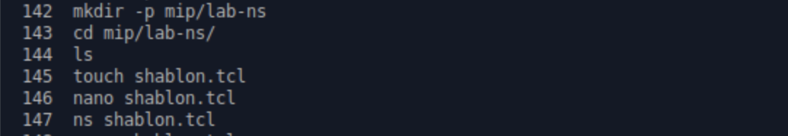{#fig:001 width=70%}

Получившийся шаблон можно использовать в дальнейшем в большинстве разрабатываемых скриптов NS-2, добавляя в него до строки $ns at 5.0 "finish" описание объектов и действий моделируемой системы.

## Скрипт шаблона

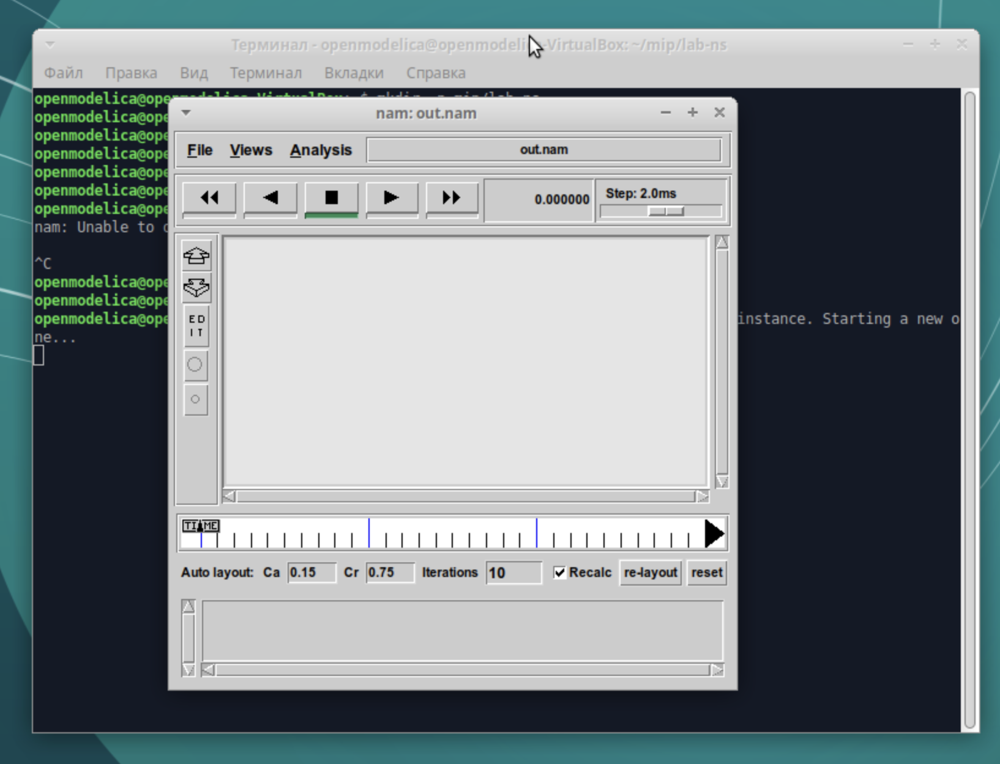{#fig:003 width=40%} 

## Симуляция шаблона

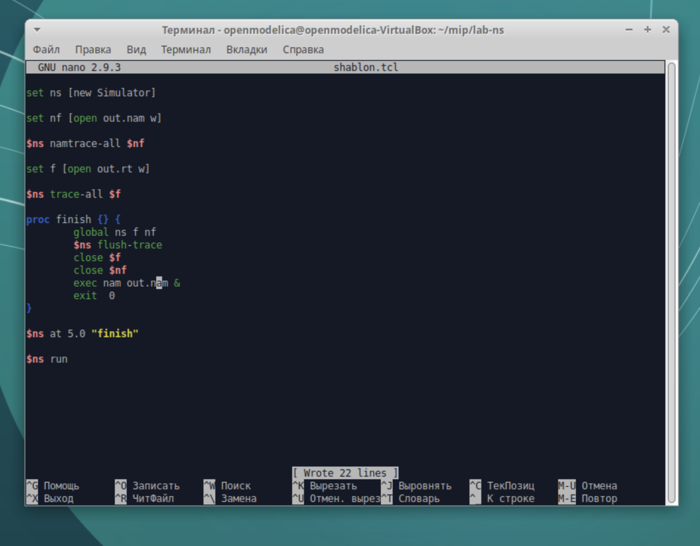{#fig:002 width=70%}

##  Простой пример описания топологии сети, состоящей из двух узлов и одного соединения

Постановка задачи. Требуется смоделировать сеть передачи данных, состоящую из двух узлов, соединённых дуплексной линией связи с полосой пропускания 2 Мб/с и задержкой 10 мс, очередью с обслуживанием типа DropTail. От одного узла к другому по протоколу UDP осуществляется передача пакетов, размером 500 байт,
с постоянной скоростью 200 пакетов в секунду.

## Реализация модели

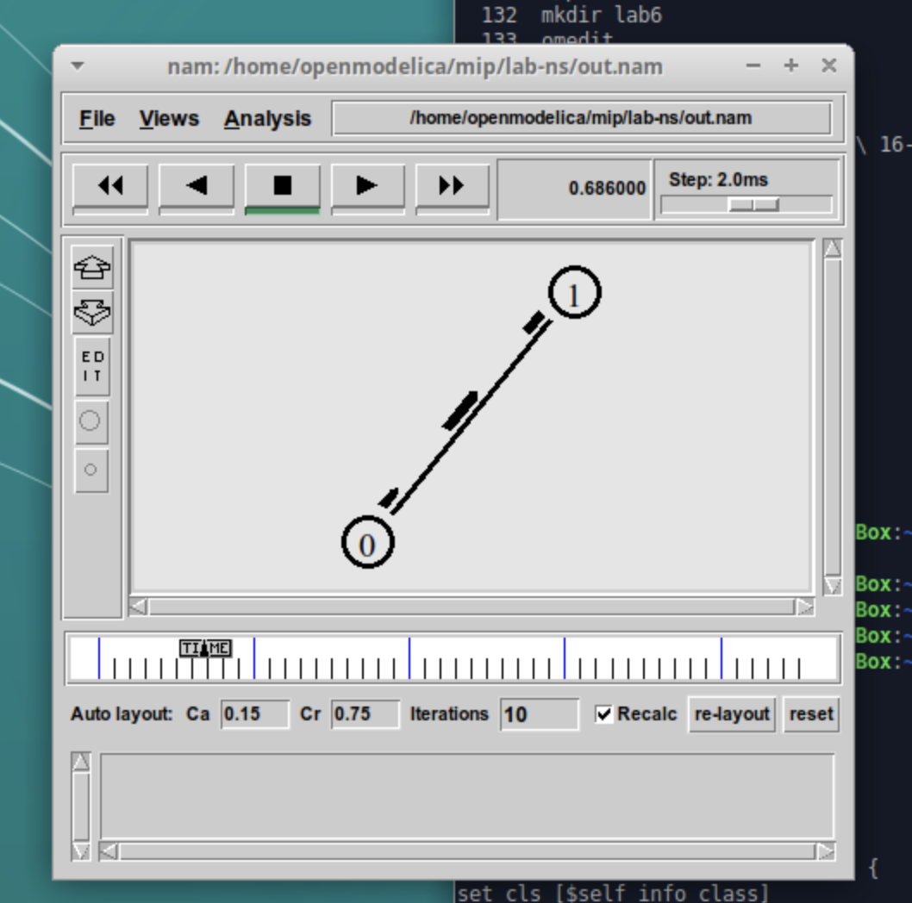{#fig:004 width=50%}  

## Скрипт сети из двух узлов и одного соединения 

Скопируем содержимое созданного шаблона в новый файл example1.tcl и откроем на редактирование. Создадим агенты для генерации и приёма трафика. Создадим агент UDP и присоединим к узлу n0. К агенту присоединяем приложение. В данном случае — это источник с постоянной скоростью (Constant Bit Rate, CBR), который каждые 5 мс посылает пакет R = 500 байт. Далее создадим Null-агент, который работает как приёмник трафика, и прикрепим его к узлу n1. Соединим агенты между собой. Для запуска и остановки приложения CBR добавляются at-события в планировщик событий. 

## Скрипт сети из двух узлов и одного соединения 

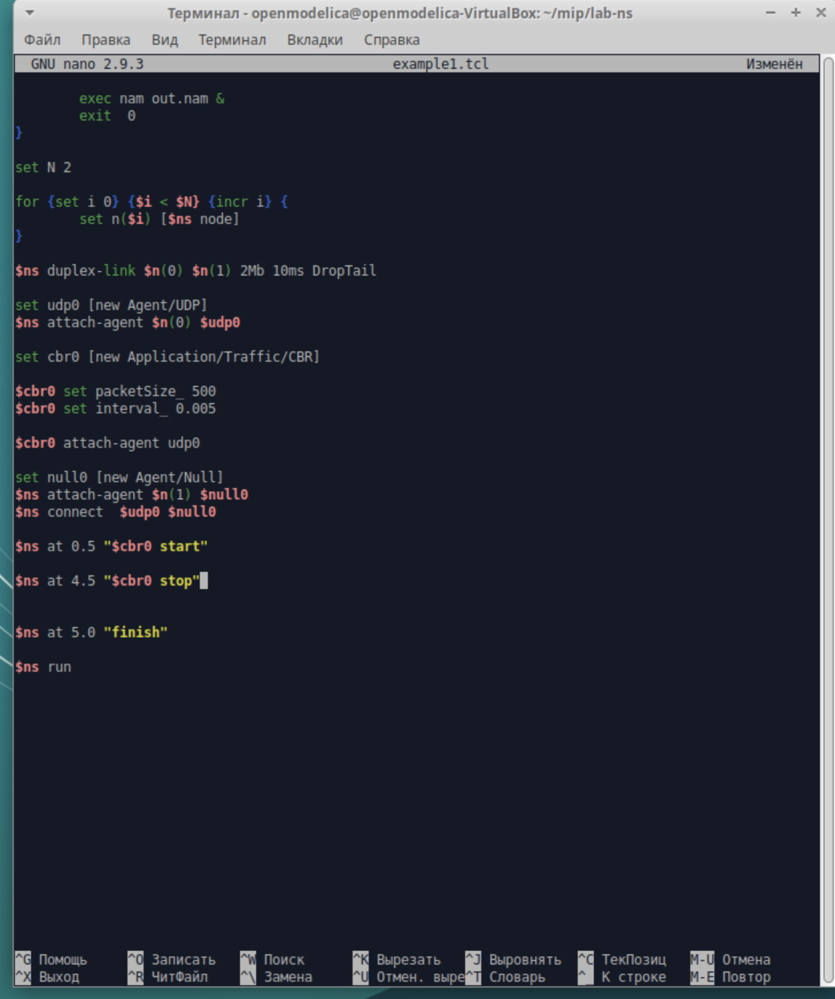{#fig:005 width=40%}  

## Пример с усложненной топологией сети

Постановка задачи. Описание моделируемой сети:
– сеть состоит из 4 узлов (n0, n1, n2, n3);
– между узлами n0 и n2, n1 и n2 установлено дуплексное соединение с пропускной способностью 2 Мбит/с и задержкой 10 мс;
– между узлами n2 и n3 установлено дуплексное соединение с пропускной способностью 1,7 Мбит/с и задержкой 20 мс;
– каждый узел использует очередь с дисциплиной DropTail для накопления пакетов, максимальный размер которой составляет 10;
– TCP-источник на узле n0 подключается к TCP-приёмнику на узле n3 (по-умолчанию, максимальный размер пакета, который TCP-агент может генерировать, равняется 1KByte)
– TCP-приёмник генерирует и отправляет ACK пакеты отправителю и откидывает полученные пакеты;
– UDP-агент, который подсоединён к узлу n1, подключён к null-агенту на узле n3 (null-агент просто откидывает пакеты);
– генераторы трафика ftp и cbr прикреплены к TCP и UDP агентам соответственно;
– генератор cbr генерирует пакеты размером 1 Кбайт со скоростью 1 Мбит/с;
– работа cbr начинается в 0,1 секунду и прекращается в 4,5 секунды, а ftp начинает работать в 1,0 секунду и прекращает в 4,0 секунды.

## Реализация модели. 

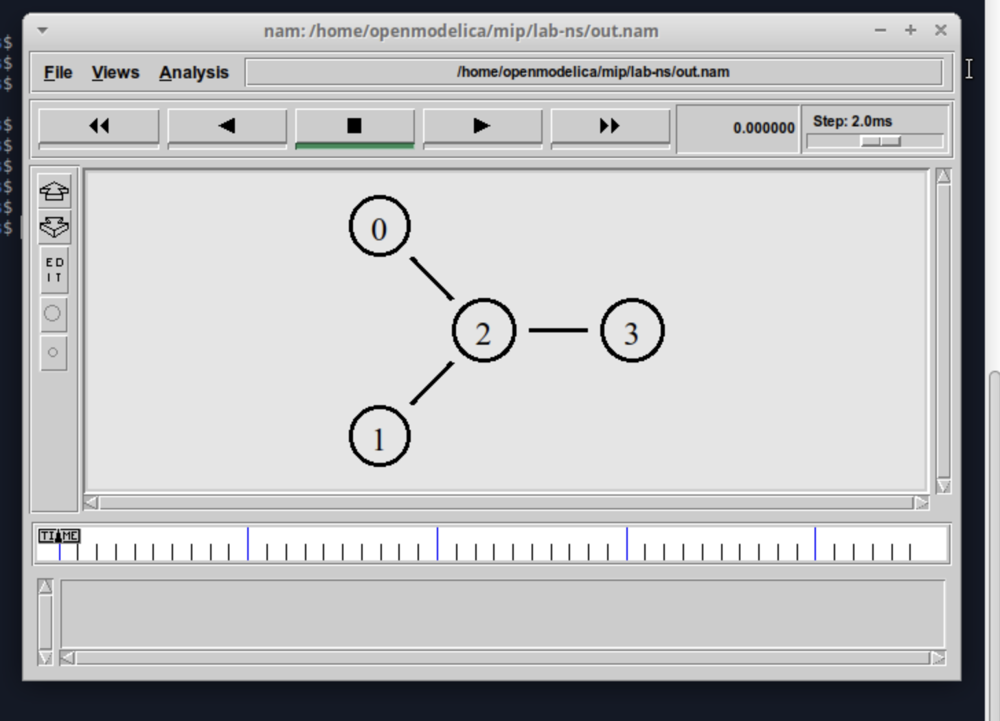{#fig:006 width=30%}   

## Модель с усложненной топологией сети. Симуляция

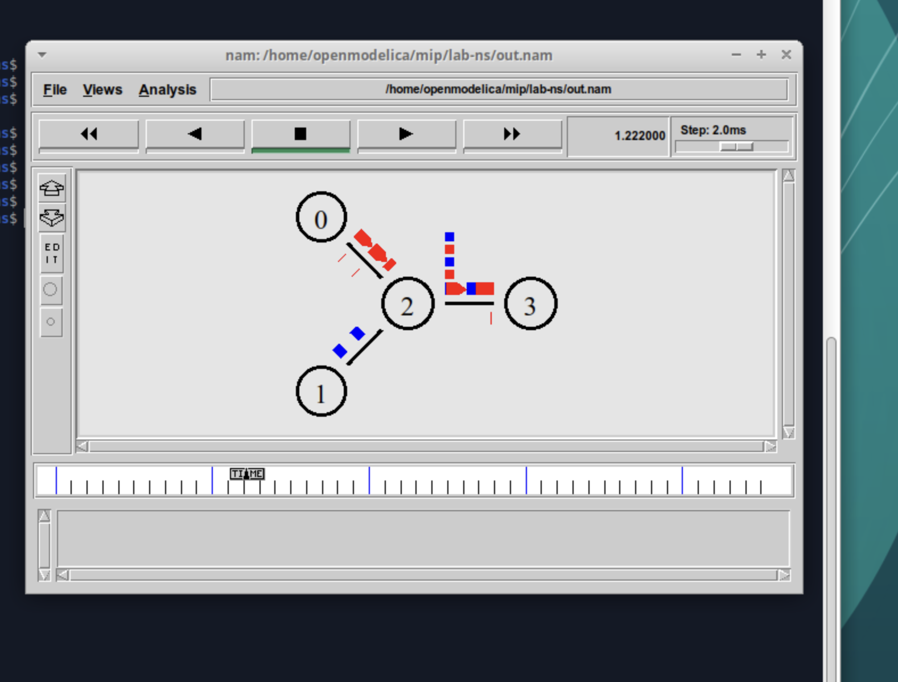{#fig:007 width=50%}

## Скрипт модели с усложненной топологией сети

Скопируем содержимое созданного шаблона в новый файл и откроем example2.tcl на редактирование. Создадим 4 узла и 3 дуплексных соединения с указанием направления. Создадим агент UDP с прикреплённым к нему источником CBR и агент TCP с прикреплённым к нему приложением FTP. Создадим агенты-получатели. Соединим агенты udp0 и tcp1 и их получателей. Зададим описание цвета каждого потока. Отслеживание событий в очереди. Наложим ограничения на размер очереди. Добавим at-события.

## Скрипт модели с усложненной топологией сети

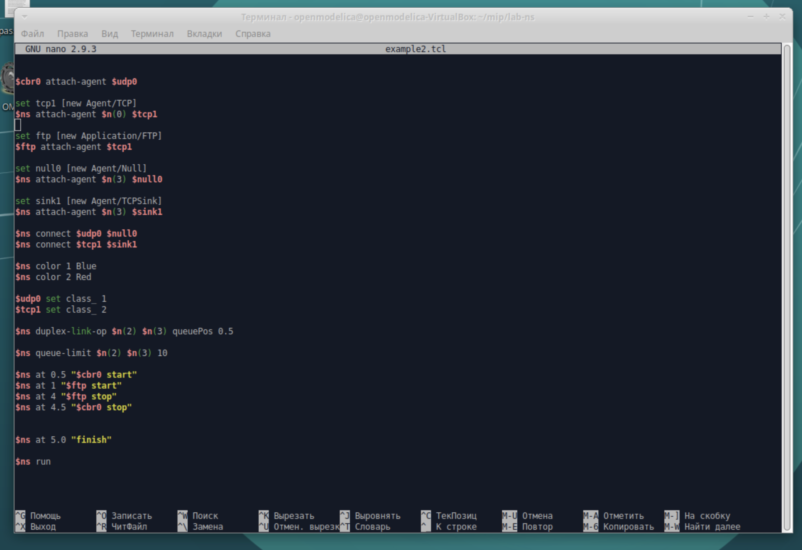{#fig:008 width=40%}  

## Пример с кольцевой топологией сети

Постановка задачи. Требуется построить модель передачи данных по сети с кольцевой топологией и динамической маршрутизацией пакетов:
– сеть состоит из 7 узлов, соединённых в кольцо;
– данные передаются от узла n(0) к узлу n(3) по кратчайшему пути;
– с 1 по 2 секунду модельного времени происходит разрыв соединения между узлами n(1) и n(2);
– при разрыве соединения маршрут передачи данных должен измениться на резервный.

## Реализация модели. 

Скопируем содержимое созданного шаблона в новый файл и откроем example3.tcl на редактирование. Опишем топологию моделируемой сети.  Далее соединим узлы так, чтобы создать круговую топологию. Каждый узел, за исключением последнего, соединяется со следующим, последний соединяется с первым. Для этого в цикле использован оператор %, означающий остаток от деления нацело.
Зададим передачу данных от узла n(0) к узлу n(3). Данные передаются по кратчайшему маршруту от узла n(0) к узлу n(3), через узлы n(1) и n(2) 

## Передача данных по кратчайшему пути сети с кольцевой топологией

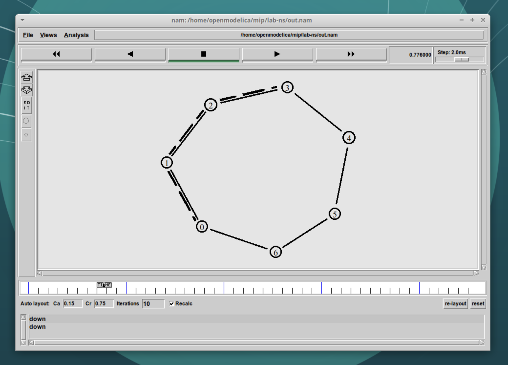{#fig:009 width=30%}  

## Передача данных по сети с кольцевой топологией в случае разрыва соединения

Добавим команду разрыва соединения между узлами n(1) и n(2) на время в одну секунду, а также время начала и окончания передачи данных. Передача данных при кольцевой топологии сети в случае разрыва соединения.

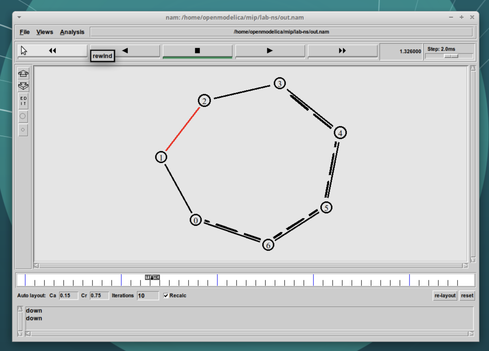{#fig:010 width=30%}

## Передача данных по сети с кольцевой топологией в случае разрыва соединения

Добавив в начало скрипта после команды создания объекта Simulator, увидим, что сразу после запуска в сети отправляется небольшое количество маленьких пакетов, используемых для обмена информацией, необходимой для маршрутизации между узлами. Когда соединение будет разорвано, информация о топологии будет обновлена, и пакеты будут отсылаться по новому маршруту через узлы n(6), n(5) и n(4).

## Скрипт модели с кольцевой топологией

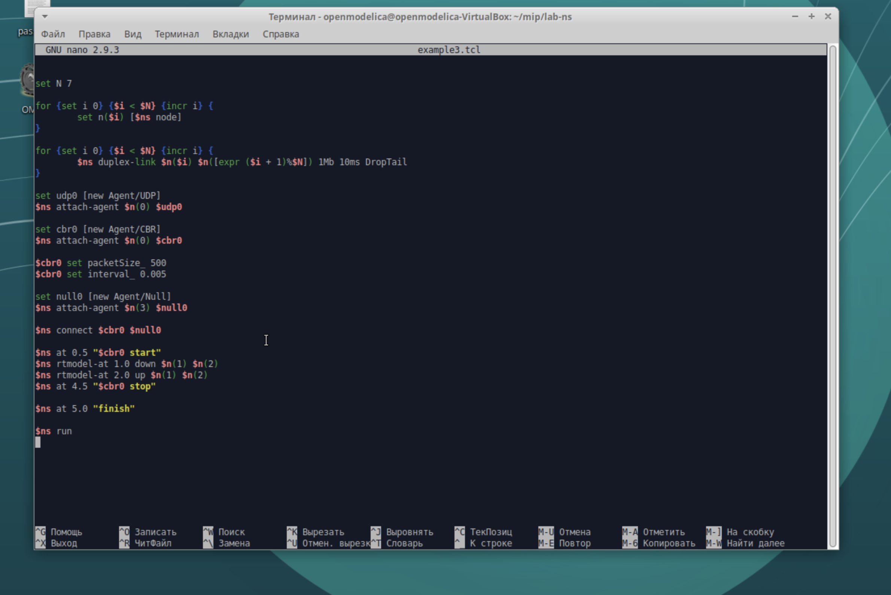{#fig:012 width=30%}  

## Выполнение упражнения

Упражнение. Внесите следующие изменения в реализацию примера с кольцевой топологией сети:
– повторить топологию сети, предоставленную в файле с заданиями к лаборатороной работе;
– передача данных должна осуществляться от узла n(0) до узла n(5) по кратчайшему пути в течение 5 секунд модельного времени;
– передача данных должна идти по протоколу TCP (тип Newreno), на принимающей стороне используется TCPSink-объект типа DelAck; поверх TCP работает протокол FTP с 0,5 до 4,5 секунд модельного времени;
– с 1 по 2 секунду модельного времени происходит разрыв соединения между узлами n(0) и n(1);
– при разрыве соединения маршрут передачи данных должен измениться на резервный, после восстановления соединения пакеты снова должны пойти по кратчайшему пути.

## Скрипт модели из упражнения

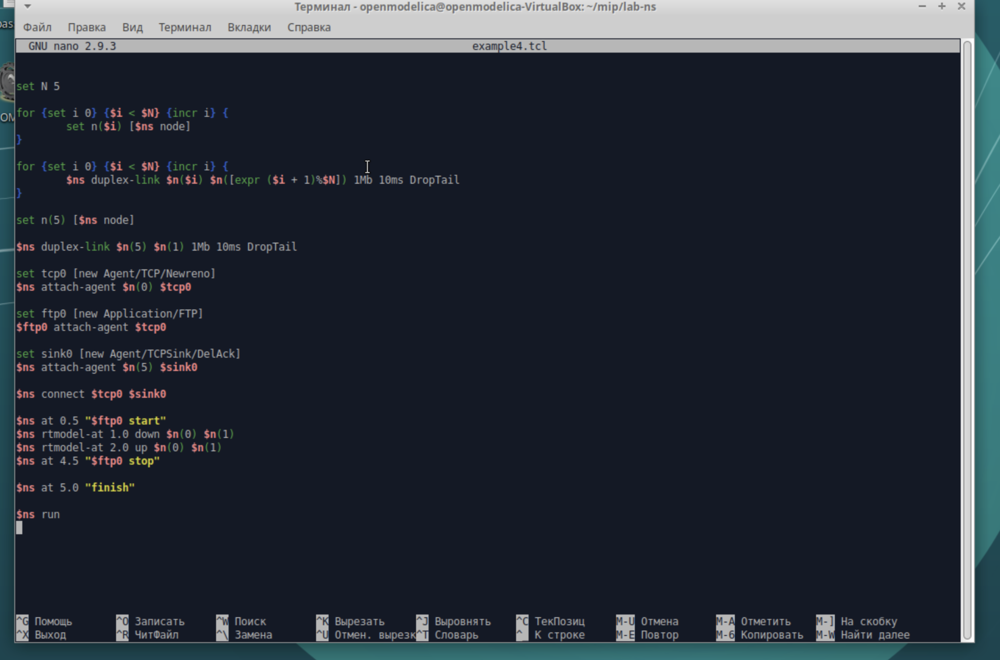{#fig:013 width=30%}  

## Топология сети.

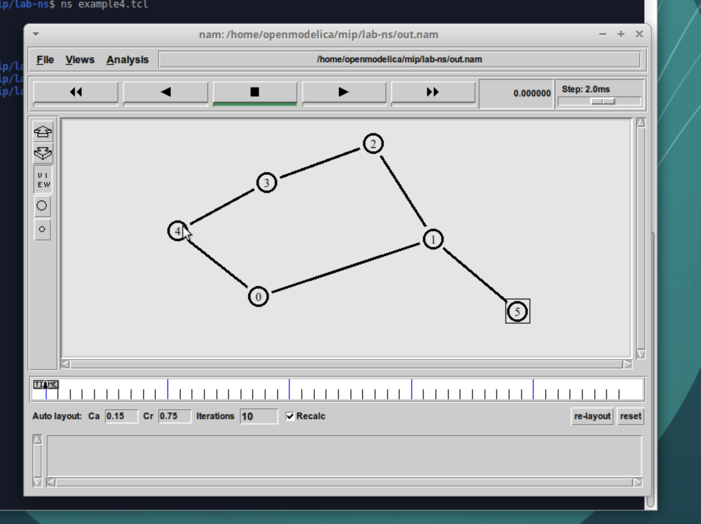{#fig:014 width=30%}  

## Движение по кратчайшему пути. 

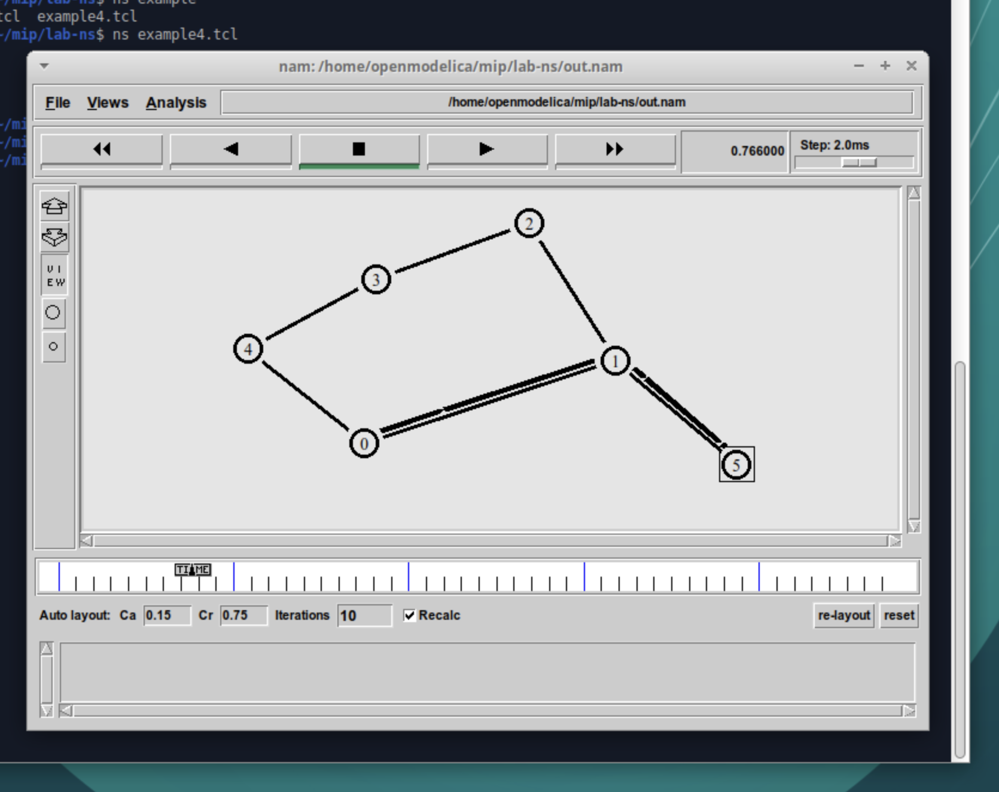{#fig:015 width=30%}  

## Разрыв связи между узлами.

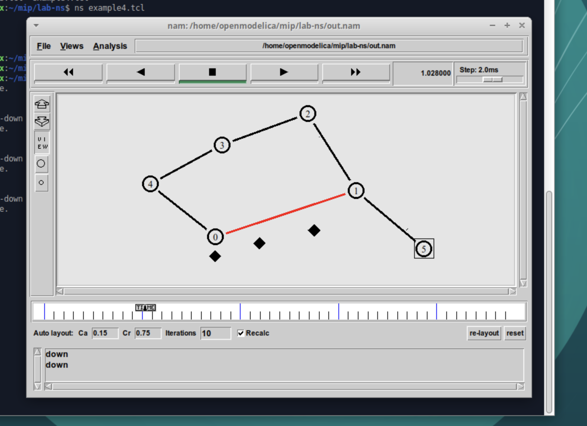{#fig:016 width=30%}  

## Движение по длинному пути. 

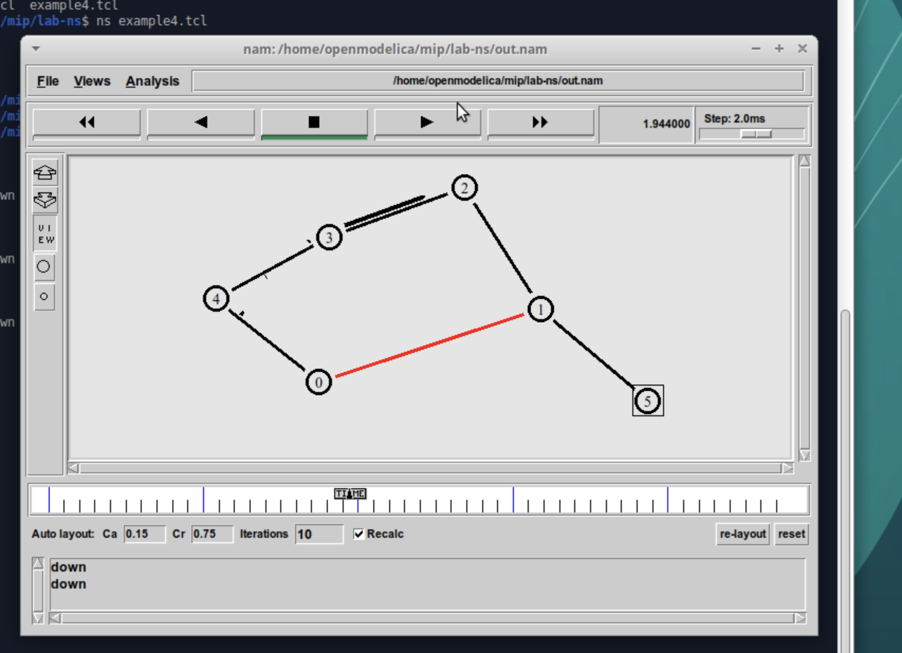{#fig:017 width=30%}  

# Выводы

Мы приобрели навыки моделирования сетей передачи данных с помощью средства имитационного моделирования NS-2, а также провели анализ полученных результатов моделирования.