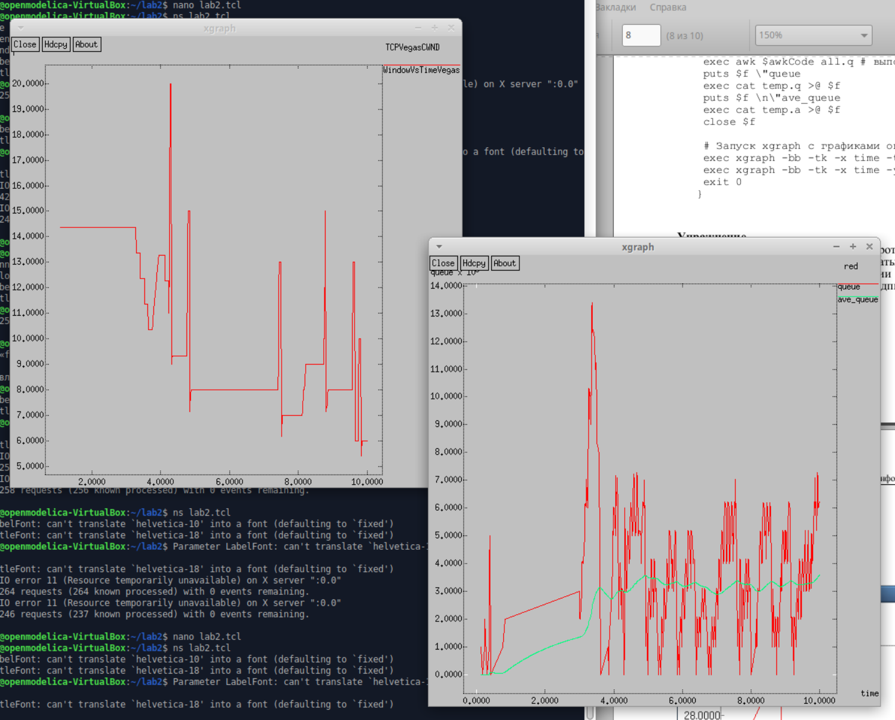

---
## Front matter
lang: ru-RU
title: Лабораторная работа №2
subtitle: "Исследование протокола TCP и алгоритма управления очередью RED"
author:
  - Кадров Виктор Максимович
teacher:
  - Кулябов Д. С.
  - д.ф.-м.н., профессор
  - профессор кафедры теории вероятностей и кибербезопасности 
institute:
  - Российский университет дружбы народов имени Патриса Лумумбы, Москва, Россия
date: 16 февраля 2025

## i18n babel
babel-lang: russian
babel-otherlangs: english

## Formatting pdf
toc: false
toc-title: Содержание
slide_level: 2
aspectratio: 169
section-titles: true
theme: metropolis
header-includes:
 - \metroset{progressbar=frametitle,sectionpage=progressbar,numbering=fraction}
---

## Цель работы

Исследовать протокол TCP и алгоритм управления очередью RED.

## Задание

1. Рассмотреть пример с дисциплиной RED.
2. Изменить в модели на узле s1 тип протокола TCP с Reno на NewReno, затем на Vegas. Сравнить и пояснить результаты.
3. Внести изменения при отображении окон с графиками (изменить цвет фона, цвет траекторий, подписи к осям, подпись траектории в легенде).

## Пример с дисциплиной RED.

Постановка задачи. Описание моделируемой сети:
– сеть состоит из 6 узлов;
– между всеми узлами установлено дуплексное соединение с различными пропускной способностью и задержкой 10 мс;
– узел r1 использует очередь с дисциплиной RED для накопления пакетов, максимальный размер которой составляет 25;
– TCP-источники на узлах s1 и s2 подключаются к TCP-приёмнику на узле s3;
– генераторы трафика FTP прикреплены к TCP-агентам.

## Скрипт модели с дисциплиной RED

{#fig:001 width=35%}

## Скрипт модели с дисциплиной RED

{#fig:002 width=50%}

## График динамики размера окна TCP(сверху) и график динамики длины очереди и среденей длины очереди(снизу) при типе протокола TCP Reno на узле s1. 

{#fig:003 width=30%}

## Изменения в модели на узле s1 типа протокола TCP с Reno на NewReno, затем на Vegas. 

Скрипт изменений на узле s1 типа протокола TCP с Reno на Newreno.

{#fig:004 width=70%}  

## График динамики размера окна TCP(сверху) и график динамики длины очереди и среденей длины очереди(снизу) при типе протокола TCP NewReno на узле s1. 

{#fig:005 width=30%}

## Скрипт изменений на узле s1 типа протокола TCP с Reno на Vegas. 

{#fig:006 width=70%}  

## График динамики размера окна TCP(сверху) и график динамики длины очереди и среденей длины очереди(снизу) при типе протокола TCP Vegas на узле s1.

{#fig:007 width=30%}

## Изменения при отображении окон с графиками (изменить цвет фона, цвет траекторий, подписи к осям, подпись траектории в легенде).

Изменение процедуры finish.

{#fig:008 width=40%} 

## Изменение мониторинга размера окна TCP. 

{#fig:009 width=70%} 

## Результаты изменений отображения окон с графиками. 

{#fig:010 width=40%}

## Выводы

Мы исследовали протокол TCP и алгоритм управления очередью RED.
