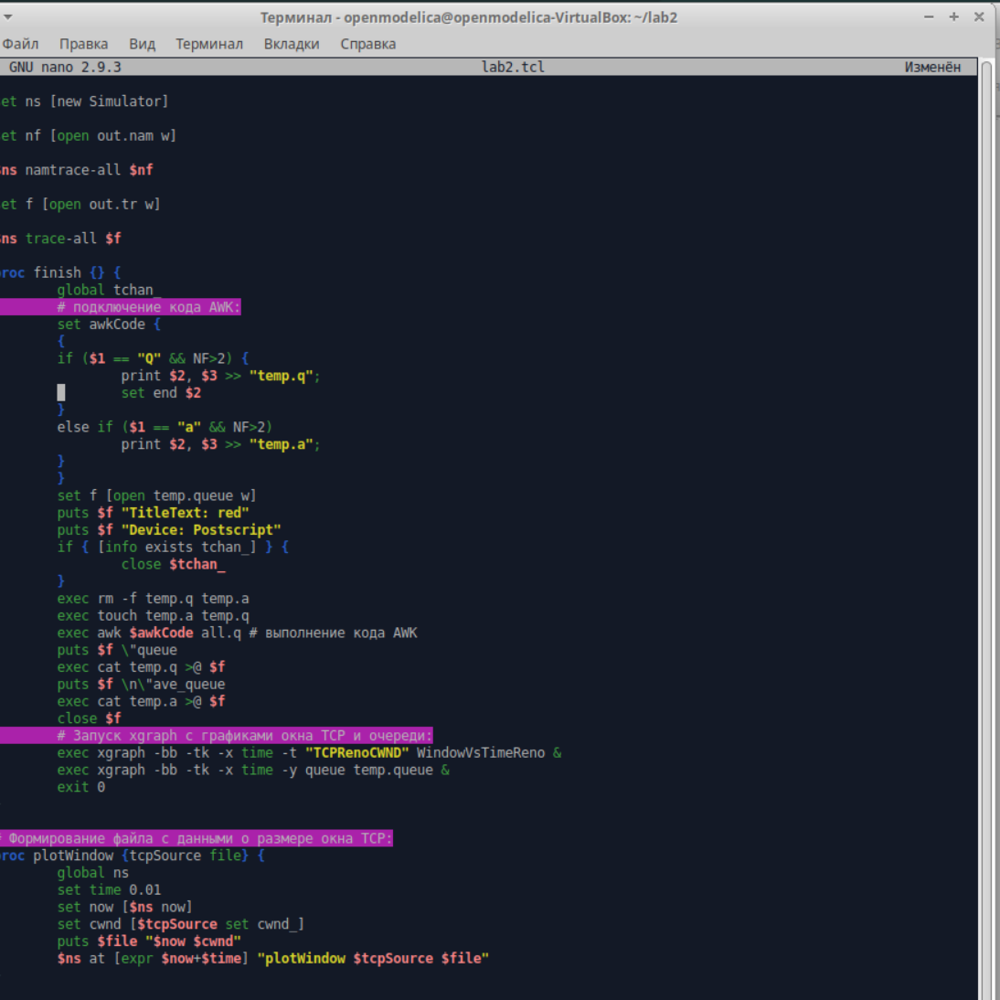
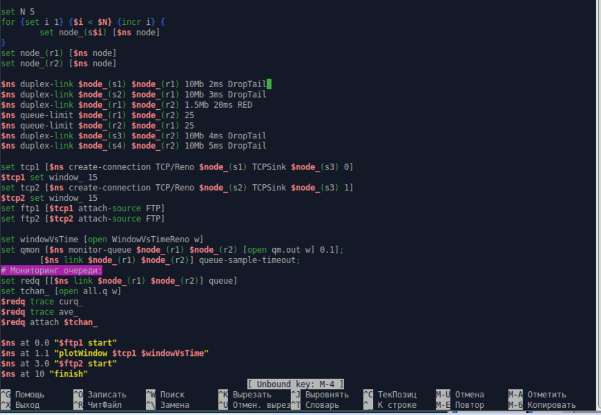
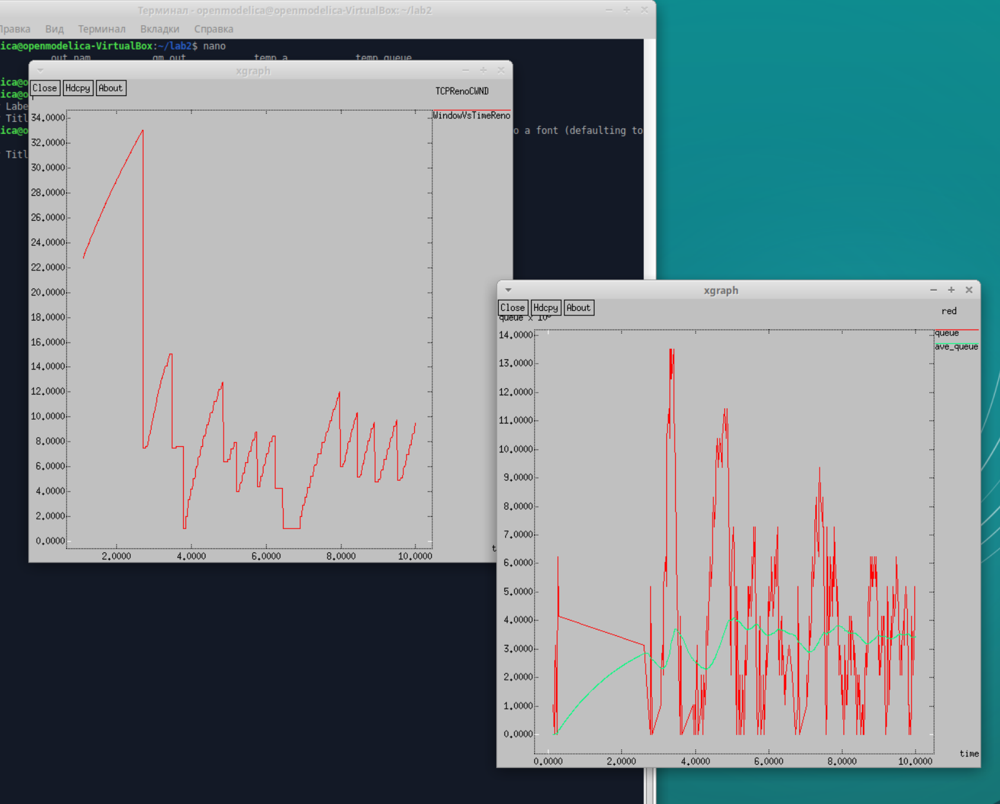
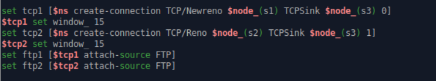
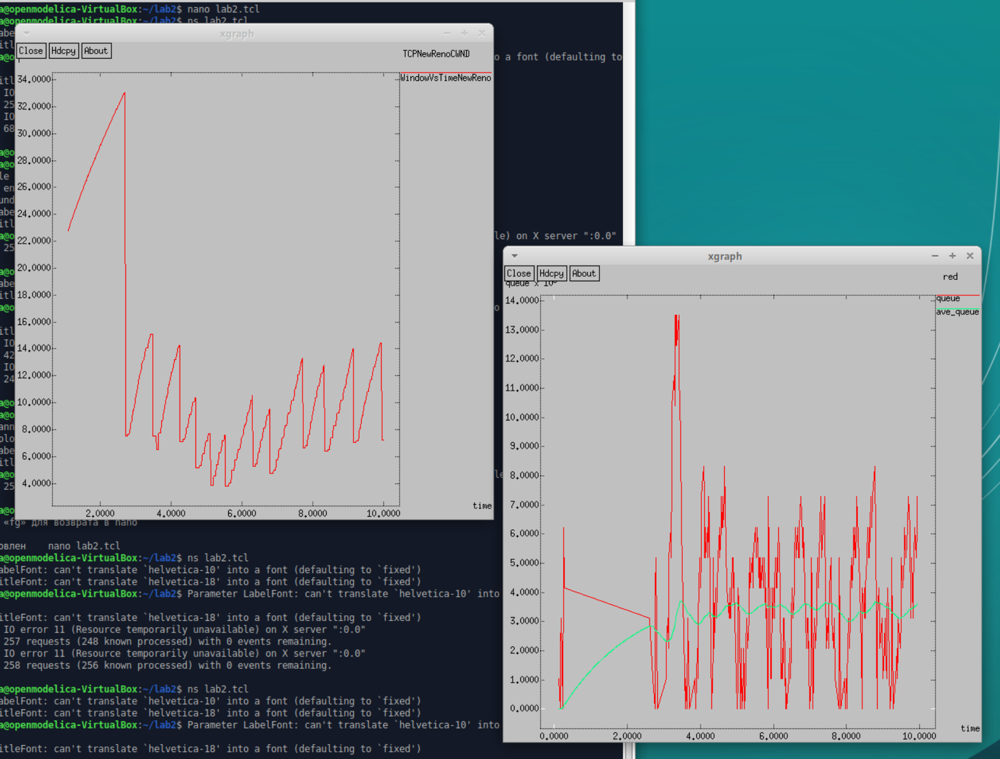
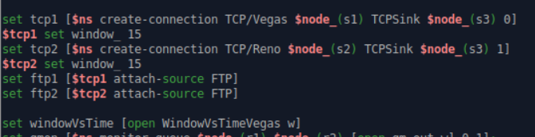
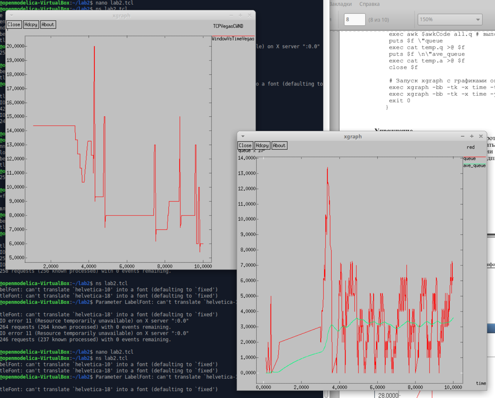
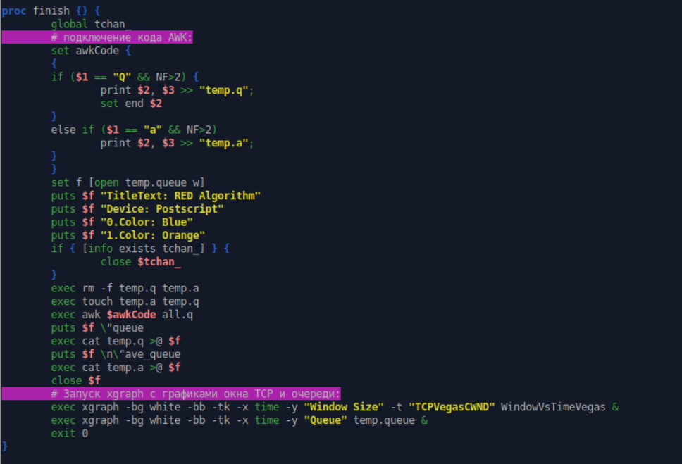
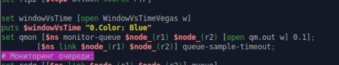
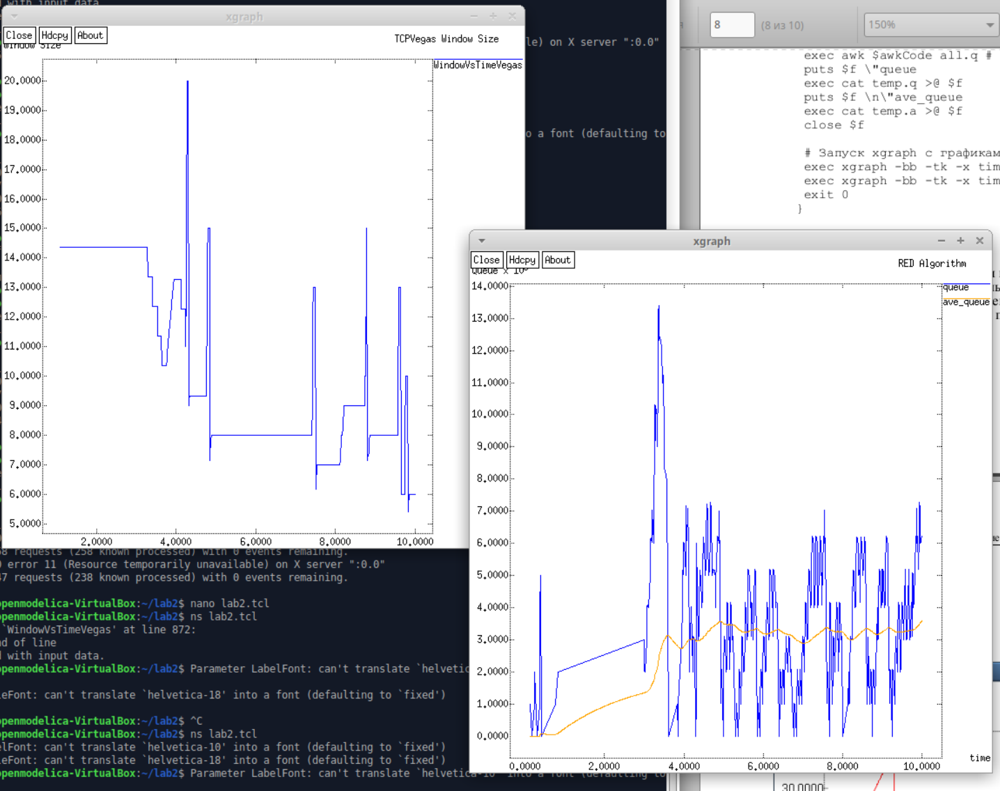

---
## Front matter
title: "Лабораторная работа №2"
subtitle: "Исследование протокола TCP и алгоритма управления очередью RED"
author: "Кадров Виктор Максимович"

## Generic otions
lang: ru-RU
toc-title: "Содержание"

## Bibliography
bibliography: bib/cite.bib
csl: pandoc/csl/gost-r-7-0-5-2008-numeric.csl

## Pdf output format
toc: true # Table of contents
toc-depth: 2
lof: true # List of figures
lot: false # List of tables
fontsize: 12pt
linestretch: 1.5
papersize: a4
documentclass: scrreprt
## I18n polyglossia
polyglossia-lang:
  name: russian
  options:
	- spelling=modern
	- babelshorthands=true
polyglossia-otherlangs:
  name: english
## I18n babel
babel-lang: russian
babel-otherlangs: english
## Fonts
mainfont: IBM Plex Serif
romanfont: IBM Plex Serif
sansfont: IBM Plex Sans
monofont: IBM Plex Mono
mathfont: STIX Two Math
mainfontoptions: Ligatures=Common,Ligatures=TeX,Scale=0.94
romanfontoptions: Ligatures=Common,Ligatures=TeX,Scale=0.94
sansfontoptions: Ligatures=Common,Ligatures=TeX,Scale=MatchLowercase,Scale=0.94
monofontoptions: Scale=MatchLowercase,Scale=0.94,FakeStretch=0.9
mathfontoptions:
## Biblatex
biblatex: true
biblio-style: "gost-numeric"
biblatexoptions:
  - parentracker=true
  - backend=biber
  - hyperref=auto
  - language=auto
  - autolang=other*
  - citestyle=gost-numeric
## Pandoc-crossref LaTeX customization
figureTitle: "Рис."
tableTitle: "Таблица"
listingTitle: "Листинг"
lofTitle: "Список иллюстраций"
lotTitle: "Список таблиц"
lolTitle: "Листинги"
## Misc options
indent: true
header-includes:
  - \usepackage{indentfirst}
  - \usepackage{float} # keep figures where there are in the text
  - \floatplacement{figure}{H} # keep figures where there are in the text
---

# Цель работы

Исследовать протокол TCP и алгоритм управления очередью RED[@lab]. 

# Задание

1. Рассмотреть пример с дисциплиной RED.
2. Изменить в модели на узле s1 тип протокола TCP с Reno на NewReno, затем на Vegas. Сравнить и пояснить результаты.
3. Внести изменения при отображении окон с графиками (изменить цвет фона, цвет траекторий, подписи к осям, подпись траектории в легенде).

# Выполнение лабораторной работы

## Пример с дисциплиной RED.

Постановка задачи. Описание моделируемой сети:
– сеть состоит из 6 узлов;
– между всеми узлами установлено дуплексное соединение с различными пропускной способностью и задержкой 10 мс;
– узел r1 использует очередь с дисциплиной RED для накопления пакетов, максимальный размер которой составляет 25;
– TCP-источники на узлах s1 и s2 подключаются к TCP-приёмнику на узле s3;
– генераторы трафика FTP прикреплены к TCP-агентам.

Первая часть скрипта модели с дисциплиной RED. (рис. [-@fig:001]) 

{#fig:001 width=70%}

Вторая часть скрипта модели с дисциплиной RED. (рис. [-@fig:002])

{#fig:002 width=70%}

График динамики размера окна TCP(сверху) и график динамики длины очереди и среденей длины очереди(снизу) при типе протокола TCP Reno на узле s1. (рис. [-@fig:003]).

{#fig:003 width=70%}

## Изменения в модели на узле s1 типа протокола TCP с Reno на NewReno, затем на Vegas. 

Скрипт изменений на узле s1 типа протокола TCP с Reno на Newreno. (рис. [-@fig:004]).

{#fig:004 width=70%}  

График динамики размера окна TCP(сверху) и график динамики длины очереди и среденей длины очереди(снизу) при типе протокола TCP NewReno на узле s1. (рис. [-@fig:005]).

{#fig:005 width=70%}

TCP NewReno:
Улучшенная версия Reno, устраняющая его недостатки:  
- Улучшенный Fast Recovery. TCP NewReno остается в режиме восстановления после первой потери пакета и корректно обрабатывает несколько потерянных пакетов за один цикл передачи.  
- Более точный механизм обнаружения потерь и адаптации скорости.    

Скрипт изменений на узле s1 типа протокола TCP с Reno на Vegas. (рис. [-@fig:006]).

{#fig:006 width=70%}  

График динамики размера окна TCP(сверху) и график динамики длины очереди и среденей длины очереди(снизу) при типе протокола TCP Vegas на узле s1. (рис. [-@fig:007]).

{#fig:007 width=70%}

TCP Vegas:
TCP Vegas использует другой подход:  
- Оценивает задержку пакетов вместо того, чтобы просто реагировать на потери.  
- Контролирует перегрузку до ее возникновения, измеряя разницу между ожидаемой и реальной скоростью передачи.  
- Более гладкая регулировка CWND, без резких изменений, как в Reno/NewReno.  

## Изменения при отображении окон с графиками (изменить цвет фона, цвет траекторий, подписи к осям, подпись траектории в легенде).

Изменение процедуры finish. (рис. [-@fig:008]).

{#fig:008 width=70%} 

Изменение мониторинга размера окна TCP. (рис. [-@fig:009]).

{#fig:009 width=70%} 

Результаты изменений отображения окон с графиками. (рис. [-@fig:010]).

{#fig:010 width=70%}

# Выводы

Мы исследовали протокол TCP и алгоритм управления очередью RED.

# Список литературы{.unnumbered}

::: {#refs}
:::
