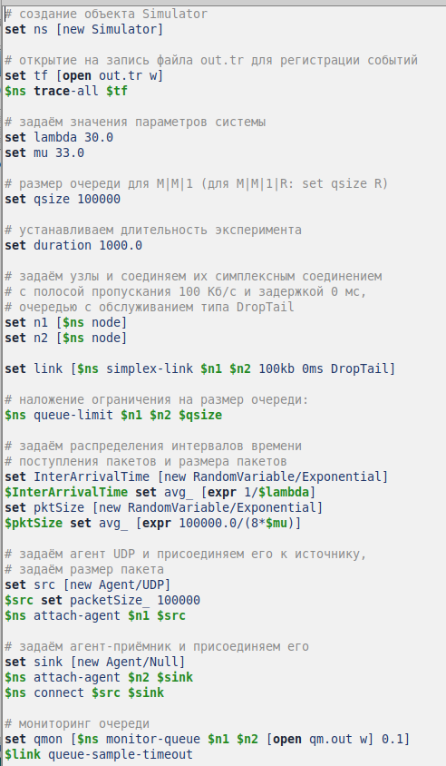
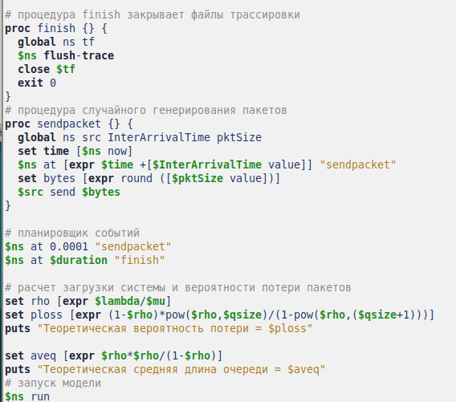
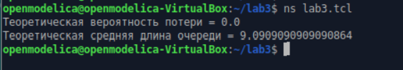
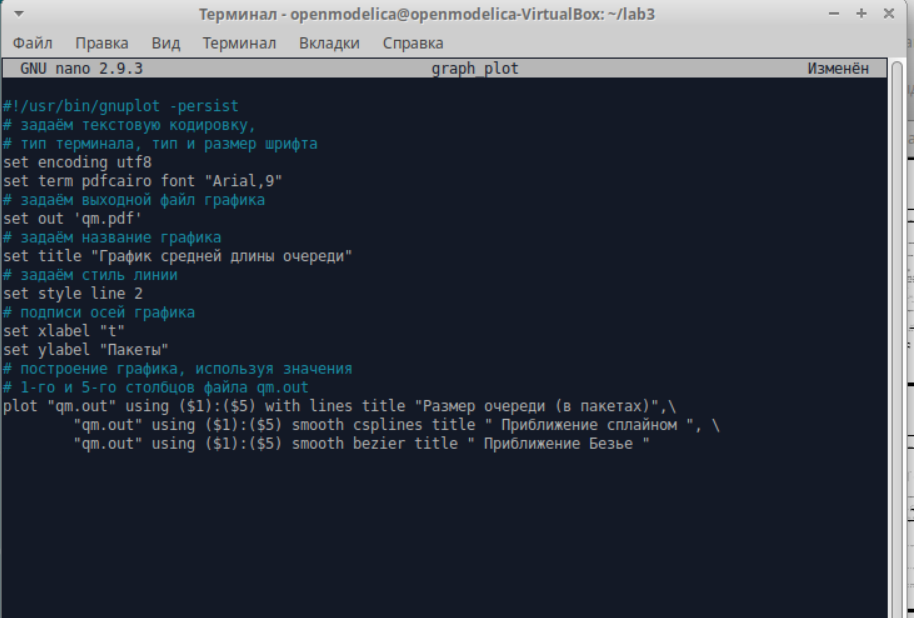
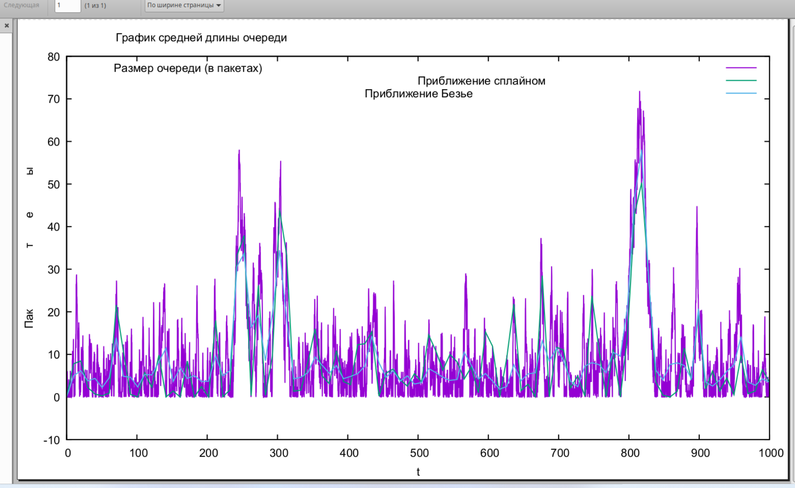

---
## Front matter
lang: ru-RU
title: Лабораторная работа №3
subtitle: "Моделирование стохастических процессов"
author:
  - Кадров Виктор Максимович
teacher:
  - Кулябов Д. С.
  - д.ф.-м.н., профессор
  - профессор кафедры теории вероятностей и кибербезопасности 
institute:
  - Российский университет дружбы народов имени Патриса Лумумбы, Москва, Россия
date: 12 апреля 2025

## i18n babel
babel-lang: russian
babel-otherlangs: english

## Formatting pdf
toc: false
toc-title: Содержание
slide_level: 2
aspectratio: 169
section-titles: true
theme: metropolis
header-includes:
 - \metroset{progressbar=frametitle,sectionpage=progressbar,numbering=fraction}
---

## Цель работы

Смоделировать систему массового обслуживания и построить график поведения длины очереди.

## Задание

1. Реализовать модель системы массового обслуживания M/M/1 и рассчитать характеристики модели.
2. Построить график поведения длины очереди.

## Реализация модели M/M/1.

M|M|1 — однолинейная СМО с накопителем бесконечной ёмкости. Поступающий поток заявок — пуассоновский с интенсивностью λ. Времена обслуживания заявок — независимые в совокупности случайные величины, распределённые по экспоненциальному закону с параметром µ. Рассмотрим реализацию данной модели с параметрами системы: lambda = 30.0 mu = 33.0.

## Реализация модели M/M/1

{#fig:001 width=25%}

## Реализация модели M/M/1

{#fig:001 width=50%}

## Реализация модели M/M/1

После запуска модели, были получены данные характеристики системы.

{#fig:001 width=70%}

## Построить график поведения длины очереди

В каталоге с проектом создадим отдельный файл, например, graph_plot. Откроем его на редактирование и добавим следующий код, обращая внимание на синтаксис GNUplot:

{#fig:001 width=50%}

## Построить график поведения длины очереди

Сделаем файл исполняемым. После компиляции файла с проектом, запустим скрипт в созданном файле graph_plot, который создаст файл qm.pdf с результатами моделирования. Измение прав доступа файла graph_plot. И запуск скрипта.

{#fig:002 width=70%}

## График поведения длины очереди

Результаты моделирования. График поведения длины очереди.

{#fig:003 width=70%}

## Выводы

Мы смоделировали систему массового обслуживания и построили график поведения длины очереди. 
