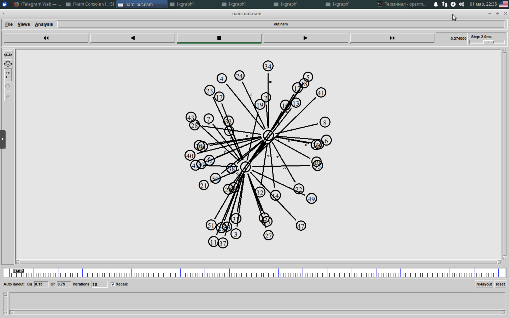
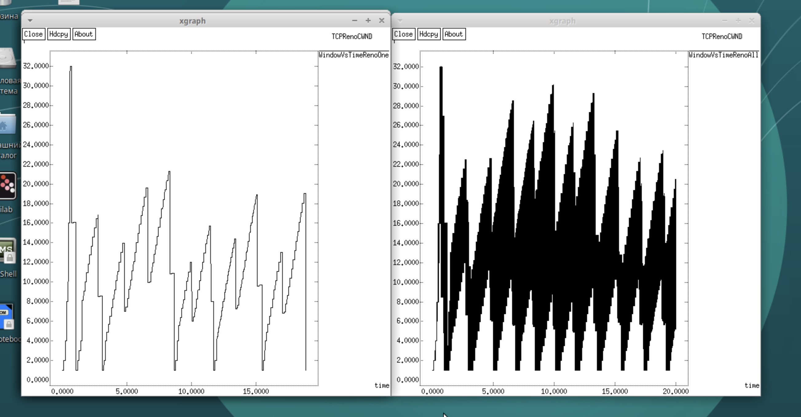
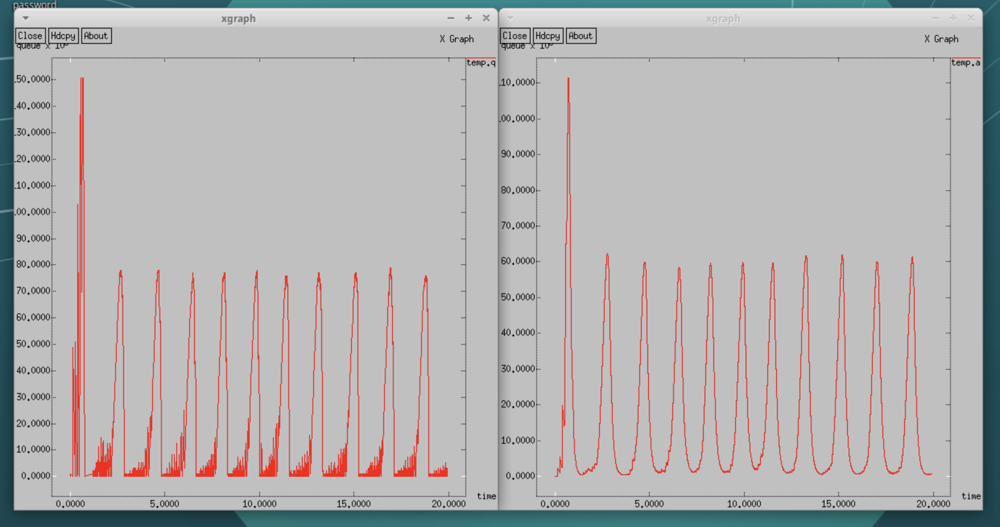
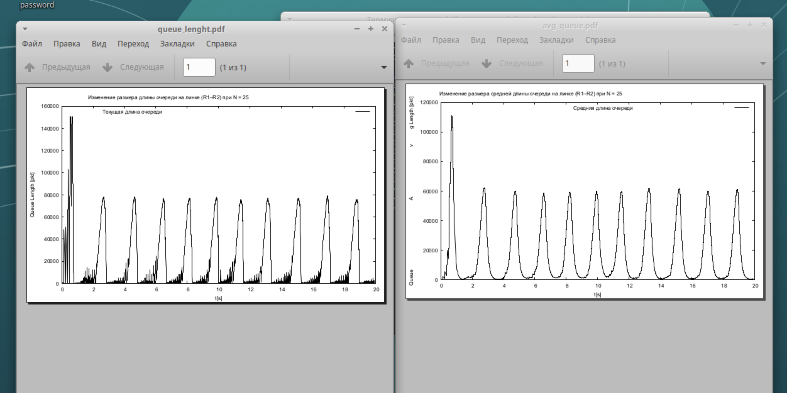

---
## Front matter
title: "Лабораторная работа №4"
subtitle: "Задание для самостоятельного выполнения"
author: "Кадров Виктор Максимович"

## Generic otions
lang: ru-RU
toc-title: "Содержание"

## Bibliography
bibliography: bib/cite.bib
csl: pandoc/csl/gost-r-7-0-5-2008-numeric.csl

## Pdf output format
toc: true # Table of contents
toc-depth: 2
lof: true # List of figures
lot: false # List of tables
fontsize: 12pt
linestretch: 1.5
papersize: a4
documentclass: scrreprt
## I18n polyglossia
polyglossia-lang:
  name: russian
  options:
	- spelling=modern
	- babelshorthands=true
polyglossia-otherlangs:
  name: english
## I18n babel
babel-lang: russian
babel-otherlangs: english
## Fonts
mainfont: PT Serif
romanfont: PT Serif
sansfont: PT Sans
monofont: PT Mono
mainfontoptions: Ligatures=TeX
romanfontoptions: Ligatures=TeX
sansfontoptions: Ligatures=TeX,Scale=MatchLowercase
monofontoptions: Scale=MatchLowercase,Scale=0.9
## Biblatex
biblatex: true
biblio-style: "gost-numeric"
biblatexoptions:
  - parentracker=true
  - backend=biber
  - hyperref=auto
  - language=auto
  - autolang=other*
  - citestyle=gost-numeric
## Pandoc-crossref LaTeX customization
figureTitle: "Рис."
tableTitle: "Таблица"
listingTitle: "Листинг"
lofTitle: "Список иллюстраций"
lotTitle: "Список таблиц"
lolTitle: "Листинги"
## Misc options
indent: true
header-includes:
  - \usepackage{indentfirst}
  - \usepackage{float} # keep figures where there are in the text
  - \floatplacement{figure}{H} # keep figures where there are in the text
---

# Цель работы

Выполнение самостоятельного задания. 

# Задание

1. Для приведённой схемы разработать имитационную модель в пакете NS-2.
2. Построить график изменения размера окна TCP (в Xgraph и в GNUPlot);
3. Построить график изменения длины очереди и средней длины очереди на первом маршрутизаторе.


# Выполнение лабораторной работы

## Реализация имитационной модели.

Описание моделируемой сети: 
- сеть состоит из N TCP-источников, N TCP-приёмников, двух маршрутизаторов R1 и R2 между источниками и приёмниками (N — не менее 20); 
- между TCP-источниками и первым маршрутизатором установлены дуплексные соединения с пропускной способностью 100 Мбит/с и задержкой 20 мс очередью типа DropTail; 
- между TCP-приёмниками и вторым маршрутизатором установлены дуплексные соединения с пропускной способностью 100 Мбит/с и задержкой 20 мс очередью типа DropTail; 
- между маршрутизаторами установлено симплексное соединение (R1–R2) с пропускной способностью 20 Мбит/с и задержкой 15 мс очередью типа RED, размером буфера 300 пакетов; в обратную сторону — симплексное соединение (R2–R1) с пропускной способностью 15 Мбит/с и задержкой 20 мс очередью типа DropTail; 
- данные передаются по протоколу FTP поверх TCPReno; 
- параметры алгоритма RED: q_min = 75, q_max = 150, q_w = 0, 002, p_max = 0.1; 
- максимальный размер TCP-окна 32; размер передаваемого пакета 500 байт; время моделирования — не менее 20 единиц модельного времени. 
```
# создание объекта Simulator
set ns [new Simulator]

# открытие на запись файла out.nam для визуализатора nam
set nf [open out.nam w]

# все результаты моделирования будут записаны в переменную nf
$ns namtrace-all $nf

# открытие на запись файла трассировки out.tr для регистрации всех событий
set f [open out.tr w]

# все регистрируемые события будут записаны в переменную f
$ns trace-all $f

Agent/TCP set window_ 32
Agent/TCP set pktSize_ 500

# процедура finish
proc finish {} {
	global tchan_
	# подключение кода AWK:
	set awkCode {
	{
		if ($1 == "Q" && NF>2) {
			print $2, $3 >> "temp.q";
			set end $2
	}
		else if ($1 == "a" && NF>2)
			print $2, $3 >> "temp.a";
	}
}


  exec rm -f temp.q temp.a
  exec touch temp.a temp.q

  set f [open temp.q w]
  puts $f "0.Color: Orange"
  close $f

  set f [open temp.a w]
  puts $f "0.Color: Orange"
  close $f

  exec awk $awkCode all.q

  # Запуск xgraph с графиками окна TCP и очереди:
  exec xgraph -bg white -bb -tk -x time -t "TCPRenoCWND" WindowVsTimeRenoOne &
  exec xgraph -bg white -bb -tk -x time -t "TCPRenoCWND" WindowVsTimeRenoAll &
  exec xgraph -bb -tk -x time -y queue temp.q &
  exec xgraph -bb -tk -x time -y queue temp.a &
  exec nam out.nam &
  exit 0
}

# Формирование файла с данными о размере окна TCP:
proc plotWindow {tcpSource file} {
	global ns
	set time 0.01
	set now [$ns now]
	set cwnd [$tcpSource set cwnd_]
	puts $file "$now $cwnd"
	$ns at [expr $now+$time] "plotWindow $tcpSource $file"
}

set r1 [$ns node]
set r2 [$ns node]

$ns simplex-link $r1 $r2 20Mb 15ms RED
$ns simplex-link $r2 $r1 15Mb 20ms DropTail
$ns queue-limit $r1 $r2 300

set N 25
for {set i 0} {$i < $N} {incr i} {
	set n1($i) [$ns node]
	$ns duplex-link $n1($i) $r1 100Mb 20ms DropTail
	set n2($i) [$ns node]
	$ns duplex-link $n2($i) $r2 100Mb 20ms DropTail

	set tcp($i) [$ns create-connection TCP/Reno $n1($i) TCPSink $n2($i) $i]
	set ftp($i) [$tcp($i) attach-source FTP]
}

# Мониторинг размера окна TCP:
set windowVsTimeOne [open WindowVsTimeRenoOne w]
puts $windowVsTimeOne "0.Color: Black"
set windowVsTimeAll [open WindowVsTimeRenoAll w]
puts $windowVsTimeAll "0.Color: Black"

set qmon [$ns monitor-queue $r1 $r2 [open qm.out w] 0.1];
[$ns link $r1 $r2] queue-sample-timeout;

# Мониторинг очереди:
set redq [[$ns link $r1 $r2] queue]
$redq set thresh_ 75
$redq set maxthresh_ 150
$redq set q_weight_ 0.002
$redq set linterm_ 10

set tchan_ [open all.q w]
$redq trace curq_
$redq trace ave_
$redq attach $tchan_

for {set i 0} {$i < $N} {incr i} {
	$ns at 0.0 "$ftp($i) start"
	$ns at 0.0 "plotWindow $tcp($i) $windowVsTimeAll"
}

$ns at 0.0 "plotWindow $tcp(1) $windowVsTimeOne"

# at-событие для планировщика событий, которое запускает
# процедуру finish через 20s после начала моделирования
$ns at 20.0 "finish"
# запуск модели
$ns run
```
После запуска модели, была получена следующая симуляция. (рис. [-@fig:001])

{#fig:001 width=70%}

Были получены графики изменения окна TCP на линке 1-го источника и на всех источниках. (рис. [-@fig:002])

{#fig:002 width=70%}

Также были получены графики размера длины очереди и средней длины очереди на линке (R1-R2). (рис. [-@fig:003])

{#fig:003 width=70%}

## Построить графики изменения окна TCP в GNUPlot.

В каталоге с проектом создадим отдельный файл, например, gnu_plot. Откроем его на редактирование и добавим следующий код, обращая внимание на синтаксис GNUplot:

```
#!/usr/bin/gnuplot -persist
# задаём текстовую кодировку,
# тип терминала, тип и размер шрифта

set encoding utf8
set term pdfcairo font "Arial,9"

# задаём выходной файл графика
set out 'window_1.pdf'

# задаём название графика
set title "Изменение размера окна TCP на линке 1-го источника при N = 25"

# подписи осей графика
set xlabel "t[s]" 
set ylabel "CWND [pkt]"

# построение графика, используя значения 1-го и 2-го столбцов файла WindowVsTimeRenoOne
plot "WindowVsTimeRenoOne" using ($1):($2) with lines lt rgb "black" title "Размер окна TCP на линке 1-го источника"

# задаём выходной файл графика
set out 'window_25.pdf'

# задаём название графика
set title "Изменение размера окна TCP на всех N источниках при N = 25"

# подписи осей графика
set xlabel "t[s]" 
set ylabel "CWND [pkt]"

# построение графика, используя значения 1-го и 2-го столбцов файла WindowVsTimeRenoAll
plot "WindowVsTimeRenoAll" using ($1):($2) with lines lt rgb "black" title "Размер окна TCP на всех источниках"

# задаём выходной файл графика
set out 'queue_lenght.pdf'

# задаём название графика
set title "Изменение размера длины очереди на линке (R1–R2) при N = 25"

# подписи осей графика
set xlabel "t[s]" 
set ylabel "Queue Length [pkt]"

# построение графика, используя значения 1-го и 2-го столбцов файла temp.q
plot "temp.q" using ($1):($2) with lines lt rgb "black" title "Текущая длина очереди"

# задаём выходной файл графика
set out 'avg_queue.pdf'

# задаём название графика
set title "Изменение размера средней длины очереди на линке (R1–R2) при N = 25"

# подписи осей графика
set xlabel "t[s]" 
set ylabel "Queue Avg Length [pkt]" 

# построение графика, используя значения
# 1-го и 2-го столбцов файла temp.a
plot "temp.a" using ($1):($2) with lines lt rgb "black" title "Средняя длина очереди"

```
Были получены графики изменения окна TCP на линке 1-го источника и на всех источниках. (рис. [-@fig:004])

{#fig:004 width=70%}

Также были получены графики размера длины очереди и средней длины очереди на линке (R1-R2). (рис. [-@fig:005])

{#fig:005 width=70%}

# Выводы

Мы выполнили самостоятельное задание.

# Список литературы{.unnumbered}

::: {#refs}
:::
