---
## Front matter
title: "Лабораторная работа №5"
subtitle: "Модель эпидемии (SIR)"
author: "Кадров Виктор Максимович"

## Generic otions
lang: ru-RU
toc-title: "Содержание"

## Bibliography
bibliography: bib/cite.bib
csl: pandoc/csl/gost-r-7-0-5-2008-numeric.csl

## Pdf output format
toc: true # Table of contents
toc-depth: 2
lof: true # List of figures
lot: false # List of tables
fontsize: 12pt
linestretch: 1.5
papersize: a4
documentclass: scrreprt
## I18n polyglossia
polyglossia-lang:
  name: russian
  options:
	- spelling=modern
	- babelshorthands=true
polyglossia-otherlangs:
  name: english
## I18n babel
babel-lang: russian
babel-otherlangs: english
## Fonts
mainfont: IBM Plex Serif
romanfont: IBM Plex Serif
sansfont: IBM Plex Sans
monofont: IBM Plex Mono
mathfont: STIX Two Math
mainfontoptions: Ligatures=Common,Ligatures=TeX,Scale=0.94
romanfontoptions: Ligatures=Common,Ligatures=TeX,Scale=0.94
sansfontoptions: Ligatures=Common,Ligatures=TeX,Scale=MatchLowercase,Scale=0.94
monofontoptions: Scale=MatchLowercase,Scale=0.94,FakeStretch=0.9
mathfontoptions:
## Biblatex
biblatex: true
biblio-style: "gost-numeric"
biblatexoptions:
  - parentracker=true
  - backend=biber
  - hyperref=auto
  - language=auto
  - autolang=other*
  - citestyle=gost-numeric
## Pandoc-crossref LaTeX customization
figureTitle: "Рис."
tableTitle: "Таблица"
listingTitle: "Листинг"
lofTitle: "Список иллюстраций"
lotTitle: "Список таблиц"
lolTitle: "Листинги"
## Misc options
indent: true
header-includes:
  - \usepackage{indentfirst}
  - \usepackage{float} # keep figures where there are in the text
  - \floatplacement{figure}{H} # keep figures where there are in the text
---

# Цель работы

Исслеодвать модель эпидемии(SIR) с помощью программы *xcos* и OpenModelica.

# Задание

- рассмотреть модель SIR в xcos (в том числе и с использованием блока Modelica), а также в OpenModelica;
- реализовать модель SIR с учётом процесса рождения / гибели особей в xcos (в том числе и с использованием блока Modelica), а также в OpenModelica;
- построить графики эпидемического порога при различных значениях параметров модели (в частности изменяя параметр µ);
- сделать анализ полученных графиков в зависимости от выбранных значений параметров модели.

# Выполнение лабораторной работы

## Математическая модель

$$
\begin{cases}
	\frac{dS}{dt} = - \frac{\beta I S}{N}, \\
	\frac{dI}{dt} = \frac{\beta I S}{N} - \gamma I, \\
	\frac{dR}{dt} = \gamma I,
\end{cases}
$$

где $S$ -- численность восприимчивой популяции, $I$ -- численность инфицированных, $R$ -- численность удаленной популяции (в результате смерти или выздоровления), и $N$ -- это сумма этих трёх, а $\beta$ и $\gamma$ - это коэффициенты заболеваемости и выздоровления соответственно[@SIR].

## Реализация модели в xcos

В меню Моделирование, Задать переменные окружения зададим значения переменных. (рис. [-@fig:001]).

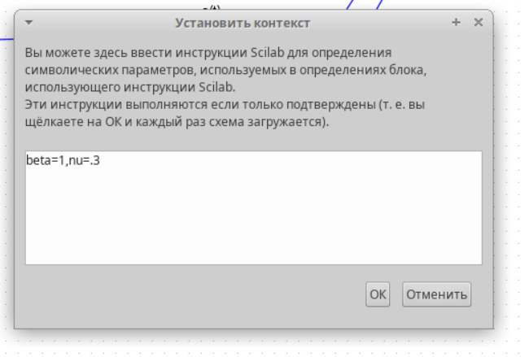{#fig:001 width=70%}

В модели, изображённой на рис. [-@fig:002], использованы следующие блоки xcos:
- CLOCK_c -- запуск часов модельного времени;
- CSCOPE -- регистрирующее устройство для построения графика;
- TEXT_f -- задаёт текст примечаний;
- MUX -- мультиплексер, позволяющий в данном случае вывести на графике сразу несколько кривых;
- INTEGRAL_m -- блок интегрирования;
- GAINBLK_f -- в данном случае позволяет задать значения коэффициентов $\beta$ и $\nu$;
- SUMMATION -- блок суммирования;
- PROD_f -- поэлементное произведение двух векторов на входе блока.

Первое уравнение модели задано верхним блоком интегрирования, блоком произведения и блоком задания коэффициента $\beta$. Блок произведения соединён с выходами верхнего и среднего блоков интегрирования и блоком коэффициента $\beta$, что реализует математическую конструкцию $\beta s(t)i(t)$. 

Третье уравнение модели задано нижним блоком интегрирования и блоком задания коэффициента $\nu$. Для реализации математической конструкции $\nu i(t)$ соединяем выход среднего блока интегрирования и вход блока задания коэффициента $\nu$, а результат передаём на вход нижнего блока интегрирования.

Средний блок интегрирования и блок суммирования определяют второе уравнение модели, которое по сути является суммой правых частей первого и третьего уравнений. Для реализации соединяем входы верхнего и нижнего блоков интегрирования с входами блока суммирования, меняя при этом в его параметрах оба знака на минус. Выход блока суммирования соединяем с входом среднего блока интегрирования.

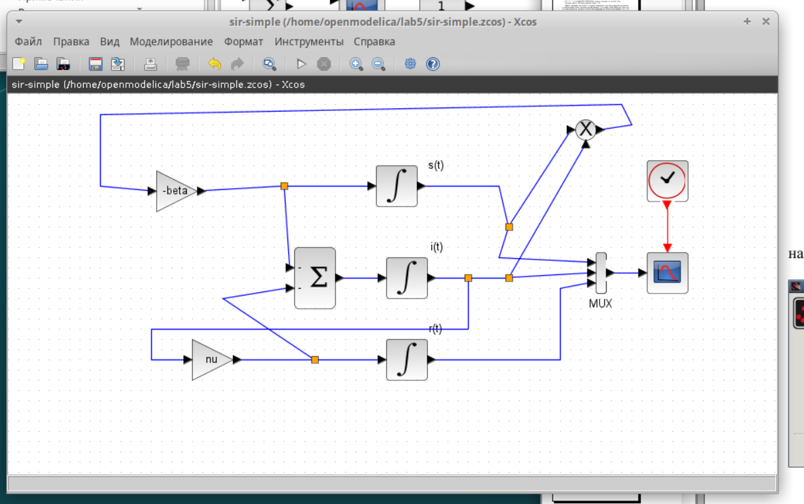{#fig:002 width=70%}

Зададим начальные значения в блоках интегрирования.  (рис. [-@fig:003], [-@fig:004]).

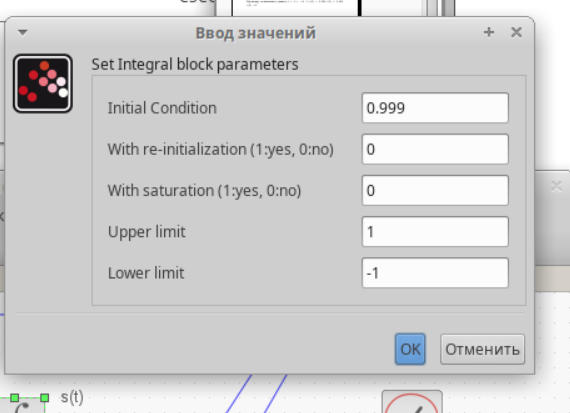{#fig:003 width=70%}

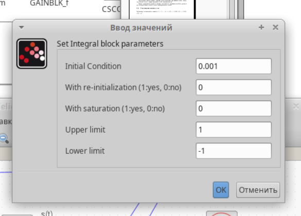{#fig:004 width=70%}

Зададим конечное время интегрирования. (рис. [-@fig:005]).

{#fig:005 width=70%}

Результат моделирования в xcos. (рис. [-@fig:006]).

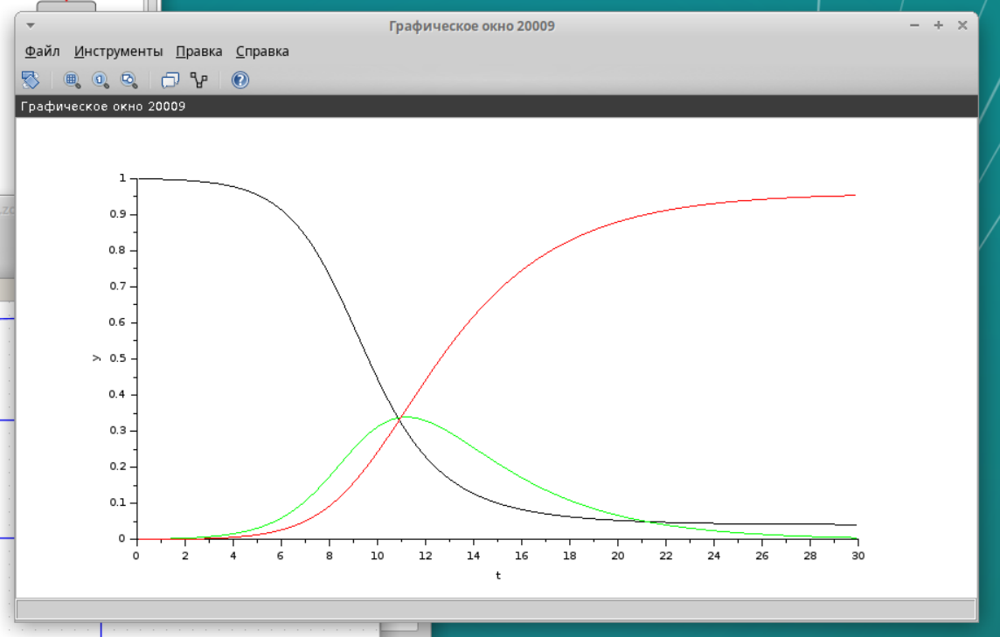{#fig:006 width=70%} 

## Реализация модели с помощью блока Modelica в xcos

Для реализации модели с помощью языка Modelica помимо блоков CLOCK_c, CSCOPE, TEXT_f и MUX требуются блоки CONST_m -- задаёт константу; MBLOCK(Modelica generic) -- блок реализации кода на языке Modelica(рис. [-@fig:007]).

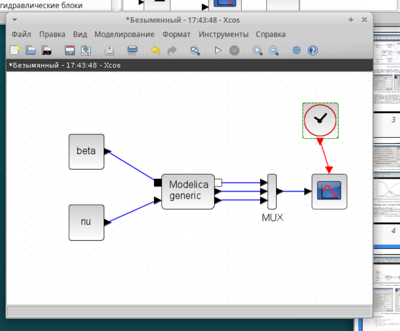{#fig:007 width=70%} 

Зададим параметры блока Modelica. Переменные на входе (“beta”,“nu”) и выходе (“s”, “i”, “r”) блока заданы как внешние (“E”). (рис. [-@fig:008])

{#fig:008 width=70%} 

Код на языке Modelica. (рис. [-@fig:009])

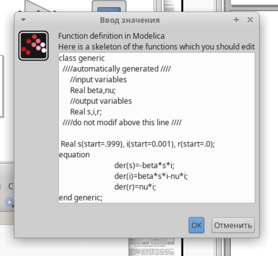{#fig:009 width=70%} 

Результат моделирования с помощью блока Modelica в xcos. (рис. [-@fig:010]).

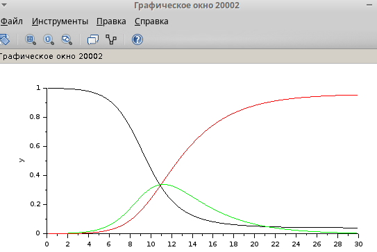{#fig:010 width=70%} 

## Реализация модели SIR в OpenModelica

Создадим файл модели, зададим дифференциальные уравнения и присвоим переменным значения. (рис. [-@fig:011]).

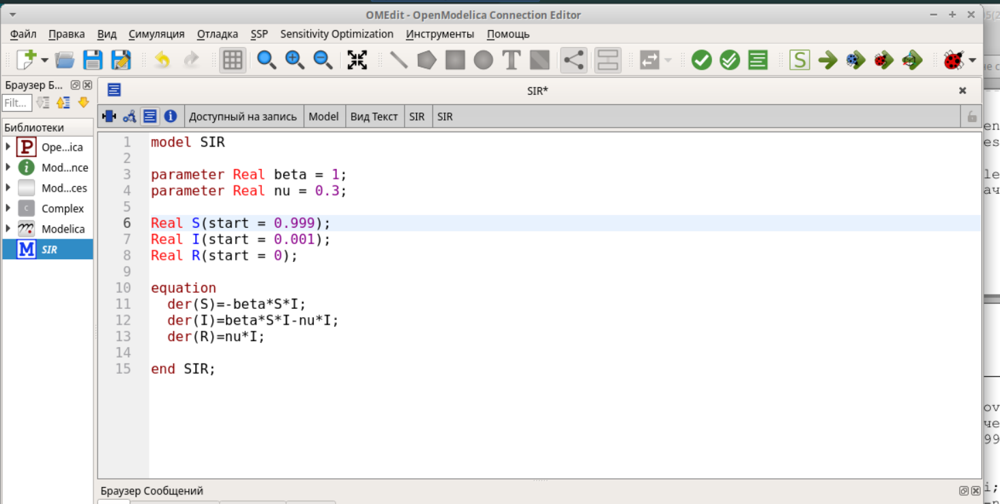{#fig:011 width=70%} 

Зададим интервал симуляции. (рис. [-@fig:012]).

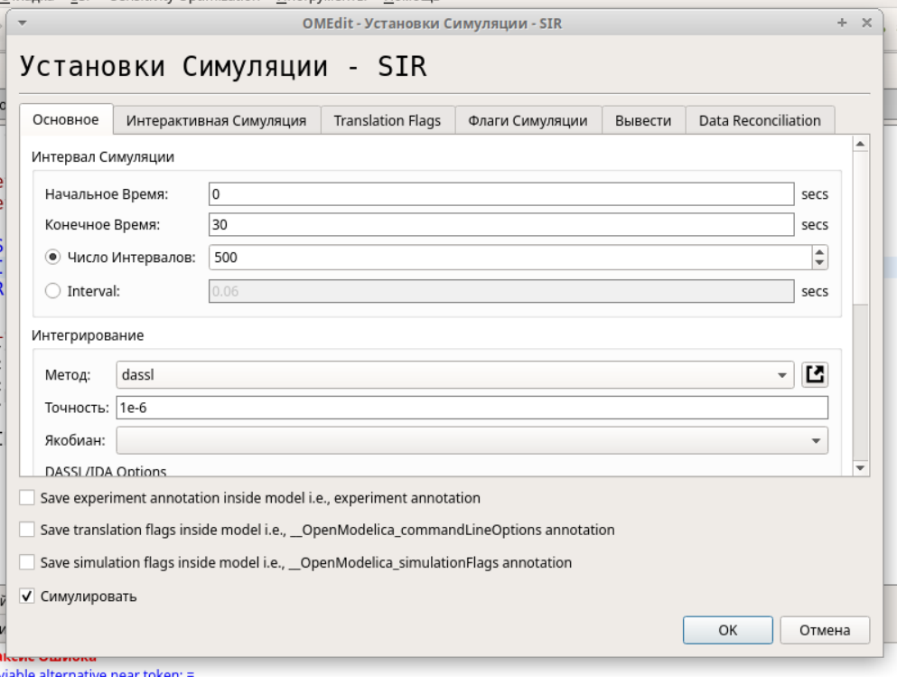{#fig:012 width=70%} 

Результат реализации модели SIR в OpenModelica (рис. [-@fig:013]).

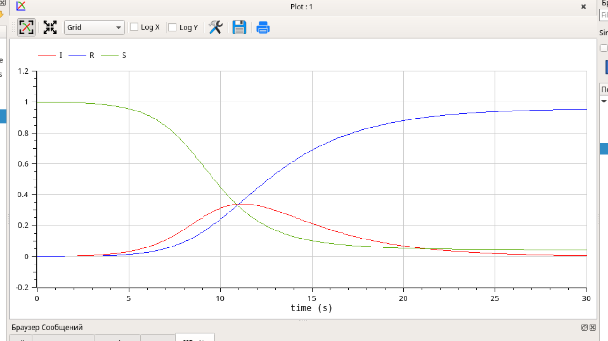{#fig:013 width=70%} 

# Задание для самостоятельного выполнения

## Модель SIR с учетом демографии

В дополнение к предположениям, которые были сделаны для модели SIR, предположим, что учитываются демографические процессы, в частности, что смертность в популяции полностью уравновешивает рождаемость, а все рожденные индивидуумы появляются на свет абсолютно здоровыми. Тогда получим следующую систему уравнений:

$$
\begin{cases}
\frac{dS}{dt} = - \beta I S + \mu (N - S), \\
\frac{dI}{dt} = \beta I S - \gamma I - \mu I, \\
\frac{dR}{dt} = \gamma I - \mu R,
\end{cases}
$$

где $\nu$ -- константа, которая равна коэффициенту смертности и рождаемости.

## Реализация модели в xcos

Для начала добавим переменную $\mu$ в Задать переменные окружения в xcos. Добавим необходимые для реализации модели блоки. (рис. [-@fig:014]).

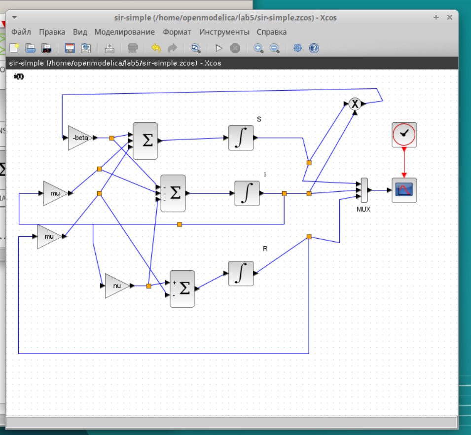{#fig:014 width=70%}

Результат моделирования. (рис. [-@fig:015]).

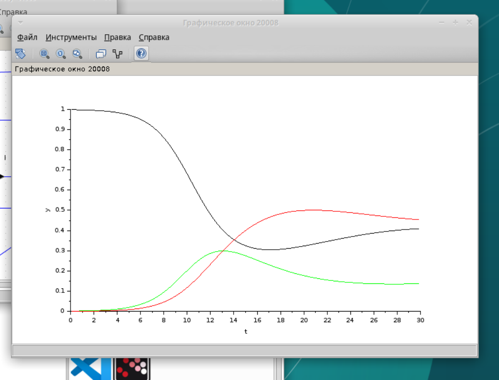{#fig:015 width=70%}

## Реализация модели с использованием блока Modelica в xcos

В изначальную реализацию с помощью блока Modelica добавим параметр $\mu$(рис. [-@fig:016]).

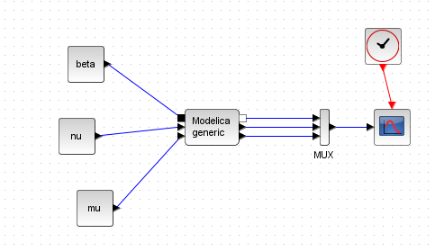{#fig:016 width=70%}

Также изменим данные блока Modelica(рис. [-@fig:017]).

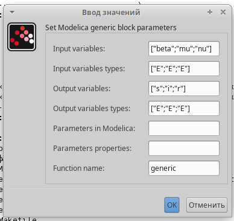{#fig:017 width=70%} 

Код на языке Modelica (рис. [-@fig:018]).

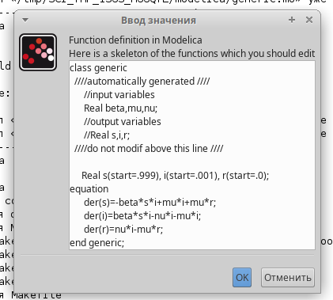{#fig:018 width=70%} 

Результат моделирования SIR с учетом демографии с помощью блока Modelica в xcos. (рис. [-@fig:019]).

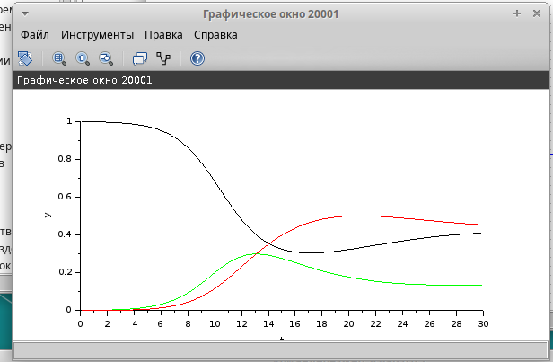{#fig:019 width=70%} 

## Реализация модели SIR с учетом демографии в OpenModelica

Создадим файл модели, зададим дифференциальные уравнения и присвоим переменным значения. (рис. [-@fig:020]).

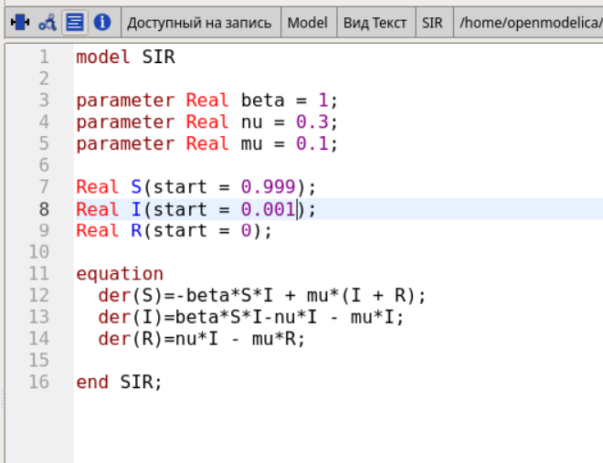{#fig:020 width=70%} 

Результат реализации модели SIR с учетом демографии в OpenModelica (рис. [-@fig:021]).

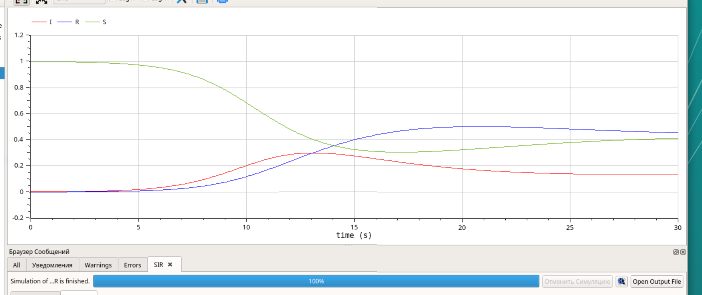{#fig:021 width=70%} 

## Анализ графиков при разных параметрах модели

Построим графики эпидемического порога при различных значениях параметров модели.

Когда параметр $\mu$ достигает значения 0.8(рис. [-@fig:022]) на графике появляются прямые. То есть рождается и умирает столько же здоровых, сколько заражается.

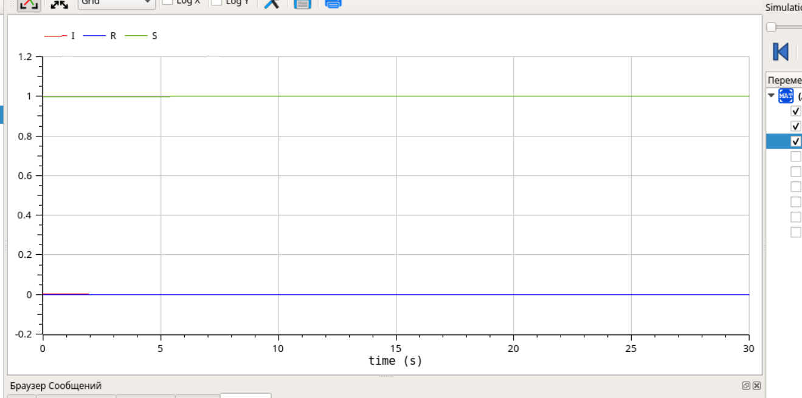{#fig:022 width=70%}

При значении параметра $\nu$ равным 0.4, данный параметр отвечает за скорость выздоравления, мы видим, что все три траектории на пересекаются на 30 секундном интервале, и траектория заразившихся накодится значительно ниже здоровых и выздоровивших. (рис. [-@fig:023]).

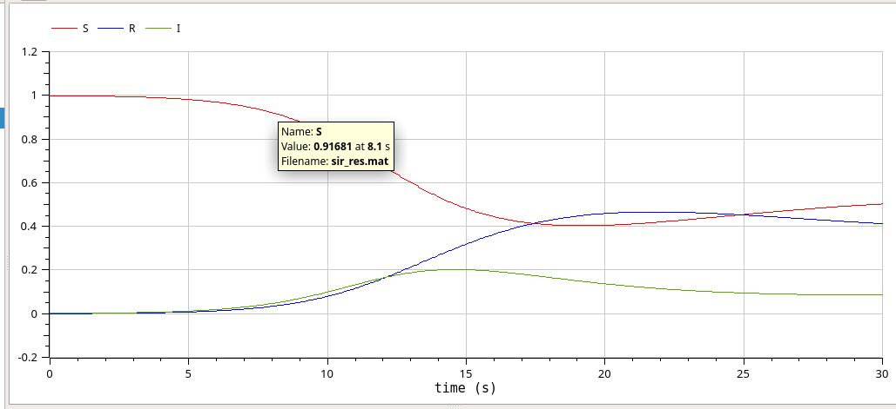{#fig:023 width=70%} 

Когда параметр $\mu$ опускается до значения 0.05(рис. [-@fig:024])  график становится похожим на первоначальный график, где мы не учитывали это значение. 

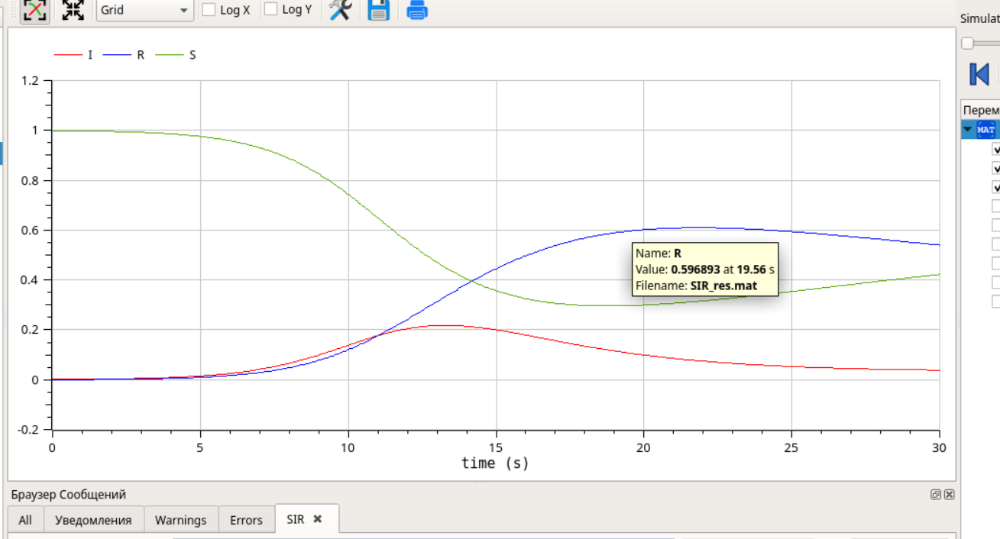{#fig:024 width=70%}

При значении параметра $\beta$ равным 4, данный параметр отвечает за скорость заражения, мы видим, что пик заражения наступает очень рано, резкая вспышка заболевших. Также можно заметить, что тогда система быстро приходит в стационарный режим (рис. [-@fig:025]).

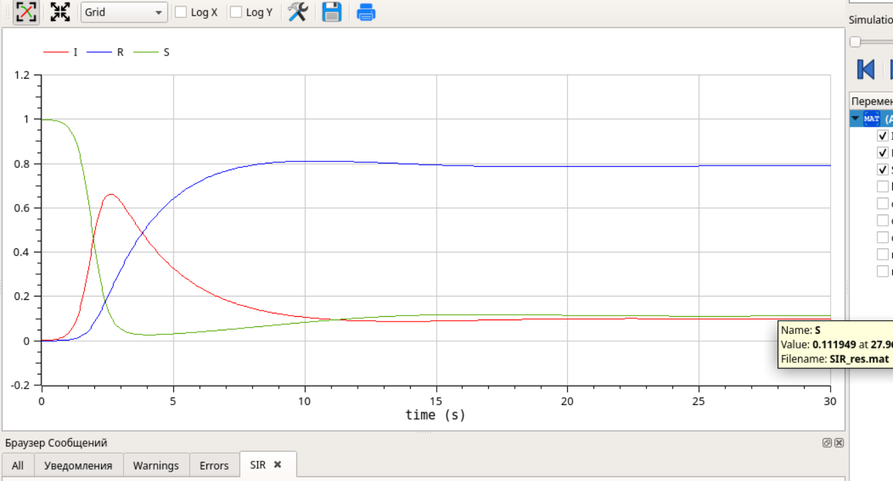{#fig:025 width=70%} 

Когда параметр $\mu$ достигает значения 0.4(рис. [-@fig:026]) можно заметить, что система быстро стремится к стационарному режиму.

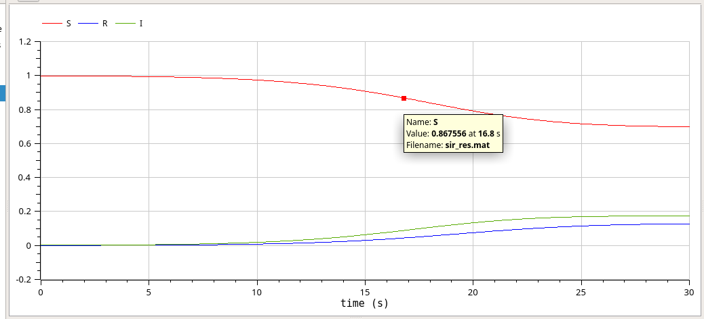{#fig:026 width=70%} 

# Выводы

Мы исслеодвали модель эпидемии(SIR) с помощью программы *xcos* и OpenModelica.

# Список литературы{.unnumbered}

::: {#refs}
:::
