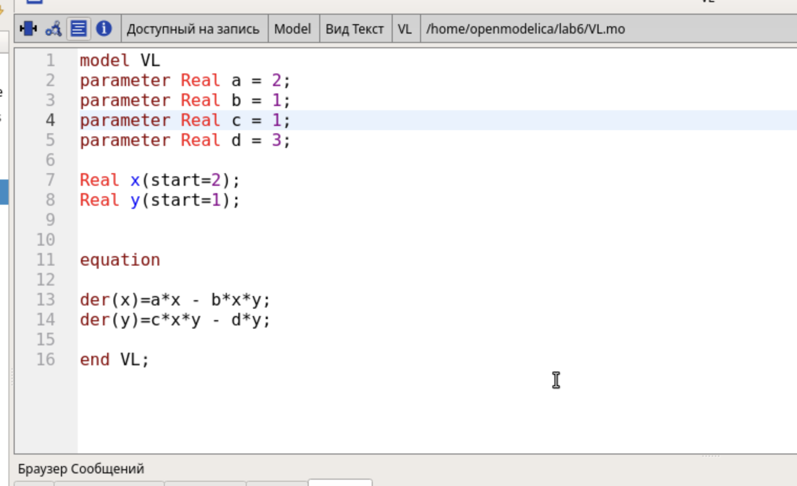
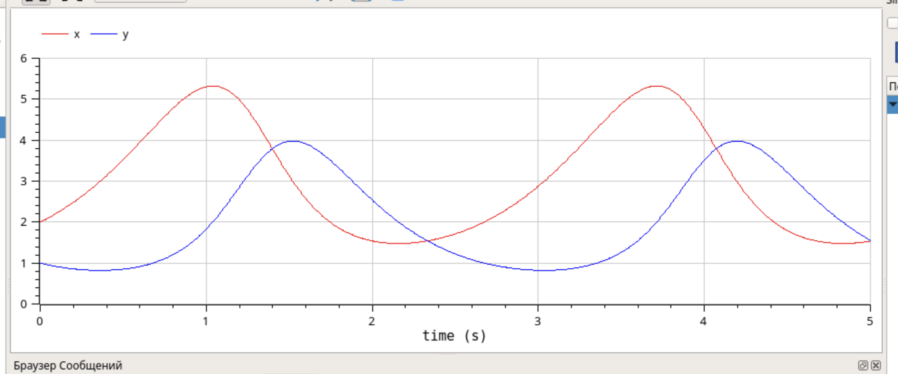
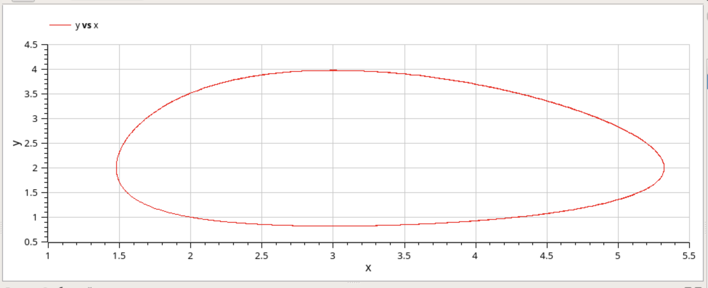

---
## Front matter
lang: ru-RU
title: Отчет по лабораторной работе №6
subtitle: Модель «хищник–жертва»
author:
  - Кадров В. М.
teacher:
  - Кулябов Д. С.
  - д.ф.-м.н., профессор
  - профессор кафедры теории вероятностей и кибербезопасности 
institute:
  - Российский университет дружбы народов имени Патриса Лумумбы, Москва, Россия
date: 8 марта 2025

## i18n babel
babel-lang: russian
babel-otherlangs: english

## Formatting pdf
toc: false
toc-title: Содержание
slide_level: 2
aspectratio: 169
section-titles: true
theme: metropolis
header-includes:
 - \metroset{progressbar=frametitle,sectionpage=progressbar,numbering=fraction}
---

# Задание

Реализуйте модель «хищник – жертва» в OpenModelica. Постройте
графики изменения численности популяций и фазовый портрет.

# Теоретическое введение

Модель «хищник–жертва» (модель Лотки — Вольтерры) представляет собой модель межвидовой конкуренции. В математической
форме модель имеет вид
$$
\begin{cases}
  \dot x = ax - bxy \\
  \dot y = cxy - dy,
\end{cases}
$$
где x — количество жертв; y — количество хищников; a, b, c, d — коэффициен-
ты, отражающие взаимодействия между видами: a — коэффициент рождаемости
жертв; b — коэффициент убыли жертв; c — коэффициент рождения хищников; d—
коэффициент убыли хищников.

# Выполнение лабораторной работы

## Код модели

Код модели был написан в OpenModelica. Также были заданы начальные условия и параметры системы.

{#fig:001 width=70%}

## Симуляция

После старта симуляции на 5с и 1000 шагов мы получили динамику изменения популяций и фазовый портрет системы.

{#fig:002 width=70%}

## Симуляция

{#fig:003 width=70%}

# Выводы

Модель «хищник – жертва» была реализована в OpenModelica.
