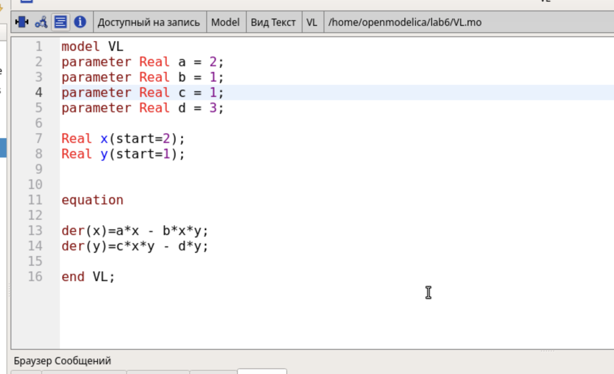
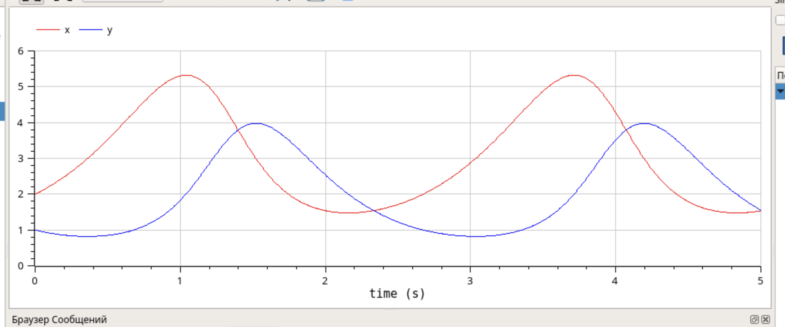
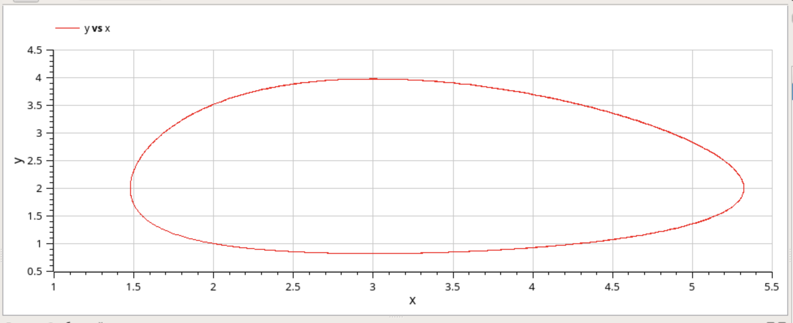

---
## Front matter
title: "Отчет по лабораторной работе №6"
subtitle: "Модель «хищник–жертва»"
author: "Кадров Виктор Максимович"

## Generic otions
lang: ru-RU
toc-title: "Содержание"

## Bibliography
bibliography: bib/cite.bib
csl: pandoc/csl/gost-r-7-0-5-2008-numeric.csl

## Pdf output format
toc: true # Table of contents
toc-depth: 2
lof: true # List of figures
lot: false # List of tables
fontsize: 12pt
linestretch: 1.5
papersize: a4
documentclass: scrreprt
## I18n polyglossia
polyglossia-lang:
  name: russian
  options:
	- spelling=modern
	- babelshorthands=true
polyglossia-otherlangs:
  name: english
## I18n babel
babel-lang: russian
babel-otherlangs: english
## Fonts
mainfont: IBM Plex Serif
romanfont: IBM Plex Serif
sansfont: IBM Plex Sans
monofont: IBM Plex Mono
mathfont: STIX Two Math
mainfontoptions: Ligatures=Common,Ligatures=TeX,Scale=0.94
romanfontoptions: Ligatures=Common,Ligatures=TeX,Scale=0.94
sansfontoptions: Ligatures=Common,Ligatures=TeX,Scale=MatchLowercase,Scale=0.94
monofontoptions: Scale=MatchLowercase,Scale=0.94,FakeStretch=0.9
mathfontoptions:
## Biblatex
biblatex: true
biblio-style: "gost-numeric"
biblatexoptions:
  - parentracker=true
  - backend=biber
  - hyperref=auto
  - language=auto
  - autolang=other*
  - citestyle=gost-numeric
## Pandoc-crossref LaTeX customization
figureTitle: "Рис."
tableTitle: "Таблица"
listingTitle: "Листинг"
lofTitle: "Список иллюстраций"
lotTitle: "Список таблиц"
lolTitle: "Листинги"
## Misc options
indent: true
header-includes:
  - \usepackage{indentfirst}
  - \usepackage{float} # keep figures where there are in the text
  - \floatplacement{figure}{H} # keep figures where there are in the text
---

# Задание

Реализуйте модель «хищник – жертва» в OpenModelica. Постройте
графики изменения численности популяций и фазовый портрет.

# Теоретическое введение

Модель «хищник–жертва» (модель Лотки — Вольтерры) представляет собой модель межвидовой конкуренции. В математической
форме модель имеет вид
$$
\begin{cases}
  \dot x = ax - bxy \\
  \dot y = cxy - dy,
\end{cases}
$$
где x — количество жертв; y — количество хищников; a, b, c, d — коэффициен-
ты, отражающие взаимодействия между видами: a — коэффициент рождаемости
жертв; b — коэффициент убыли жертв; c — коэффициент рождения хищников; d—
коэффициент убыли хищников.

# Выполнение лабораторной работы

Код модели был написан в OpenModelica. Также были заданы начальные условия и параметры системы (рис. [-@fig:001]).

{#fig:001 width=70%}

После старта симуляции на 5с и 1000 шагов мы получили динимаку изменения популяций (рис. [-@fig:002]) и фазовый портрет системы (рис. [-@fig:003]).

{#fig:002 width=70%}

{#fig:003 width=70%}

# Выводы

Модель «хищник – жертва» была реализована в OpenModelica.

# Список литературы{.unnumbered}

::: {#refs}
:::
