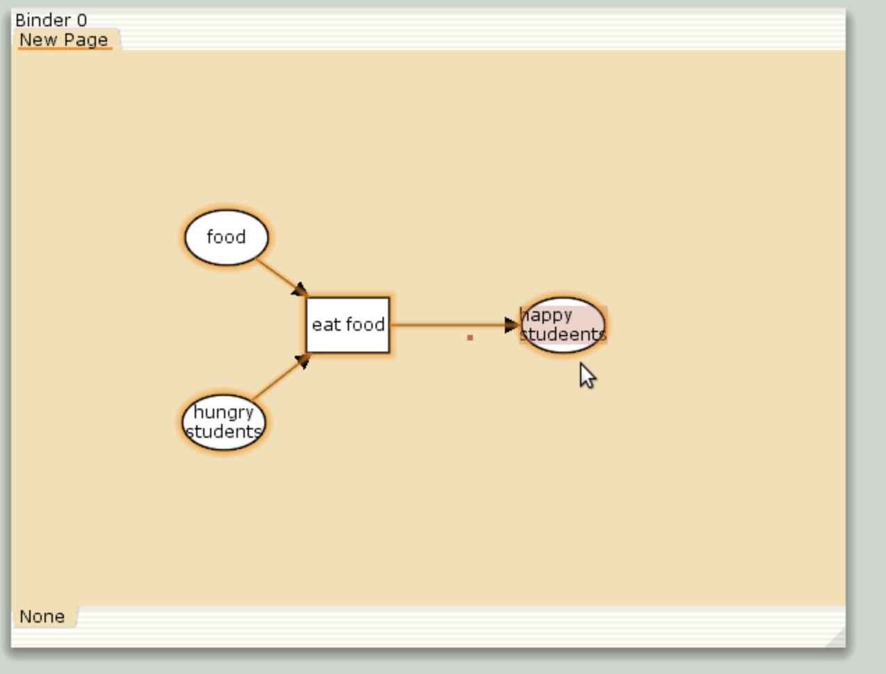
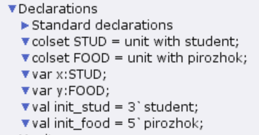
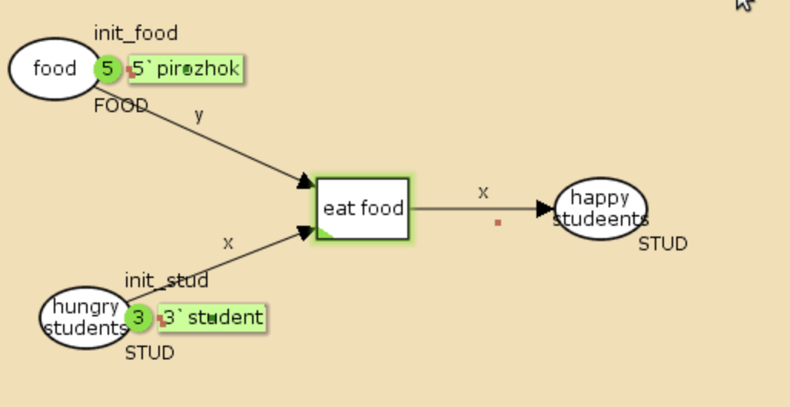
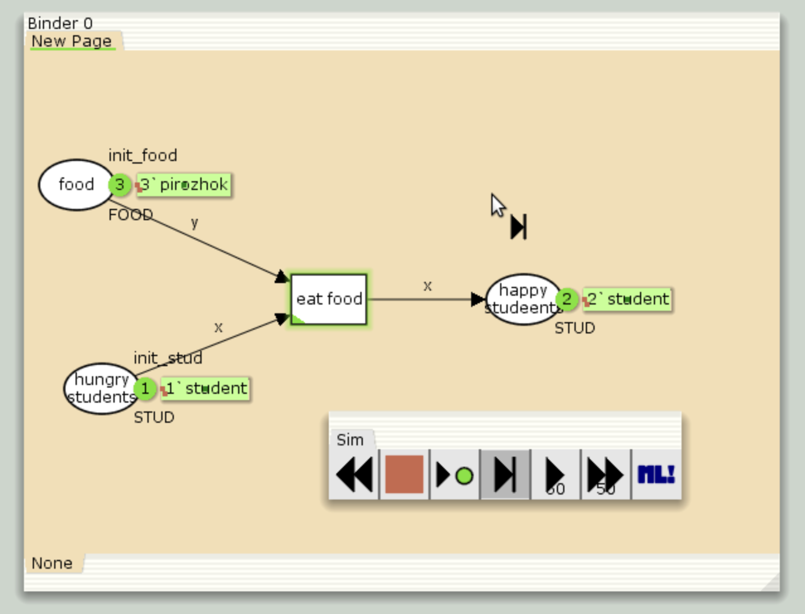
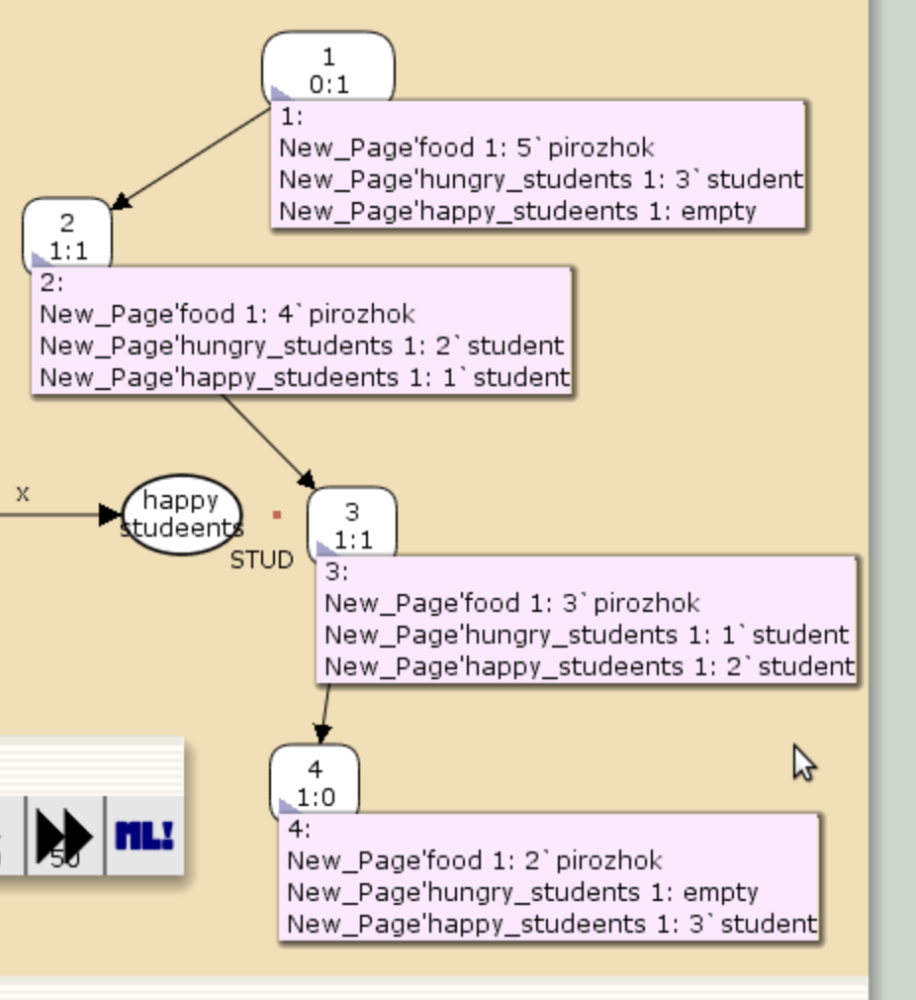

---
## Front matter
lang: ru-RU
title: Лабораторная работа №9
subtitle: "Модель «Накорми студентов»"
author:
  - Кадров Виктор Максимович
teacher:
  - Кулябов Д. С.
  - д.ф.-м.н., профессор
  - профессор кафедры теории вероятностей и кибербезопасности 
institute:
  - Российский университет дружбы народов имени Патриса Лумумбы, Москва, Россия
date: 5 апреля 2025

## i18n babel
babel-lang: russian
babel-otherlangs: english

## Formatting pdf
toc: false
toc-title: Содержание
slide_level: 2
aspectratio: 169
section-titles: true
theme: metropolis
header-includes:
 - \metroset{progressbar=frametitle,sectionpage=progressbar,numbering=fraction}
---

## Цель работы

Исследовать модель «Накорми студентов» с помощью программы *CPN Tools*.

## Задание

- реализовать модель «Накорми студентов» в *CPN Tools*;
- вычислить пространство состояний, сформировать отчет о нем и построить граф.


# Выполнение лабораторной работы.

## Реализация модели в *CPN Tools*

Рассмотрим пример студентов, обедающих пирогами. Голодный студент становится сытым после того, как съедает пирог.

Таким образом, имеем:

- два типа фишек: «пироги» и «студенты»;

- три позиции: «голодный студент», «пирожки», «сытый студент»;

- один переход: «съесть пирожок».

## Реализация модели в *CPN Tools*

{#fig:001 width=50%}

## Реализация модели в *CPN Tools*

{#fig:002 width=50%}

## Реализация модели в *CPN Tools*

{#fig:003 width=50%}

## Реализация модели в *CPN Tools*

{#fig:004 width=50%}

## Упражнение

{#fig:005 width=70%}

```
CPN Tools state space report for:
<unsaved net>
Report generated: Sat Apr  5 23:42:26 2025
```
## Упражнение
 Statistics
------------------------------------------------------------------------
```
  State Space
     Nodes:  4
     Arcs:   3
     Secs:   0
     Status: Full
```
## Упражнение
```
  Scc Graph
     Nodes:  4
     Arcs:   3
     Secs:   0
```
## Упражнение
```
 Boundedness Properties
------------------------------------------------------------------------

  Best Integer Bounds
                             Upper      Lower
     New_Page'food 1         5          2
     New_Page'happy_studeents 1
                             3          0
     New_Page'hungry_students 1
                             3          0
```
## Упражнение
```
  Best Upper Multi-set Bounds
     New_Page'food 1     5`pirozhok
     New_Page'happy_studeents 1
                         3`student
     New_Page'hungry_students 1
                         3`student
```
## Упражнение
```
  Best Lower Multi-set Bounds
     New_Page'food 1     2`pirozhok
     New_Page'happy_studeents 1
                         empty
     New_Page'hungry_students 1
                         empty
```
## Упражнение
```

 Home Properties
------------------------------------------------------------------------

  Home Markings
     [4]

```
## Упражнение
```
 Liveness Properties
------------------------------------------------------------------------

  Dead Markings
     [4]

  Dead Transition Instances
     None

  Live Transition Instances
     None

```
## Упражнение
```
 Fairness Properties
------------------------------------------------------------------------
     No infinite occurrence sequences.

```

## Выводы

Мы исследовали модель «Накорми студентов» с помощью программы *CPN Tools*.