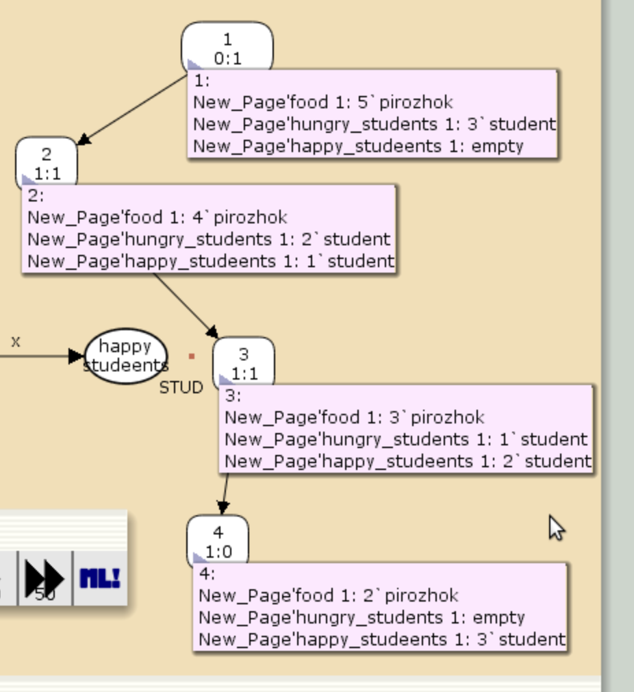

---
## Front matter
title: "Лабораторная работа №9"
subtitle: "Модель «Накорми студентов»"
author: "Кадров Виктор Максимович"

## Generic otions
lang: ru-RU
toc-title: "Содержание"

## Bibliography
bibliography: bib/cite.bib
csl: pandoc/csl/gost-r-7-0-5-2008-numeric.csl

## Pdf output format
toc: true # Table of contents
toc-depth: 2
lof: true # List of figures
lot: false # List of tables
fontsize: 12pt
linestretch: 1.5
papersize: a4
documentclass: scrreprt
## I18n polyglossia
polyglossia-lang:
  name: russian
  options:
	- spelling=modern
	- babelshorthands=true
polyglossia-otherlangs:
  name: english
## I18n babel
babel-lang: russian
babel-otherlangs: english
## Fonts
mainfont: IBM Plex Serif
romanfont: IBM Plex Serif
sansfont: IBM Plex Sans
monofont: IBM Plex Mono
mathfont: STIX Two Math
mainfontoptions: Ligatures=Common,Ligatures=TeX,Scale=0.94
romanfontoptions: Ligatures=Common,Ligatures=TeX,Scale=0.94
sansfontoptions: Ligatures=Common,Ligatures=TeX,Scale=MatchLowercase,Scale=0.94
monofontoptions: Scale=MatchLowercase,Scale=0.94,FakeStretch=0.9
mathfontoptions:
## Biblatex
biblatex: true
biblio-style: "gost-numeric"
biblatexoptions:
  - parentracker=true
  - backend=biber
  - hyperref=auto
  - language=auto
  - autolang=other*
  - citestyle=gost-numeric
## Pandoc-crossref LaTeX customization
figureTitle: "Рис."
tableTitle: "Таблица"
listingTitle: "Листинг"
lofTitle: "Список иллюстраций"
lotTitle: "Список таблиц"
lolTitle: "Листинги"
## Misc options
indent: true
header-includes:
  - \usepackage{indentfirst}
  - \usepackage{float} # keep figures where there are in the text
  - \floatplacement{figure}{H} # keep figures where there are in the text
---

# Цель работы

Исследовать модель «Накорми студентов» с помощью программы *CPN Tools*[@lab].

# Задание

- реализовать модель «Накорми студентов» в *CPN Tools*[@cpn_t];
- вычислить пространство состояний, сформировать отчет о нем и построить граф.


# Выполнение лабораторной работы

## Реализация модели в *CPN Tools*

Рассмотрим пример студентов, обедающих пирогами. Голодный студент становится сытым после того, как съедает пирог.

Таким образом, имеем:

- два типа фишек: «пироги» и «студенты»;

- три позиции: «голодный студент», «пирожки», «сытый студент»;

- один переход: «съесть пирожок».

Нарисуем граф сети. Для этого с помощью контекстного меню создаём новую сеть, добавляем позиции, переход и дуги (рис. [-@fig:001]).

{#fig:001 width=70%}

В меню задаём новые декларации модели: типы фишек, начальные значения позиций, выражения для дуг. Для этого наведя мышку на меню Standart declarations, правой кнопкой вызываем контекстное меню и выбираем New Decl. После этого задаем тип s фишкам, относящимся к студентам, тип p — фишкам, относящимся к пирогам, задаём значения переменных x и y для дуг и начальные значения мультимножеств `init_stud` и `init_food`. (рис. [-@fig:002]).

{#fig:002 width=70%}

В результате получаем работающую модель (рис. [-@fig:003]).

{#fig:003 width=70%}

После запуска фишки типа «пирожки» из позиции «еда» и фишки типа «студенты» из позиции «голодный студент», пройдя через переход «кушать», попадают в позицию «сытый студент» и преобразуются в тип «студенты» (рис. [-@fig:004]).

{#fig:004 width=70%}

## Упражнение

Вычислим пространство состояний. Построим граф по этому пространству(рис. [-@fig:005]).

{#fig:005 width=70%}

Сформируем отчет пространства состояний. Из него может увидеть:

- В графе 4 узла и 3 дуги, соответственно 4 состояния и 3 перехода.
- Затем указаны границы значений для каждого элемента: голодные студенты (максимум - 3, минимум - 0), сытые студенты (максимум - 3, минимум - 0), еда (максимум - 5, минимум - 2, минимальное значение 2, так как в конце симуляции остаются пирожки).
- Также указаны границы мультимножеств.
- Маркировка home равная 4, так как в эту позицию мы можем попасть из любой другой маркировки.
- Маркировка dead равная 4, так как из неё переходов быть не может.
- В конце указано, что нет бесконечных последовательностей вхождений.


```
CPN Tools state space report for:
<unsaved net>
Report generated: Sat Apr  5 23:42:26 2025


 Statistics
------------------------------------------------------------------------

  State Space
     Nodes:  4
     Arcs:   3
     Secs:   0
     Status: Full

  Scc Graph
     Nodes:  4
     Arcs:   3
     Secs:   0


 Boundedness Properties
------------------------------------------------------------------------

  Best Integer Bounds
                             Upper      Lower
     New_Page'food 1         5          2
     New_Page'happy_studeents 1
                             3          0
     New_Page'hungry_students 1
                             3          0

  Best Upper Multi-set Bounds
     New_Page'food 1     5`pirozhok
     New_Page'happy_studeents 1
                         3`student
     New_Page'hungry_students 1
                         3`student

  Best Lower Multi-set Bounds
     New_Page'food 1     2`pirozhok
     New_Page'happy_studeents 1
                         empty
     New_Page'hungry_students 1
                         empty


 Home Properties
------------------------------------------------------------------------

  Home Markings
     [4]


 Liveness Properties
------------------------------------------------------------------------

  Dead Markings
     [4]

  Dead Transition Instances
     None

  Live Transition Instances
     None


 Fairness Properties
------------------------------------------------------------------------
     No infinite occurrence sequences.

```

# Выводы

Мы исследовали модель «Накорми студентов» с помощью программы *CPN Tools*.

# Список литературы{.unnumbered}

::: {#refs}
:::