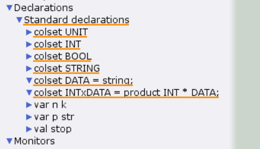
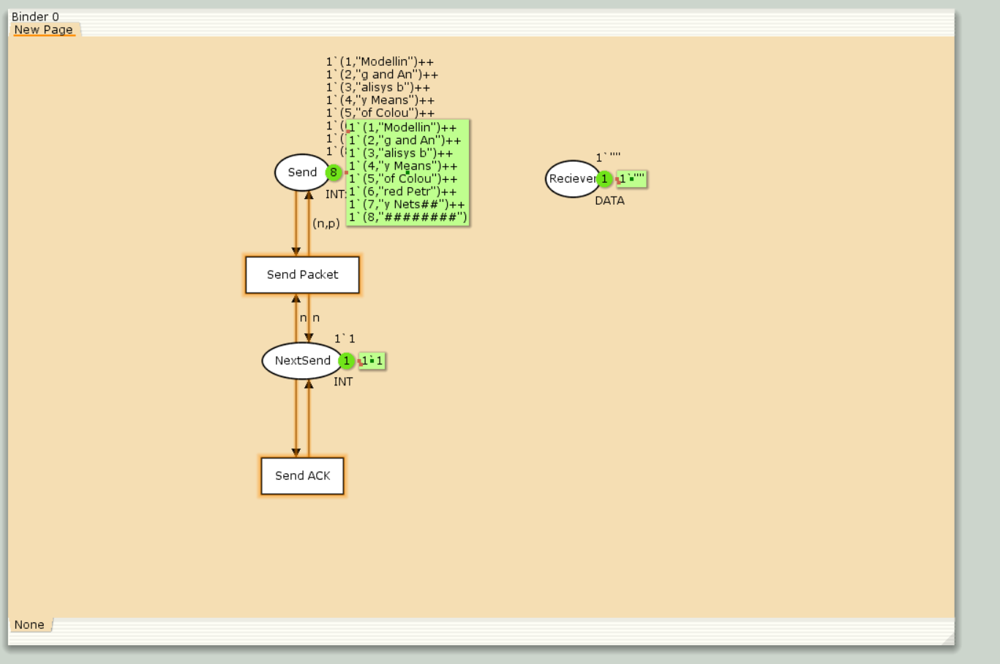
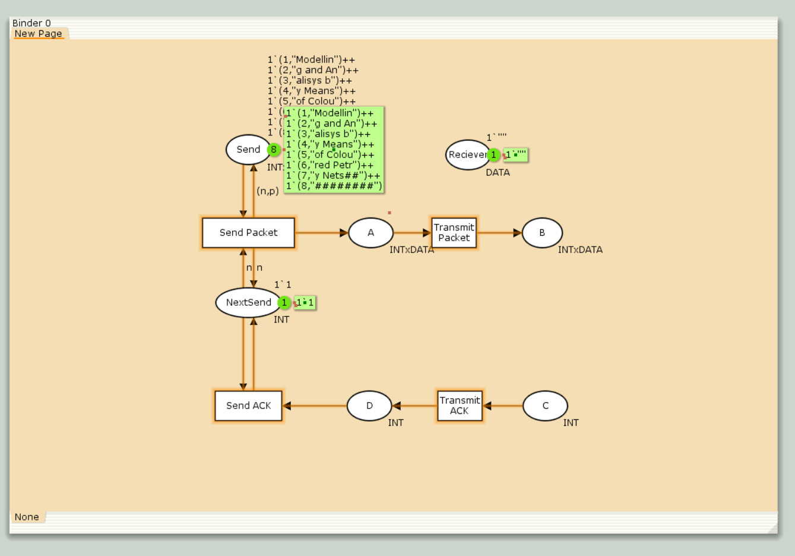
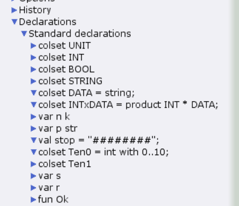
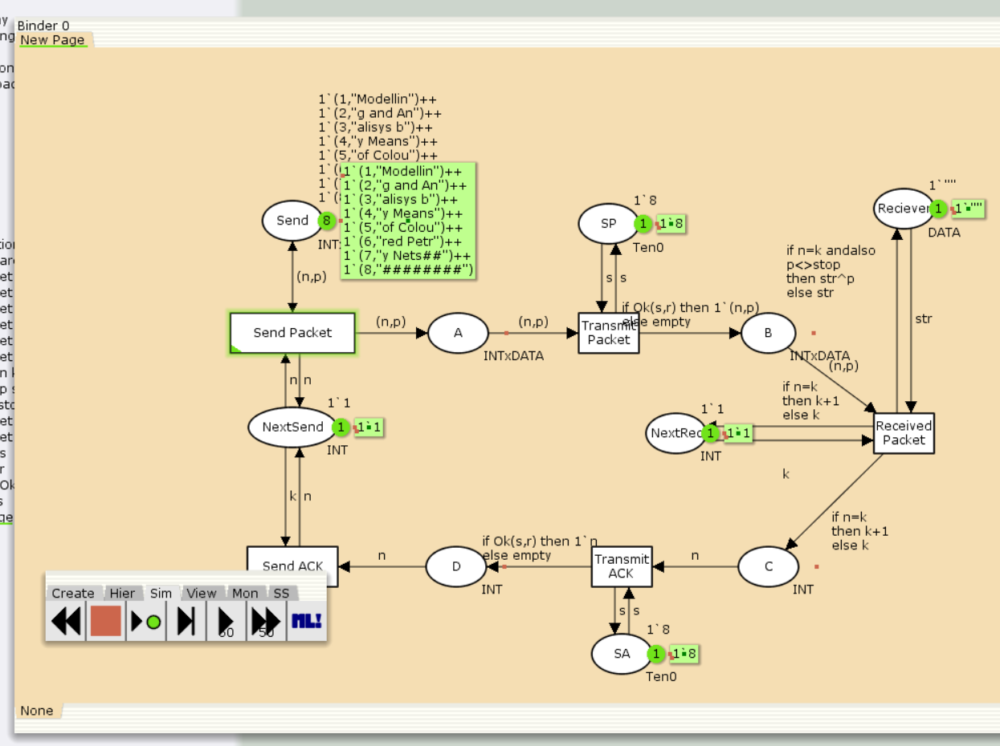
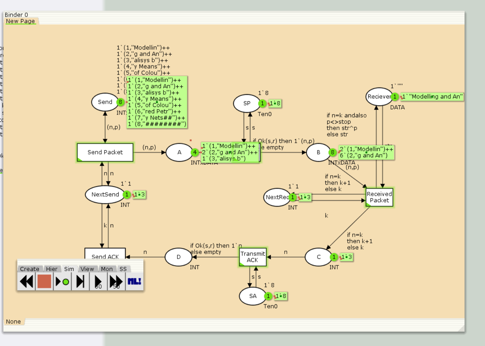
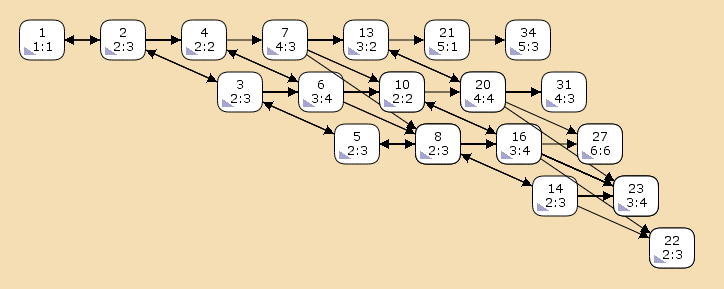

---
## Front matter
lang: ru-RU
title: Лабораторная работа №12
subtitle: "Пример моделирования простого протокола передачи данных"
author:
  - Кадров Виктор Максимович
teacher:
  - Кулябов Д. С.
  - д.ф.-м.н., профессор
  - профессор кафедры теории вероятностей и кибербезопасности 
institute:
  - Российский университет дружбы народов имени Патриса Лумумбы, Москва, Россия
date: 26 апреля 2025

## i18n babel
babel-lang: russian
babel-otherlangs: english

## Formatting pdf
toc: false
toc-title: Содержание
slide_level: 2
aspectratio: 169
section-titles: true
theme: metropolis
header-includes:
 - \metroset{progressbar=frametitle,sectionpage=progressbar,numbering=fraction}
---

## Цели и задачи

**Цель работы**

Реализовать в *CPN Tools* простой протокол передачи данных и провести анализ.

**Задание**

- Реализовать в *CPN Tools* простой протокол передачи данных.
- Вычислить пространство состояний, сформировать отчет о нем и построить граф.

# Выполнение лабораторной работы

## Реализация задачи в CPN Tools

{#fig:001 width=70%}

## Реализация задачи в CPN Tools

{#fig:002 width=50%}

## Реализация задачи в CPN Tools

{#fig:003 width=50%}

## Реализация задачи в CPN Tools

{#fig:004 width=50%}

## Реализация задачи в CPN Tools

{#fig:005 width=70%}

## Реализация задачи в CPN Tools

{#fig:006 width=70%}

## Пространство состояний

```
CPN Tools state space report for:
/home/openmodelica/Desktop/lab12.cpn
Report generated: Sat Apr 26 22:52:29 2025

```
## Пространство состояний

```
 Statistics
------------------------------------------------------------------------

  State Space
     Nodes:  15804
     Arcs:   247803
     Secs:   300
     Status: Partial

  Scc Graph
     Nodes:  9348
     Arcs:   211289
     Secs:   13

```
## Пространство состояний

```
 Boundedness Properties
------------------------------------------------------------------------
  Best Integer Bounds
                             Upper      Lower
     lab_12'A 1              12         0
     lab_12'B 1              7          0
     lab_12'C 1              5          0
     lab_12'D 1              7          0
     lab_12'NextRec 1        1          1
     lab_12'NextSend 1       1          1
     lab_12'Receiver 1       1          1
     lab_12'SA 1             1          1
     lab_12'SP 1             1          1
     lab_12'Send 1           8          8
```
## Пространство состояний

```
  Best Upper Multi-set Bounds
     lab_12'A 1          12`(2,"g and An")++
9`(3,"alysis b")++
4`(4,"y Means ")
     lab_12'B 1          7`(2,"g and An")++
4`(3,"alysis b")++
2`(4,"y Means ")
     lab_12'C 1          5`3++
4`4++
2`5
     lab_12'D 1          1`2++
6`3++
3`4++
1`5
```
## Пространство состояний

```
     lab_12'NextRec 1    1`3++
1`4++
1`5
     lab_12'NextSend 1   1`2++
1`3++
1`4
     lab_12'Receiver 1   1`"Modelling and An"++
1`"Modelling and Analysis b"++
1`"Modelling and Analysis by Means "
     lab_12'SA 1         1`8
     lab_12'SP 1         1`8
     lab_12'Send 1       1`(1,"Modellin")++
1`(2,"g and An")++
1`(3,"alysis b")++
1`(4,"y Means ")++
1`(5,"of Colou")++
1`(6,"red Petr")++
1`(7,"y Nets##")++
1`(8,"########")

```
## Пространство состояний

```
  Best Lower Multi-set Bounds
     lab_12'A 1          empty
     lab_12'B 1          empty
     lab_12'C 1          empty
     lab_12'D 1          empty
     lab_12'NextRec 1    empty
     lab_12'NextSend 1   empty
     lab_12'Receiver 1   empty
     lab_12'SA 1         1`8
     lab_12'SP 1         1`8
     lab_12'Send 1       1`(1,"Modellin")++
1`(2,"g and An")++
1`(3,"alysis b")++
1`(4,"y Means ")++
1`(5,"of Colou")++
1`(6,"red Petr")++
1`(7,"y Nets##")++
1`(8,"########")
```
## Пространство состояний

```
 Home Properties
------------------------------------------------------------------------
  Home Markings
     None

 Liveness Properties
------------------------------------------------------------------------
  Dead Markings
     6555 [9999,9998,9997,9996,9995,...]

  Dead Transition Instances
     None

```
## Пространство состояний

```

  Live Transition Instances
     None

 Fairness Properties
------------------------------------------------------------------------
       lab_12'Received_Packet 1
                         No Fairness
       lab_12'Send_ACK 1      No Fairness
       lab_12'Send_Packet 1   Impartial
       lab_12'Transmit_ACK 1  No Fairness
       lab_12'Transmit_Packet 1
                         Impartial

```

## Пространство состояний

{#fig:007 width=70%}

## Выводы

В результате выполнения работы был реализован в *CPN Tools* простой протокол передачи данных и проведен анализ его пространства состояний.
