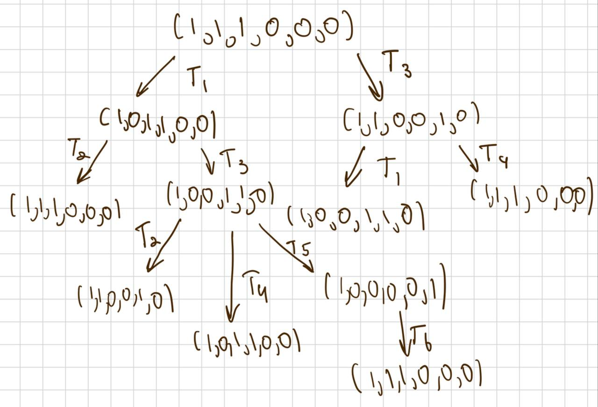
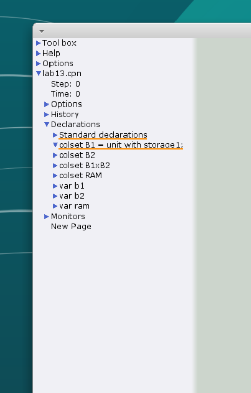
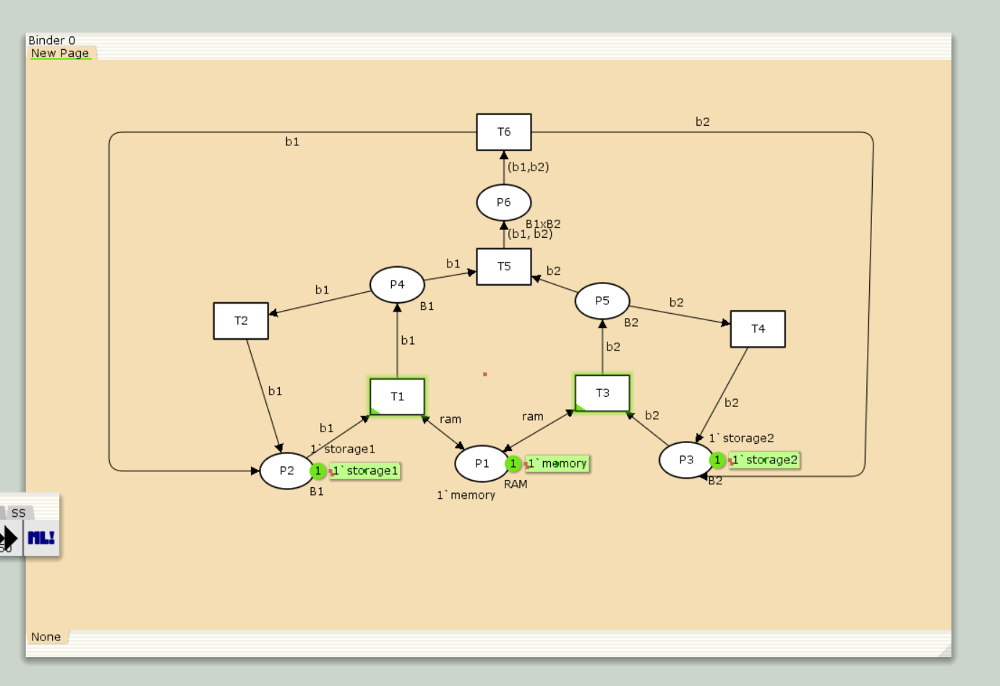
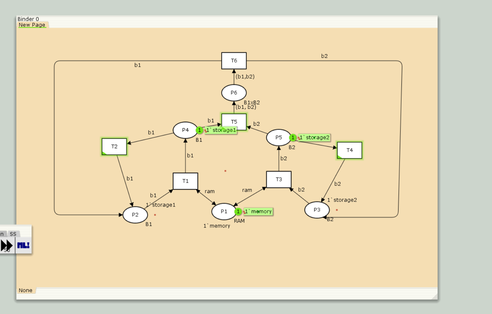
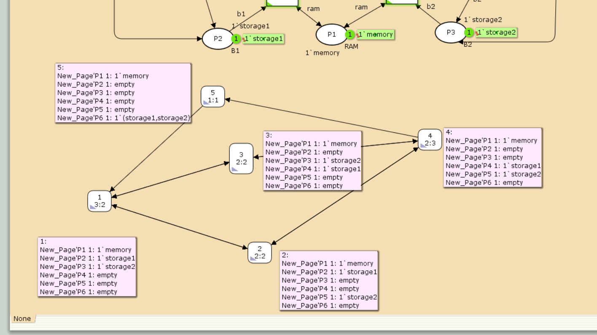

---
## Front matter
lang: ru-RU
title: Лабораторная работа №13
subtitle: "Задание для самостоятельного выполнения"
author:
  - Кадров Виктор Максимович
teacher:
  - Кулябов Д. С.
  - д.ф.-м.н., профессор
  - профессор кафедры теории вероятностей и кибербезопасности 
institute:
  - Российский университет дружбы народов имени Патриса Лумумбы, Москва, Россия
date: 3 мая 2025

## i18n babel
babel-lang: russian
babel-otherlangs: english

## Formatting pdf
toc: false
toc-title: Содержание
slide_level: 2
aspectratio: 169
section-titles: true
theme: metropolis
header-includes:
 - \metroset{progressbar=frametitle,sectionpage=progressbar,numbering=fraction}
---

## Цели и задачи

**Цель работы**

Реализовать в *CPN Tools* задание для самостоятельного выполнения.

**Задание**

1. Используя теоретические методы анализа сетей Петри, провести анализ сети(с помощью построения дерева достижимости). Определить, является ли сеть безопасной, ограниченной, сохраняющей, имеются ли тупики.
2. Промоделировать сеть Петри с помощью *CPNTools*.
3. Вычислить пространство состояний. Сформировать отчёт о пространстве состояний и проанализировать его. Построить граф пространства состояний.

# Выполнение лабораторной работы

## Анализ сети Петри 

{#fig:001 width=70%}

## Реализация задачи в CPN Tools

{#fig:002 width=50%}

## Реализация задачи в CPN Tools

{#fig:003 width=60%}

## Реализация задачи в CPN Tools

{#fig:004 width=60%}

## Пространство состояний в CPN Tools

{#fig:005 width=70%}

## Пространство состояний в CPN Tools

```
CPN Tools state space report for:
/home/openmodelica/Desktop/lab_13/lab_13.cpn
Report generated: Sat May 3 22:54:31 2025

```
## Пространство состояний в CPN Tools

```
 Statistics
------------------------------------------------------------------------

  State Space
     Nodes:  5
     Arcs:   10
     Secs:   0
     Status: Full

  Scc Graph
     Nodes:  1
     Arcs:   0
     Secs:   0
```
## Пространство состояний в CPN Tools

```

 Boundedness Properties
------------------------------------------------------------------------

  Best Integer Bounds
                             Upper      Lower
     lab_13'P1 1             1          1
     lab_13'P2 1             1          0
     lab_13'P3 1             1          0
     lab_13'P4 1             1          0
     lab_13'P5 1             1          0
     lab_13'P6 1             1          0

```
## Пространство состояний в CPN Tools

```

  Best Upper Multi-set Bounds
     lab_13'P1 1         1`memory
     lab_13'P2 1         1`storage1
     lab_13'P3 1         1`storage2
     lab_13'P4 1         1`storage1
     lab_13'P5 1         1`storage2
     lab_13'P6 1         1`(storage1,storage2)

```
## Пространство состояний в CPN Tools

```
  Best Lower Multi-set Bounds
     lab_13'P1 1         1`memory
     lab_13'P2 1         empty
     lab_13'P3 1         empty
     lab_13'P4 1         empty
     lab_13'P5 1         empty
     lab_13'P6 1         empty

```
## Пространство состояний в CPN Tools

```

 Home Properties
------------------------------------------------------------------------

  Home Markings
     All

```
## Пространство состояний в CPN Tools

```

 Liveness Properties
------------------------------------------------------------------------

  Dead Markings
     None

  Dead Transition Instances
     None

  Live Transition Instances
     All

```
## Пространство состояний в CPN Tools

```

 Fairness Properties
------------------------------------------------------------------------
       lab_13'T1 1            No Fairness
       lab_13'T2 1            No Fairness
       lab_13'T3 1            No Fairness
       lab_13'T4 1            No Fairness
       lab_13'T5 1            Just
       lab_13'T6 1            Fair
```

## Выводы

В результате выполнения лабораторной работы было выполнено самостоятельное задание: проведен анализ сети Петри, эта сеть была построена с помощью CPNTools, и также был построен граф состояний и проведён его анализ.
