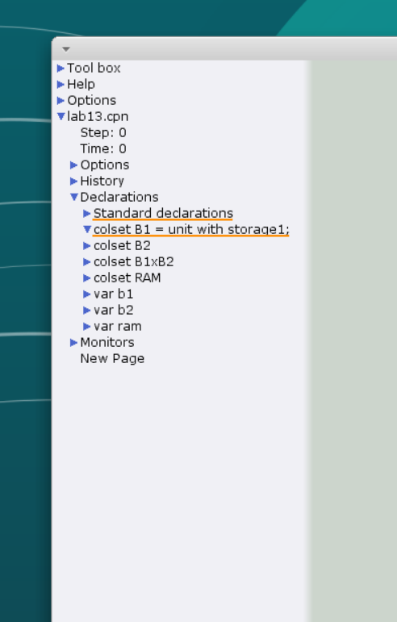
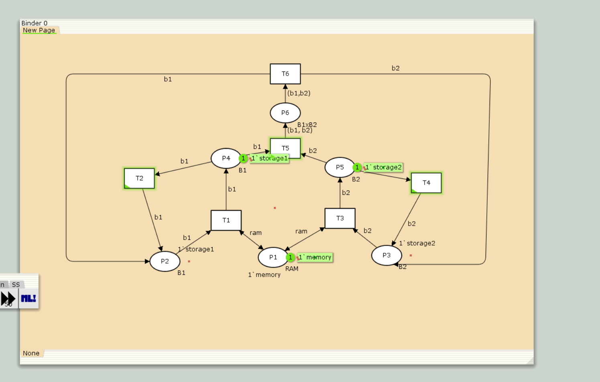
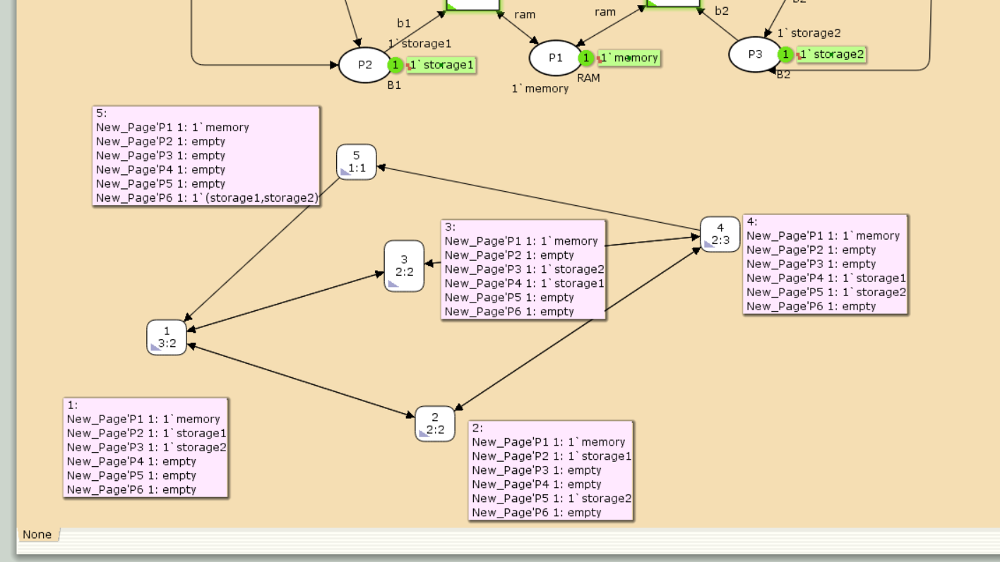

---
## Front matter
title: "Лабораторная работа №13"
subtitle: "Задание для самостоятельного выполнения"
author: "Кадров Виктор Максимович"

## Generic otions
lang: ru-RU
toc-title: "Содержание"

## Bibliography
bibliography: bib/cite.bib
csl: pandoc/csl/gost-r-7-0-5-2008-numeric.csl

## Pdf output format
toc: true # Table of contents
toc-depth: 2
lof: true # List of figures
lot: false # List of tables
fontsize: 12pt
linestretch: 1.5
papersize: a4
documentclass: scrreprt
## I18n polyglossia
polyglossia-lang:
  name: russian
  options:
	- spelling=modern
	- babelshorthands=true
polyglossia-otherlangs:
  name: english
## I18n babel
babel-lang: russian
babel-otherlangs: english
## Fonts
mainfont: IBM Plex Serif
romanfont: IBM Plex Serif
sansfont: IBM Plex Sans
monofont: IBM Plex Mono
mathfont: STIX Two Math
mainfontoptions: Ligatures=Common,Ligatures=TeX,Scale=0.94
romanfontoptions: Ligatures=Common,Ligatures=TeX,Scale=0.94
sansfontoptions: Ligatures=Common,Ligatures=TeX,Scale=MatchLowercase,Scale=0.94
monofontoptions: Scale=MatchLowercase,Scale=0.94,FakeStretch=0.9
mathfontoptions:
## Biblatex
biblatex: true
biblio-style: "gost-numeric"
biblatexoptions:
  - parentracker=true
  - backend=biber
  - hyperref=auto
  - language=auto
  - autolang=other*
  - citestyle=gost-numeric
## Pandoc-crossref LaTeX customization
figureTitle: "Рис."
tableTitle: "Таблица"
listingTitle: "Листинг"
lofTitle: "Список иллюстраций"
lotTitle: "Список таблиц"
lolTitle: "Листинги"
## Misc options
indent: true
header-includes:
  - \usepackage{indentfirst}
  - \usepackage{float} # keep figures where there are in the text
  - \floatplacement{figure}{H} # keep figures where there are in the text
---

# Введение

## Цели и задачи

**Цель работы**

Реализовать в *CPN Tools* задание для самостоятельного выполнения[@lab].

**Задание**

1. Используя теоретические методы анализа сетей Петри, провести анализ сети(с помощью построения дерева достижимости). Определить, является ли сеть безопасной, ограниченной, сохраняющей, имеются ли тупики[@cpn].
2. Промоделировать сеть Петри с помощью *CPNTools*.
3. Вычислить пространство состояний. Сформировать отчёт о пространстве состояний и проанализировать его. Построить граф пространства состояний.

# Выполнение лабораторной работы

## Анализ сети Петри 

Построим дерево достижимости(рис. [-@fig:001]):

{#fig:001 width=70%}

Можно увидеть, что рассматриваемая сеть Петри:
- безопасна, так как число фишек в каждой позиции не может превысить 1;
- ограничена, так как существует такое целое k, что число фишек в каждой позиции не может превысить k(в нашем случае k = 1);
- не имеет тупиков;
- не является сохраняющей, так как при переходе T5 теряется 1 фишка, а при T6 -- порождается;

## Реализация задачи в CPN Tools

Сеть Петри моделируемой системы имеет следующую структуру.
Множество позиций:
- P1 -- состояние оперативной памяти (свободна / занята);
- P2 -- состояние внешнего запоминающего устройства B1 (свободно / занято);
- P3 -- состояние внешнего запоминающего устройства B2 (свободно / занято);
- P4 -- работа на ОП и B1 закончена;
- P5 -- работа на ОП и B2 закончена;
- P6 -- работа на ОП, B1 и B2 закончена;
Множество переходов:
- T1 -- ЦП работает только с RAM и B1;
- T2 -- обрабатываются данные из RAM и с B1 переходят на устройство вывода;
- T3 -- CPU работает только с RAM и B2;
- T4 -- обрабатываются данные из RAM и с B2 переходят на устройство вывода;
- T5 -- CPU работает только с RAM и с B1, B2;
- T6 -- обрабатываются данные из RAM, B1, B2 и переходят на устройство вывода.
Функционирование сети Петри можно расматривать как срабатывание переходов, в ходе которого происходит перемещение маркеров по позициям:
- работа CPU с RAM и B1 отображается запуском перехода T1 (удаление маркеров из P1, P2 и появление в P1, P4), что влечет за собой срабатывание перехода T2, т.е. передачу данных с RAM и B1 на устройство вывода;
- работа CPU с RAM и B2 отображается запуском перехода T3 (удаление маркеров из P1 и P3 и появление в P1 и P5), что влечет за собой срабатывание перехода T4, т.е. передачу данных с RAM и B2 на устройство вывода;
- работа CPU с RAM, B1 и B2 отображается запуском перехода T5 (удаление маркеров из P4 и P5 и появление в P6), далее срабатывание перехода T6, и данные из RAM, B1 и B2 передаются на устройство вывода;
- состояние устройств восстанавливается при срабатывании: RAM — переходов T1 или T2; B1 -- переходов T2 или T6; B2 -- переходов T4 или T6.

В меню задаем новые декларации модели: типы фишек, начальные значения позиций, выражения для дуг(рис. [-@fig:002]).

{#fig:002 width=70%}

Рисуем граф сети. Для этого с помощью контекстного меню создаём новую сеть, добавляем позиции, переходы и дуги, а также зададим типы данных и начальные состояния(рис. [-@fig:003]):

{#fig:003 width=70%}

Запустим модель и посмотрим, как она работает(рис. [-@fig:004]).

{#fig:004 width=70%}

## Пространство состояний в CPN Tools

Сформируем граф пространства состояний, он состоит всего из 5 вершин(рис. [-@fig:005]):

{#fig:005 width=70%}

Затем сформируем отчет пространства состояний. Из него может увидеть:

- есть 5 состояний и 10 переходов между ними, strongly connected components (SCC) graph содержит 1 вершину и 0 переходов, так как нет состояний, из которых можно попасть во все остальные.
- Затем указаны границы значений для каждого элемента: состояние P1 всегда заполнено 1 элементом, а остальные содержат максимум 1 элемент, минимум -- 0.
- Также указаны границы в виде мультимножеств.
- Маркировка home, равная All, означает в любое состояние мы можем попасть из любого другого.
- Маркировка dead равная None, так как нет состояний, из которых переходов быть не может.
- В конце указано, что бесконечно часто могут происходить переходы T1, T2, T3, T4, но не обязательно, также состояние T5 необходимо для того, чтобы система не попадала в тупик, то есть были бесконечные циклы, а состояние T6 происходит всегда, если доступно.


```
CPN Tools state space report for:
/home/openmodelica/Desktop/lab_13/lab_13.cpn
Report generated: Sat May 3 22:54:31 2025


 Statistics
------------------------------------------------------------------------

  State Space
     Nodes:  5
     Arcs:   10
     Secs:   0
     Status: Full

  Scc Graph
     Nodes:  1
     Arcs:   0
     Secs:   0


 Boundedness Properties
------------------------------------------------------------------------

  Best Integer Bounds
                             Upper      Lower
     lab_13'P1 1             1          1
     lab_13'P2 1             1          0
     lab_13'P3 1             1          0
     lab_13'P4 1             1          0
     lab_13'P5 1             1          0
     lab_13'P6 1             1          0

  Best Upper Multi-set Bounds
     lab_13'P1 1         1`memory
     lab_13'P2 1         1`storage1
     lab_13'P3 1         1`storage2
     lab_13'P4 1         1`storage1
     lab_13'P5 1         1`storage2
     lab_13'P6 1         1`(storage1,storage2)

  Best Lower Multi-set Bounds
     lab_13'P1 1         1`memory
     lab_13'P2 1         empty
     lab_13'P3 1         empty
     lab_13'P4 1         empty
     lab_13'P5 1         empty
     lab_13'P6 1         empty


 Home Properties
------------------------------------------------------------------------

  Home Markings
     All


 Liveness Properties
------------------------------------------------------------------------

  Dead Markings
     None

  Dead Transition Instances
     None

  Live Transition Instances
     All


 Fairness Properties
------------------------------------------------------------------------
       lab_13'T1 1            No Fairness
       lab_13'T2 1            No Fairness
       lab_13'T3 1            No Fairness
       lab_13'T4 1            No Fairness
       lab_13'T5 1            Just
       lab_13'T6 1            Fair
```

# Выводы

В результате выполнения лабораторной работы было выполнено самостоятельное задание: проведен анализ сети Петри, эта сеть была построена с помощью CPNTools, и также был построен граф состояний и проведён его анализ.

# Список литературы{.unnumbered}

::: {#refs}
:::
