---
## Front matter
title: "Лабораторная работа №14"
subtitle: "Модели обработки заказов"
author: "Кадров Виктор Максимович"

## Generic otions
lang: ru-RU
toc-title: "Содержание"

## Bibliography
bibliography: bib/cite.bib
csl: pandoc/csl/gost-r-7-0-5-2008-numeric.csl

## Pdf output format
toc: true # Table of contents
toc-depth: 2
lof: true # List of figures
lot: false # List of tables
fontsize: 12pt
linestretch: 1.5
papersize: a4
documentclass: scrreprt
## I18n polyglossia
polyglossia-lang:
  name: russian
  options:
	- spelling=modern
	- babelshorthands=true
polyglossia-otherlangs:
  name: english
## I18n babel
babel-lang: russian
babel-otherlangs: english
## Fonts
mainfont: IBM Plex Serif
romanfont: IBM Plex Serif
sansfont: IBM Plex Sans
monofont: IBM Plex Mono
mathfont: STIX Two Math
mainfontoptions: Ligatures=Common,Ligatures=TeX,Scale=0.94
romanfontoptions: Ligatures=Common,Ligatures=TeX,Scale=0.94
sansfontoptions: Ligatures=Common,Ligatures=TeX,Scale=MatchLowercase,Scale=0.94
monofontoptions: Scale=MatchLowercase,Scale=0.94,FakeStretch=0.9
mathfontoptions:
## Biblatex
biblatex: true
biblio-style: "gost-numeric"
biblatexoptions:
  - parentracker=true
  - backend=biber
  - hyperref=auto
  - language=auto
  - autolang=other*
  - citestyle=gost-numeric
## Pandoc-crossref LaTeX customization
figureTitle: "Рис."
tableTitle: "Таблица"
listingTitle: "Листинг"
lofTitle: "Список иллюстраций"
lotTitle: "Список таблиц"
lolTitle: "Листинги"
## Misc options
indent: true
header-includes:
  - \usepackage{indentfirst}
  - \usepackage{float} # keep figures where there are in the text
  - \floatplacement{figure}{H} # keep figures where there are in the text
---

# Введение

## Цели и задачи

**Цель работы**

Реализовать разные модели обслуживания клиентов и провести анализ результатов[@lab].

**Задание**

Реализовать с помощью gpss[@gpss]:

- модель оформления заказов клиентов одним оператором с разными входными данными
- построение гистограммы распределения заявок в очереди
- модель обслуживания двух типов заказов от клиентов в интернет-магазине
- модель оформления заказов несколькими операторами

# Выполнение лабораторной работы

## Модель оформления заказов клиентов одним оператором

Порядок блоков в модели соответствует порядку фаз обработки заказа в реальной системе:

1) клиент оставляет заявку на заказ в интернет-магазине;
2) если необходимо, заявка от клиента ожидает в очереди освобождения оператора для оформления заказа;
3) заявка от клиента принимается оператором для оформления заказа;
4) оператор оформляет заказ;
5) клиент получает подтверждение об оформлении заказа (покидает систему).

Модель будет состоять из двух частей: моделирование обработки заказов в интернет-магазине и задание времени моделирования. 

Для задания равномерного распределения поступления заказов используем блок `GENERATE`, для задания равномерного времени обслуживания (задержки в системе) -- `ADVANCE`. Для моделирования ожидания заявок клиентов в очереди используем блоки `QUEUE` и `DEPART`, в которых в качестве имени очереди укажем `operator_q` Для моделирования поступления заявок для оформления заказов к оператору используем блоки `SEIZE` и `RELEASE` с параметром `operator` — имени «устройства обслуживания».

Требуется, чтобы модельное время было 8 часов. Соответственно, параметр блока `GENERATE` -- 480 (8 часов по 60 минут, всего 480 минут). Работа программы начи- нается с оператора `START` с начальным значением счётчика завершений, равным 1; заканчивается -- оператором `TERMINATE` с параметром 1, что задаёт ординарность потока в модели.

Таким образом, имеем(рис. [-@fig:001]).

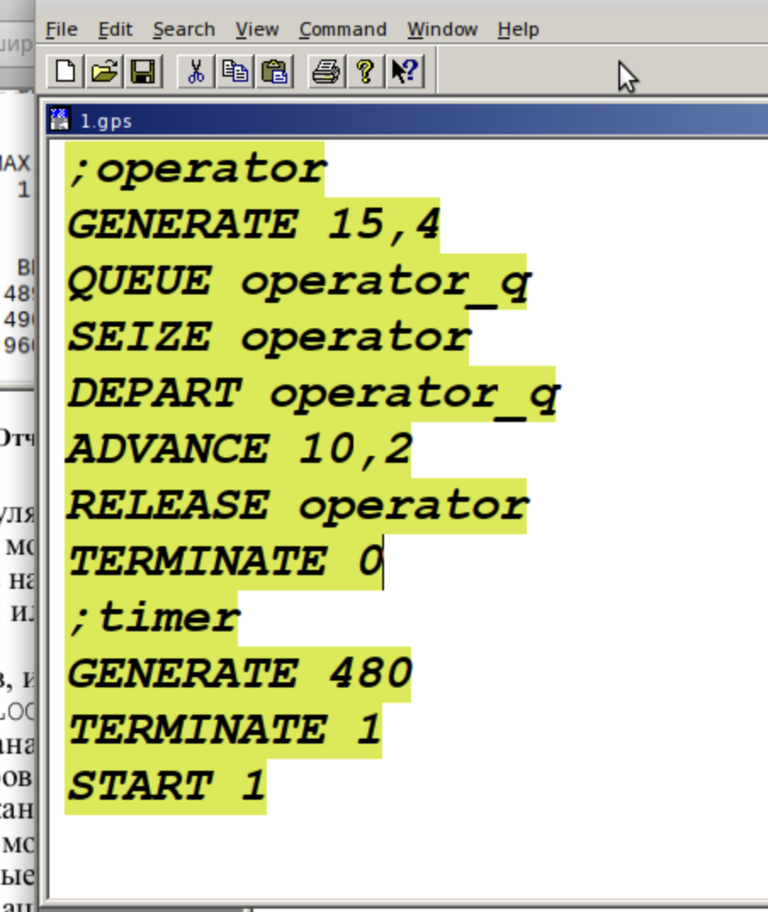{#fig:001 width=90%}

После запуска симуляции получаем отчёт(рис. [-@fig:002]).

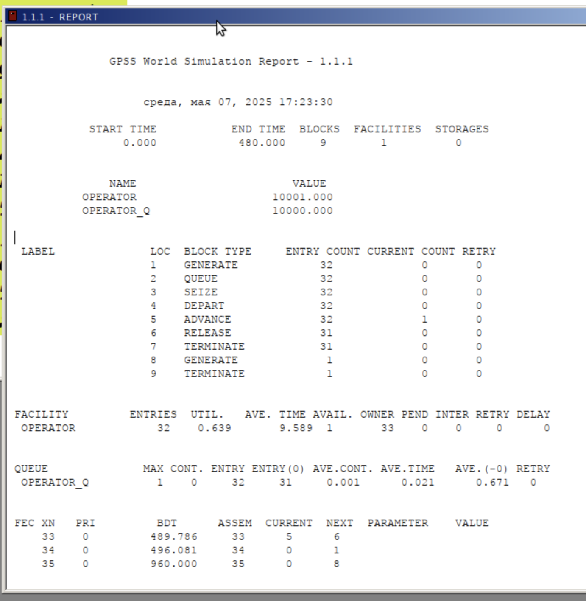{#fig:002 width=90%}

### Упражнение

Изменим интервалы постпуления заказов и время оформления клиентов(рис. [-@fig:003], [-@fig:004]).

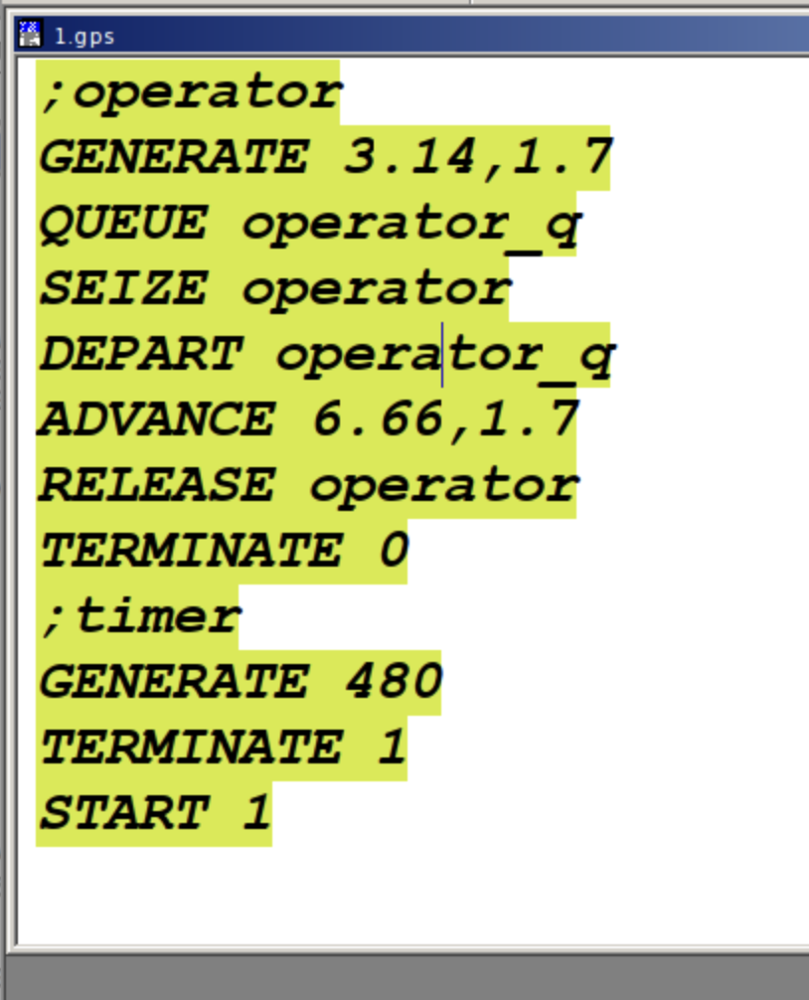{#fig:003 width=90%}

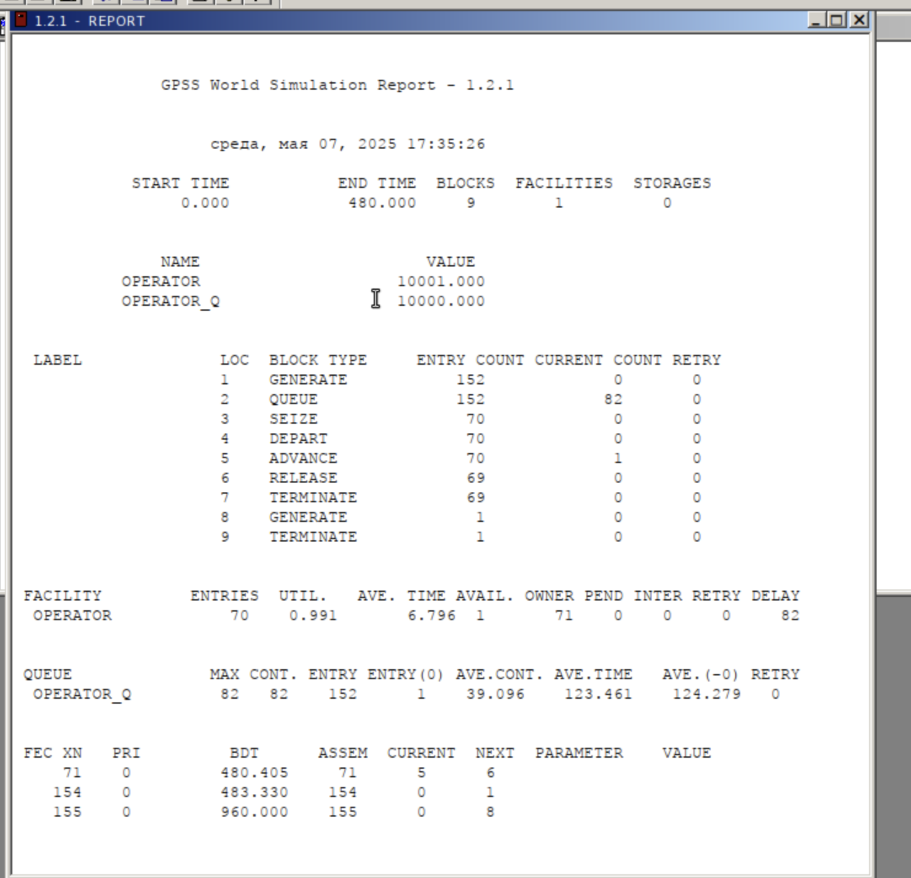{#fig:004 width=90%}

## Построение гистограммы распределения заявок в очереди

Требуется построить гистограмму распределения заявок, ожидающих обработки в очереди в примере из предыдущего упражнения. Для построения гистограммы необходимо сформировать таблицу значений заявок в очереди, записываемых в неё с определённой частотой.

Команда описания такой таблицы `QTABLE` имеет следующий формат: `Name QTABLE A,B,C,D`.
Здесь `Name` -- метка, определяющая имя таблицы. Далее должны быть заданы операнды: А задается элемент данных, чьё частотное распределение будет заноситься в таблицу (может быть именем, выражением в скобках или системным числовым атрибутом (СЧА)); B задается верхний предел первого частотного интервала; С задает ширину частотного интервала — разницу между верхней и нижней границей каждого частотного класса; D задаёт число частотных интервалов. 

Код программы будет следующим(рис. [-@fig:005]).

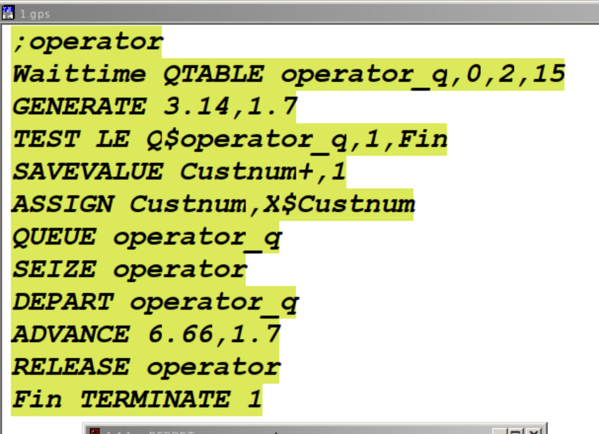{#fig:005 width=90%}

Здесь `Waittime` — метка оператора таблицы очередей `QTABLE`, в данном случае название таблицы очереди заявок на заказы. Строка с оператором `TEST` по смыслу аналогично действиям оператора `IF` и означает, что если в очереди 0 или 1 заявка, то осуществляется переход к следующему оператору, в данном случае к оператору `SAVEVALUE`, в противном случае (в очереди более одной заявки) происходит переход к оператору с меткой `Fin`, то есть заявка удаляется из системы, не попадая на обслуживание. 

Строка с оператором `SAVEVALUE` с помощью операнда `Custnum` подсчитывает число заявок на заказ, попавших в очередь. Далее оператору `ASSIGN` присваивается значение СЧА оператора `Custnum`.

Проанализируем отчет симуляции(рис. [-@fig:006], [-@fig:007]).

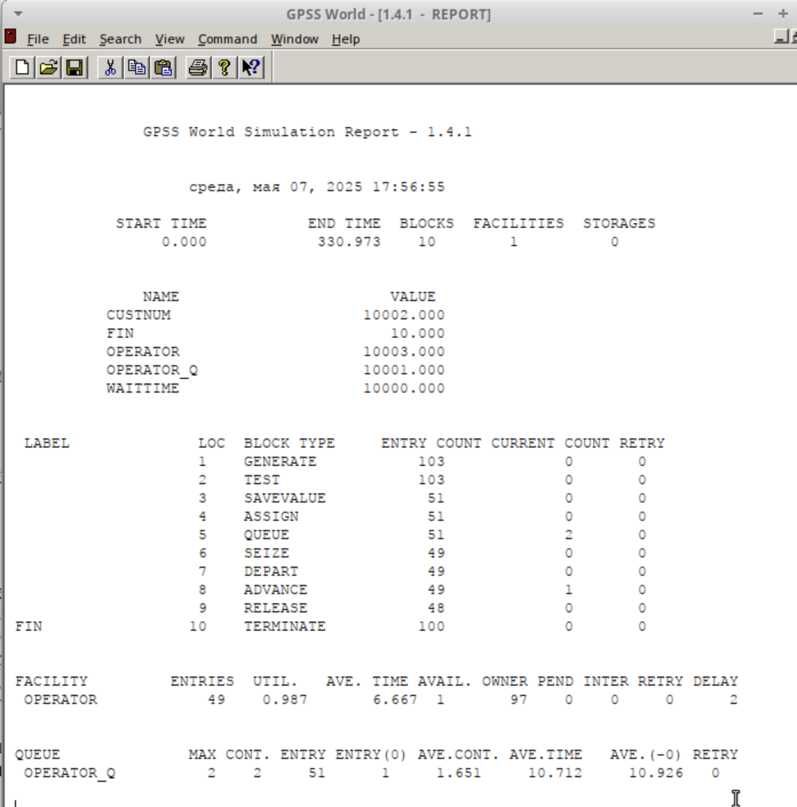{#fig:006 width=90%}

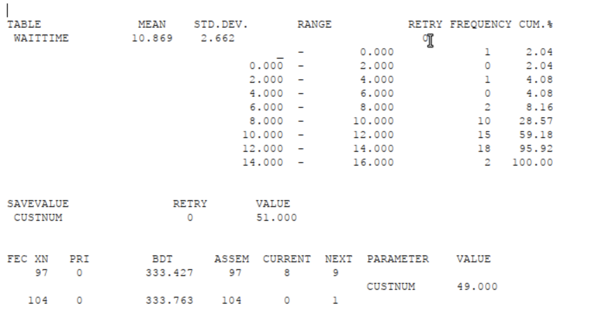{#fig:007 width=90%}

Проанализируем гистограмму(рис. [-@fig:008]).

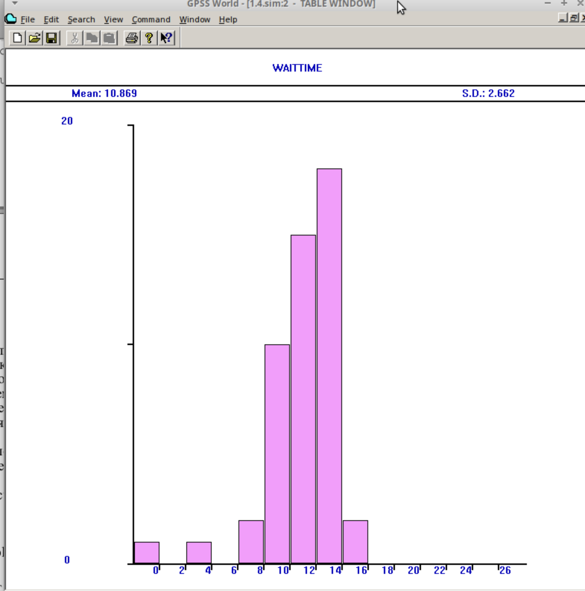{#fig:008 width=90%}

## Модель обслуживания двух типов заказов от клиентов в интернет-магазине

Необходимо реализовать отличие в оформлении обычных заказов и заказов с дополнительным пакетом услуг. Такую систему можно промоделировать с помощью двух сегментов. Один из них моделирует оформление обычных заказов, а второй -- заказов с дополнительным пакетом услуг. В каждом из сегментов пара `QUEUE–DEPART` должна описывать одну и ту же очередь, а пара блоков `SEIZE–RELEASE` должна описывать в каждом из двух сегментов одно и то же устройство и моделировать работу оператора.
Код и отчет результатов моделирования следующие(рис. [-@fig:009], [-@fig:010]).

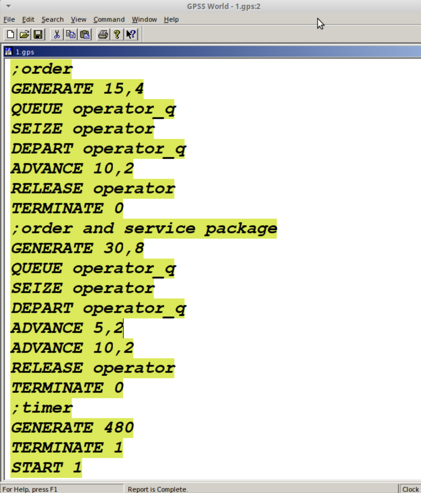{#fig:009 width=90%}

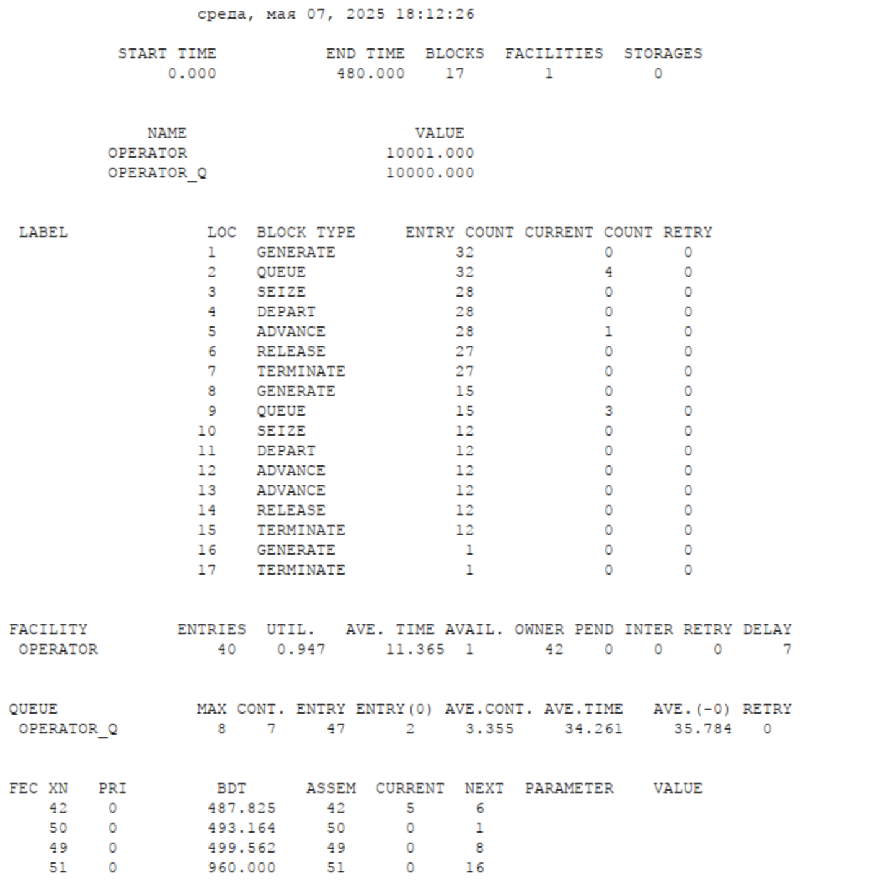{#fig:010 width=90%}

### Упражнение

Скорректируем модель так, чтобы учитывалось условие, что число заказов с дополнительным пакетом услуг составляет 30% от общего числа заказов.

Будем использовать один блок `order`, а разделим типы заявок с помощью переходов оператором `TRANSFER`. Каждый заказ обрабатывается $10 \pm 2$ минуты, после этого зададим оператор `TRANSER`, в котором укажем, что с вероятность 0.7 происходит обработка заявки(переход к блоку `notdop RELEASE operator`), а с вероятностью 0.3 дополнительно заказ обрабатывается еще $5 \pm 2$ минуты и только после этого является обработанным(рис. [-@fig:011]).

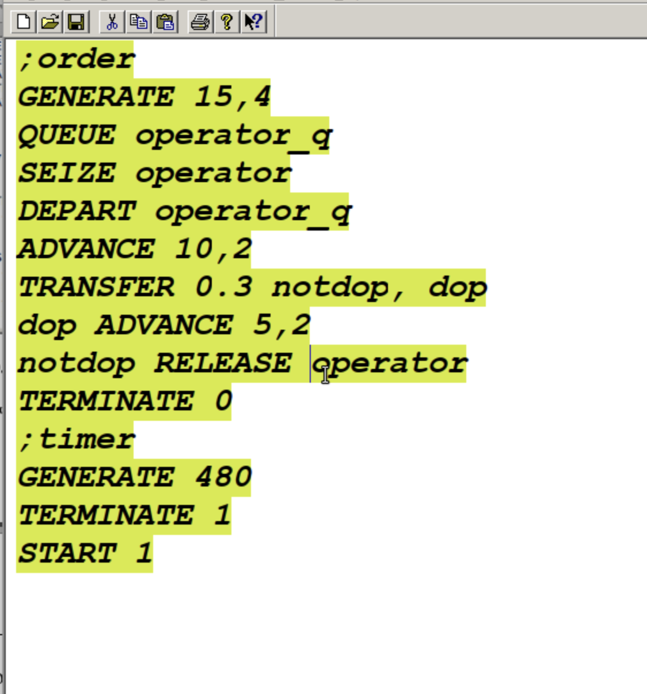{#fig:011 width=90%}

Проанализируем результаты моделирования(рис. [-@fig:012]).

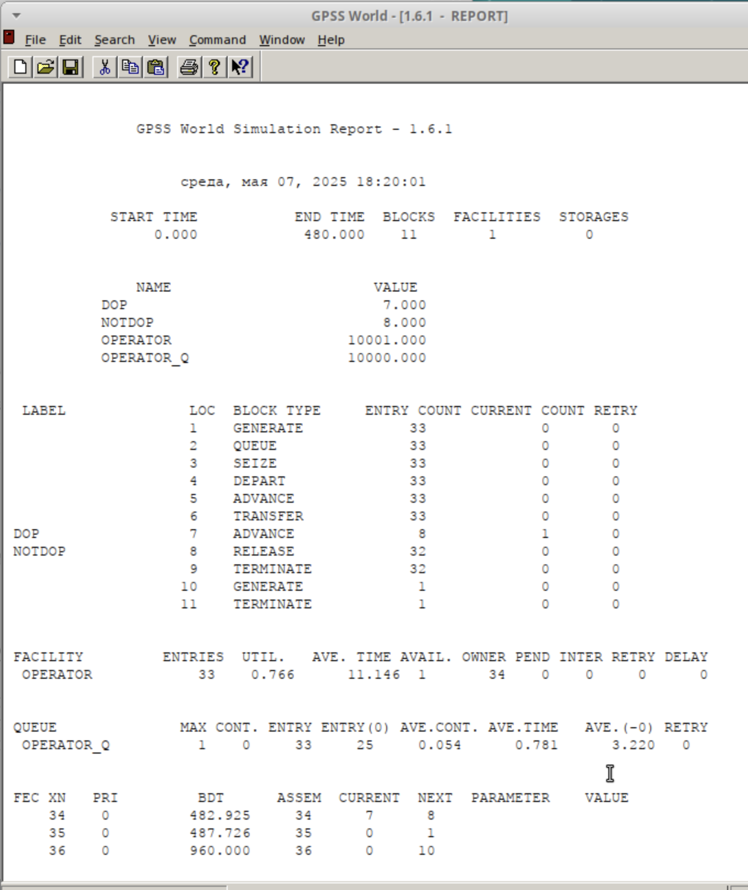{#fig:012 width=65%}

## Модель оформления заказов несколькими операторами

В интернет-магазине заказы принимают 4 оператора. Интервалы поступления заказов распределены равномерно с интервалом $5 \pm 2$ мин. Время оформления заказа каждым оператором также распределено равномерно на интервале $10 \pm 2$ мин. обработка поступивших заказов происходит в порядке очереди (FIFO). Требуется определить характеристики очереди заявок на оформление заказов при условии, что заявка может обрабатываться одним из 4-х операторов в течение восьмичасового рабочего дня.

С помощью строки `operator STORAGE 4` указываем, что у нас 4 оператора, затем к обычной процедуре генерации и обработки заявки добавляется, что заявку обрабатывает один оператор `operator,1`, сегмент моделирования времени остается без изменений(рис. [-@fig:013], [-@fig:014]).

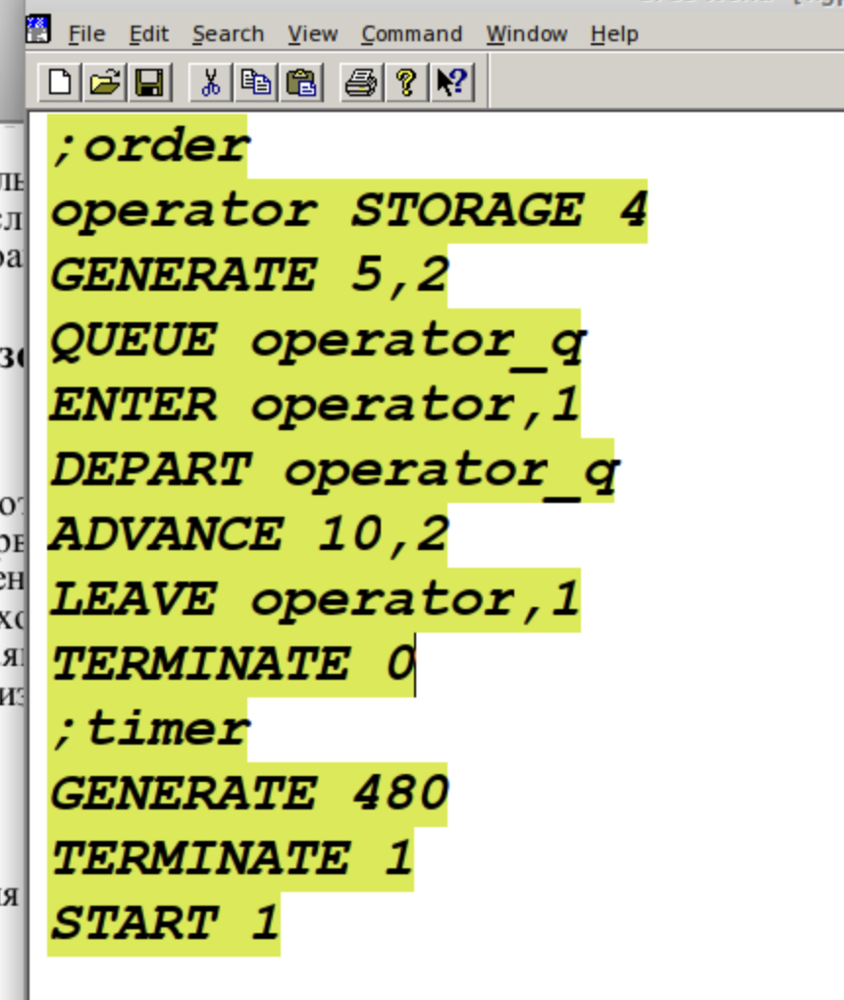{#fig:013 width=90%}

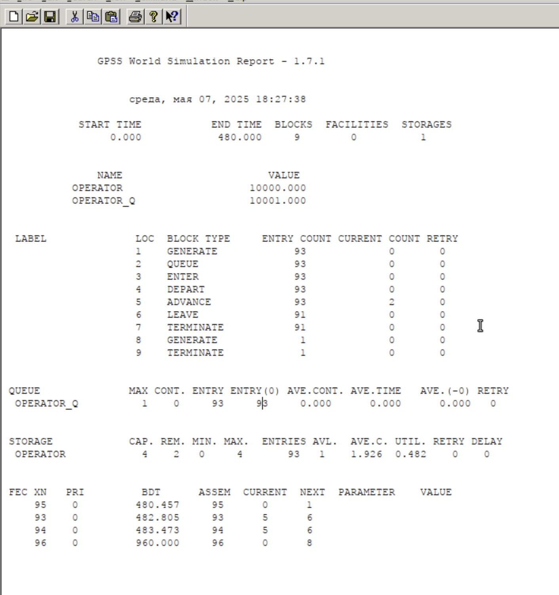{#fig:014 width=90%}

### Упражнение

Изменим модель: требуется учесть в ней возможные отказы клиентов от заказа -- когда при подаче заявки на заказ клиент видит в очереди более двух других заявок, он отказывается от подачи заявки, то есть отказывается от обслуживания (используем блок TEST и стандартный числовой атрибут Qj текущей длины очереди j).

Добавим строчку `TEST LE Q$operator_q,2`, которая проверяет больше ли в очереди клиентов, чем два, если нет -- клиент поступает на обработку, иначе уходит. Также в ранее проанализированном отчете видно, что клиентов в очереди не было больше 2, поэтому увеличим время обработки заказов до $30 \pm 2$ мин., чтобы проверить результаты изменений модели(рис. [-@fig:015]).

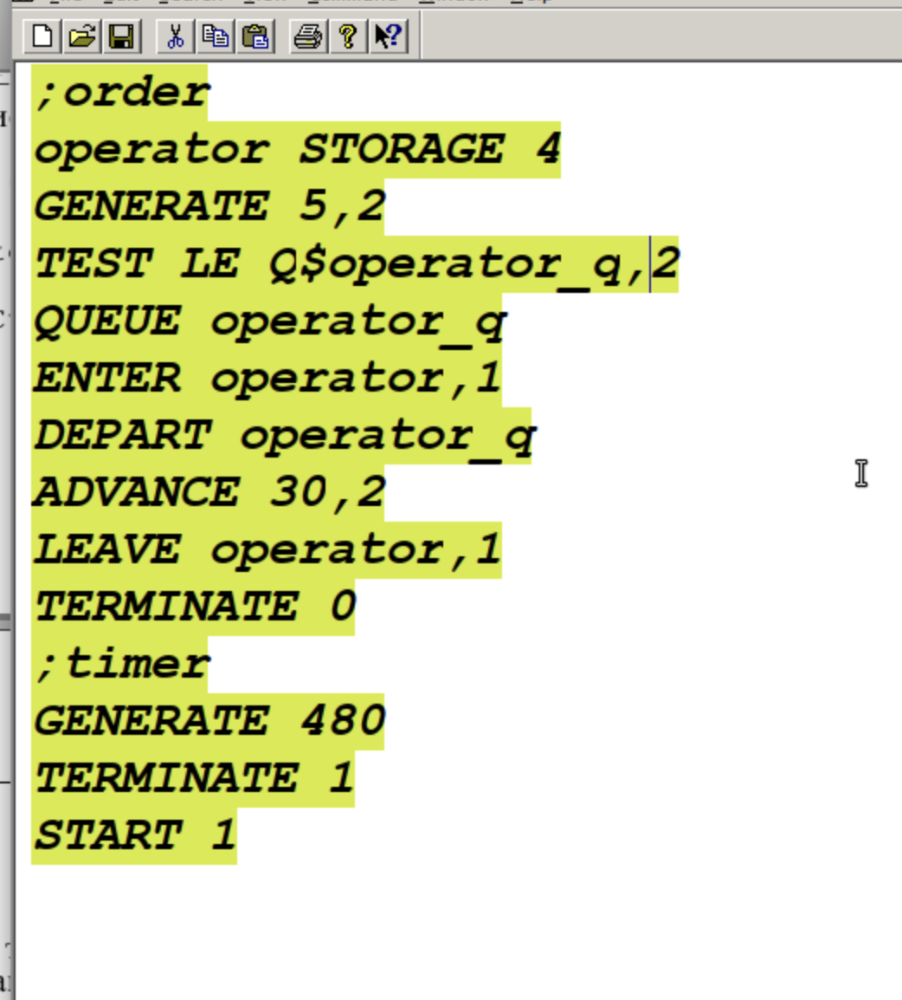{#fig:015 width=90%}

Проанализируем полученный отчет(рис. [-@fig:016]).

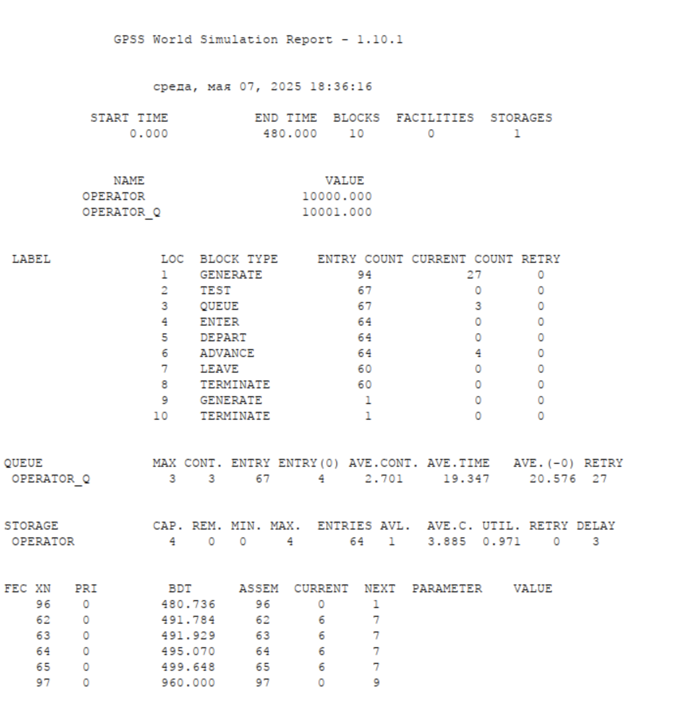{#fig:016 width=90%}

# Выводы

В результате выполнения работы были реализованы с помощью gpss:
  - модель оформления заказов клиентов одним оператором с разными входными данными
  - построение гистограммы распределения заявок в очереди
  - модель обслуживания двух типов заказов от клиентов в интернет-магазине
  - модель оформления заказов несколькими операторами

# Список литературы{.unnumbered}

::: {#refs}
:::