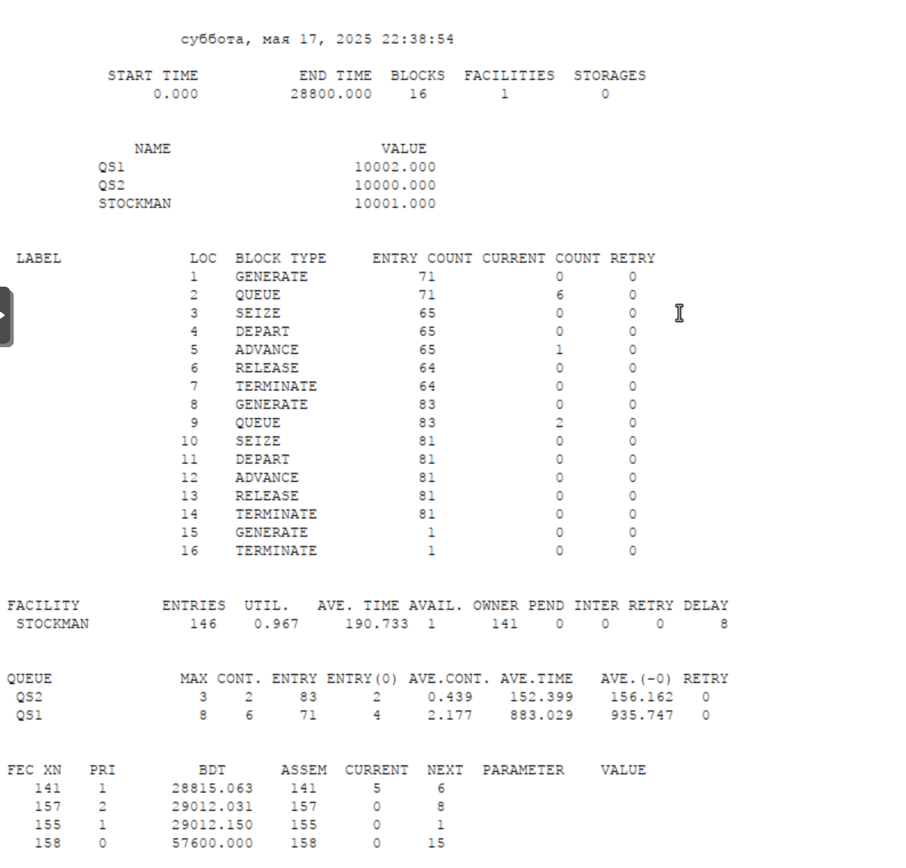

---
## Front matter
lang: ru-RU
title: Лабораторная работа №15
subtitle: "Модели обслуживания с приоритетами"
author:
  - Кадров Виктор Максимович
teacher:
  - Кулябов Д. С.
  - д.ф.-м.н., профессор
  - профессор кафедры теории вероятностей и кибербезопасности 
institute:
  - Российский университет дружбы народов имени Патриса Лумумбы, Москва, Россия
date: 17 мая 2025

## i18n babel
babel-lang: russian
babel-otherlangs: english

## Formatting pdf
toc: false
toc-title: Содержание
slide_level: 2
aspectratio: 169
section-titles: true
theme: metropolis
header-includes:
 - \metroset{progressbar=frametitle,sectionpage=progressbar,numbering=fraction}
---

## Цели и задачи

**Цель работы**

Реализовать модели обслуживания с приоритетами и провести анализ результатов.

**Задание**

Реализовать с помощью gpss:

- Модель обслуживания механиков на складе
- Модель обслуживания в порту судов двух типов

## Модель обслуживания механиков на складе

На фабрике на складе работает один кладовщик, который выдает запасные части механикам, обслуживающим станки. Время, необходимое для удовлетворения запроса, зависит от типа запасной части.Запросы бывают двух категорий. Для первой категории интервалы времени прихода механиков $420 \pm 360$ сек., время обслуживания -- $300 \pm 90$ сек. Для второй категории интервалы времени прихода механиков $360 \pm 240$ сек., время обслуживания -- $100 \pm 30$ сек.

Порядок обслуживания механиков кладовщиком такой: запросы первой категории обслуживаются только в том случае, когда в очереди нет ни одного запроса второй категории. Внутри одной категории дисциплина обслуживания -- "первым пришел -- первым обслужился". Необходимо создать модель работы кладовой, моделирование выполнять в течение восьмичасового рабочего дня.

## Модель обслуживания механиков на складе

{#fig:001 width=70%}

## Модель обслуживания механиков на складе

{#fig:002 width=55%}

## Модель обслуживания в порту судов двух типов

Морские суда двух типов прибывают в порт, где происходит их разгрузка. В порту есть два буксира, обеспечивающих ввод и вывод кораблей из порта. К первому типу судов относятся корабли малого тоннажа, которые требуют использования одного буксира. Корабли второго типа имеют большие размеры, и для их ввода и вывода из порта требуется два буксира. Из-за различия размеров двух типов кораблей необходимы и причалы различного размера. Кроме того, корабли имеют различное время погрузки/разгрузки. 

Требуется построить модель системы, в которой можно оценить время ожидания кораблями каждого типа входа в порт. Время ожидания входа в порт включает время ожидания освобождения причала и буксира. Корабль, ожидающий освобождения причала, не обслуживается буксиром до тех пор, пока не будет предоставлен нужный причал. Корабль второго типа не займёт буксир до тех пор, пока ему не будут доступны оба буксира.

## Модель обслуживания в порту судов двух типов

Параметры модели:

- для корабля первого типа:

  – интервал прибытия: $130 \pm 30$ мин;

  – время входа в порт: $30 \pm 7$ мин;

  – количество доступных причалов: 6;

  – время погрузки/разгрузки: $12 \pm 2$ час;

  – время выхода из порта: $20 \pm 5$ мин;
  
## Модель обслуживания в порту судов двух типов

- для корабля второго типа:

  – интервал прибытия: $390 \pm 60$ мин;

  – время входа в порт: $45 \pm 12$ мин;

  – количество доступных причалов: 3;

  – время погрузки/разгрузки: $18 \pm 4$ час;

  – время выхода из порта: $35 \pm 10$ мин.

- время моделирования: 365 дней по 8 часов

## Модель обслуживания в порту судов двух типов

{#fig:003 width=70%}

## Модель обслуживания в порту судов двух типов

{#fig:005 width=55%}

## Модель обслуживания в порту судов двух типов

{#fig:006 width=70%}

## Выводы

В результате выполнения работы были реализованы с помощью gpss:

- Модель обслуживания механиков на складе
- Модель обслуживания в порту судов двух типов