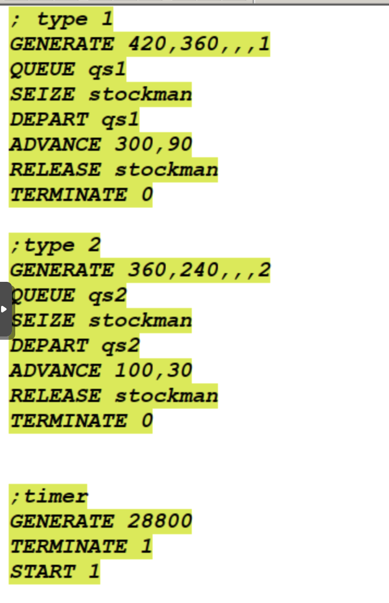
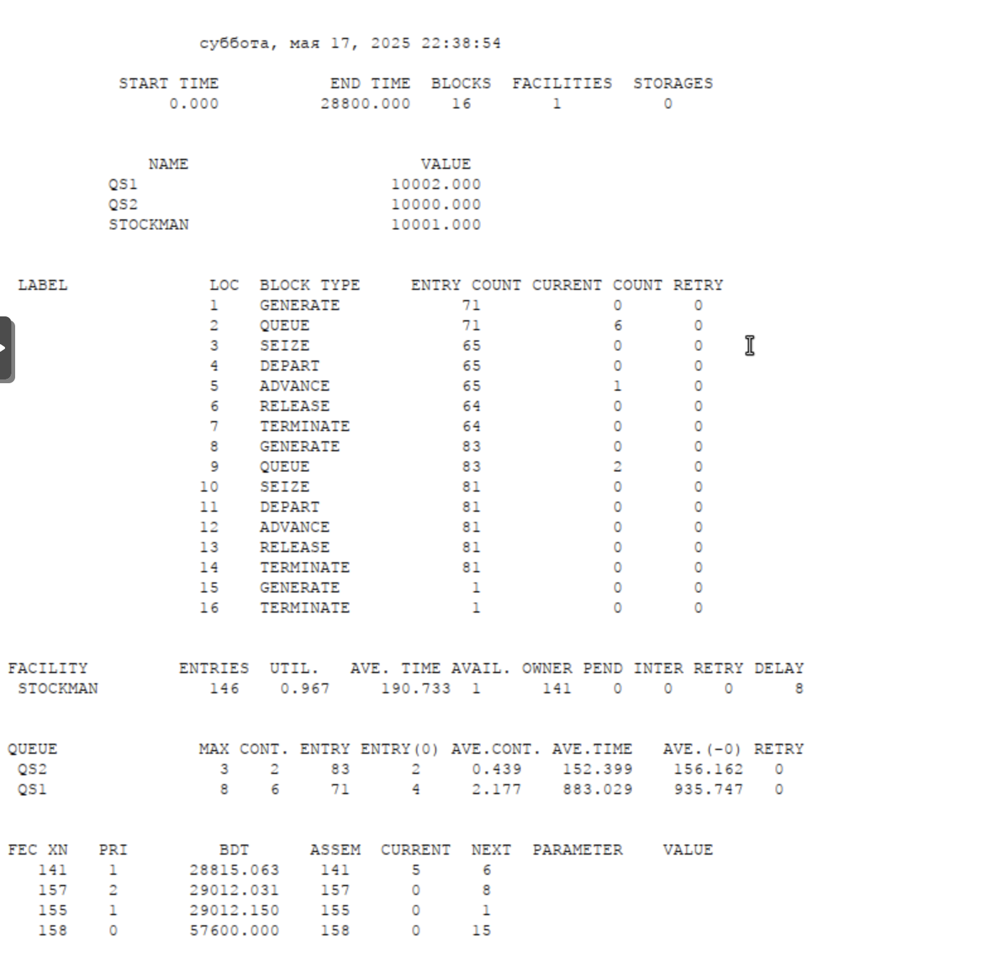
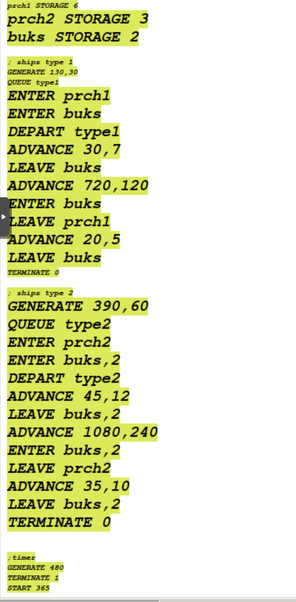
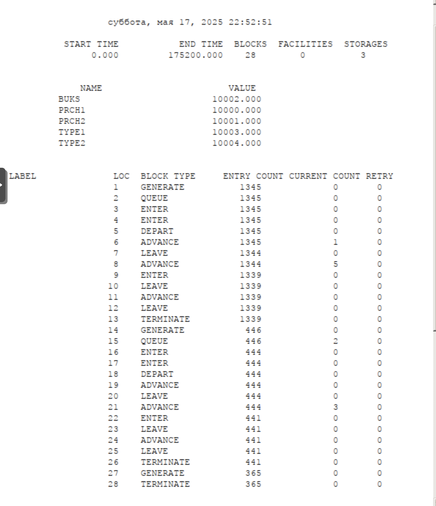
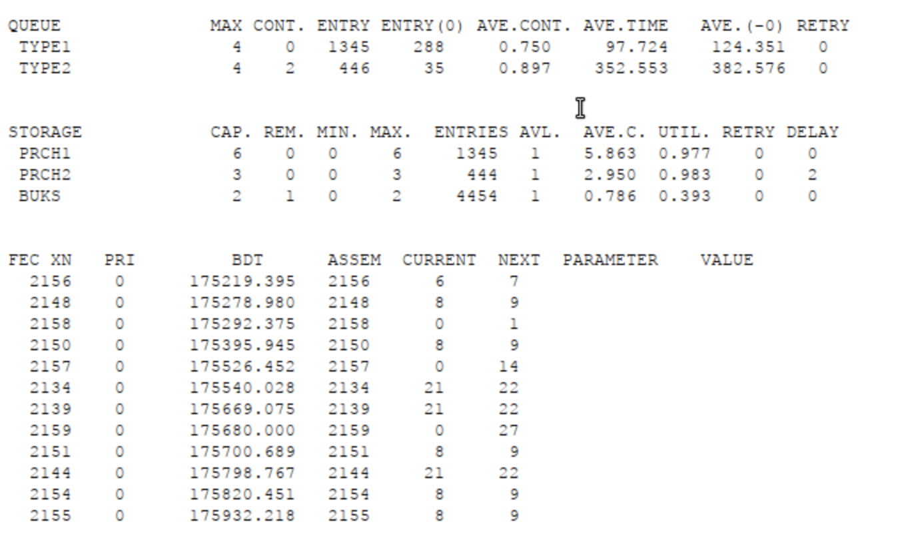

---
## Front matter
title: "Лабораторная работа №15"
subtitle: "Модели обслуживания с приоритетами"
author: "Кадров Виктор Максимович"

## Generic otions
lang: ru-RU
toc-title: "Содержание"

## Bibliography
bibliography: bib/cite.bib
csl: pandoc/csl/gost-r-7-0-5-2008-numeric.csl

## Pdf output format
toc: true # Table of contents
toc-depth: 2
lof: true # List of figures
lot: false # List of tables
fontsize: 12pt
linestretch: 1.5
papersize: a4
documentclass: scrreprt
## I18n polyglossia
polyglossia-lang:
  name: russian
  options:
	- spelling=modern
	- babelshorthands=true
polyglossia-otherlangs:
  name: english
## I18n babel
babel-lang: russian
babel-otherlangs: english
## Fonts
mainfont: IBM Plex Serif
romanfont: IBM Plex Serif
sansfont: IBM Plex Sans
monofont: IBM Plex Mono
mathfont: STIX Two Math
mainfontoptions: Ligatures=Common,Ligatures=TeX,Scale=0.94
romanfontoptions: Ligatures=Common,Ligatures=TeX,Scale=0.94
sansfontoptions: Ligatures=Common,Ligatures=TeX,Scale=MatchLowercase,Scale=0.94
monofontoptions: Scale=MatchLowercase,Scale=0.94,FakeStretch=0.9
mathfontoptions:
## Biblatex
biblatex: true
biblio-style: "gost-numeric"
biblatexoptions:
  - parentracker=true
  - backend=biber
  - hyperref=auto
  - language=auto
  - autolang=other*
  - citestyle=gost-numeric
## Pandoc-crossref LaTeX customization
figureTitle: "Рис."
tableTitle: "Таблица"
listingTitle: "Листинг"
lofTitle: "Список иллюстраций"
lotTitle: "Список таблиц"
lolTitle: "Листинги"
## Misc options
indent: true
header-includes:
  - \usepackage{indentfirst}
  - \usepackage{float} # keep figures where there are in the text
  - \floatplacement{figure}{H} # keep figures where there are in the text
---

# Введение

## Цели и задачи

**Цель работы**

Реализовать модели обслуживания с приоритетами и провести анализ результатов[@lab].

**Задание**

Реализовать с помощью gpss[@gpss]:

- Модель обслуживания механиков на складе
- Модель обслуживания в порту судов двух типов

# Выполнение лабораторной работы

## Модель обслуживания механиков на складе

На фабрике на складе работает один кладовщик, который выдает запасные части механикам, обслуживающим станки. Время, необходимое для удовлетворения запроса, зависит от типа запасной части.Запросы бывают двух категорий. Для первой категории интервалы времени прихода механиков $420 \pm 360$ сек., время обслуживания -- $300 \pm 90$ сек. Для второй категории интервалы времени прихода механиков $360 \pm 240$ сек., время обслуживания -- $100 \pm 30$ сек.

Порядок обслуживания механиков кладовщиком такой: запросы первой категории обслуживаются только в том случае, когда в очереди нет ни одного запроса второй категории. Внутри одной категории дисциплина обслуживания -- "первым пришел -- первым обслужился". Необходимо создать модель работы кладовой, моделирование выполнять в течение восьмичасового рабочего дня.

Есть два различных типа заявок, поступающих на обслуживание к одному устройству. Различаются распределения интервалов приходов и времени обслуживания для этих типов заявок. Приоритеты запросов задаются путем использования для операнда `E` блока `GENERATE` запросов второй категории большего значения, чем для запросов первой категории.

Таким образом, имеем (рис. [-@fig:001]).

{#fig:001 width=70%}

За приоритеты отвечает пятый аргумент генерации заявок.

После запуска симуляции получаем отчёт (рис. [-@fig:002]).

{#fig:002 width=70%}

## Модель обслуживания в порту судов двух типов

Морские суда двух типов прибывают в порт, где происходит их разгрузка. В порту есть два буксира, обеспечивающих ввод и вывод кораблей из порта. К первому типу судов относятся корабли малого тоннажа, которые требуют использования одного буксира. Корабли второго типа имеют большие размеры, и для их ввода и вывода из порта требуется два буксира. Из-за различия размеров двух типов кораблей необходимы и причалы различного размера. Кроме того, корабли имеют различное время погрузки/разгрузки. 

Требуется построить модель системы, в которой можно оценить время ожидания кораблями каждого типа входа в порт. Время ожидания входа в порт включает время ожидания освобождения причала и буксира. Корабль, ожидающий освобождения причала, не обслуживается буксиром до тех пор, пока не будет предоставлен нужный причал. Корабль второго типа не займёт буксир до тех пор, пока ему не будут доступны оба буксира.

Параметры модели:

- для корабля первого типа:

  – интервал прибытия: $130 \pm 30$ мин;

  – время входа в порт: $30 \pm 7$ мин;

  – количество доступных причалов: 6;

  – время погрузки/разгрузки: $12 \pm 2$ час;

  – время выхода из порта: $20 \pm 5$ мин;

- для корабля второго типа:

  – интервал прибытия: $390 \pm 60$ мин;

  – время входа в порт: $45 \pm 12$ мин;

  – количество доступных причалов: 3;

  – время погрузки/разгрузки: $18 \pm 4$ час;

  – время выхода из порта: $35 \pm 10$ мин.

- время моделирования: 365 дней по 8 часов

Построение модели будет выглядеть следующим образом (рис. [-@fig:003]).

{#fig:003 width=70%}

Получим отчет по симуляции (рис. [-@fig:004], [-@fig:005]).

{#fig:004 width=70%}

{#fig:005 width=70%}

# Выводы

В результате выполнения работы были реализованы с помощью gpss:

- Модель обслуживания механиков на складе
- Модель обслуживания в порту судов двух типов

# Список литературы{.unnumbered}

::: {#refs}
:::