---
## Front matter
lang: ru-RU
title: Лабораторная работа №16
subtitle: "Задачи оптимизации. Модель двух стратегий обслуживания"
author:
  - Кадров Виктор Максимович
teacher:
  - Кулябов Д. С.
  - д.ф.-м.н., профессор
  - профессор кафедры теории вероятностей и кибербезопасности 
institute:
  - Российский университет дружбы народов имени Патриса Лумумбы, Москва, Россия
date: 24 мая 2025

## i18n babel
babel-lang: russian
babel-otherlangs: english

## Formatting pdf
toc: false
toc-title: Содержание
slide_level: 2
aspectratio: 169
section-titles: true
theme: metropolis
header-includes:
 - \metroset{progressbar=frametitle,sectionpage=progressbar,numbering=fraction}
---

## Цели и задачи

**Цель работы**

Реализовать с помощью gpss модель двух стратегий обслуживания и оценить оптимальные параметры.

**Задание**

Реализовать с помощью gpss:

- модель с двумя очередями;
- модель с одной очередью;
- изменить модели, чтобы определить оптимальное число пропускных пунктов.

## Постановка задачи

На пограничном контрольно-пропускном пункте транспорта имеются 2 пункта пропуска. Интервалы времени между поступлением автомобилей имеют экспоненциальное распределение со средним значением $\mu$. Время прохождения автомобилями пограничного контроля имеет равномерное распределение на интервале $[a, b]$.
Предлагается две стратегии обслуживания прибывающих автомобилей:

1) автомобили образуют две очереди и обслуживаются соответствующими пунктами пропуска;
2) автомобили образуют одну общую очередь и обслуживаются освободившимся пунктом пропуска.

Исходные данные: $\mu$ = 1, 75 мин, $a$ = 1 мин, $b$ = 7 мин.

## Построение модели

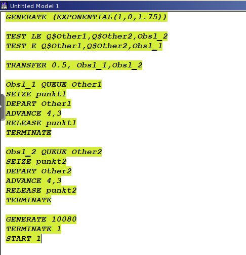{#fig:001 width=70%}

## Построение модели

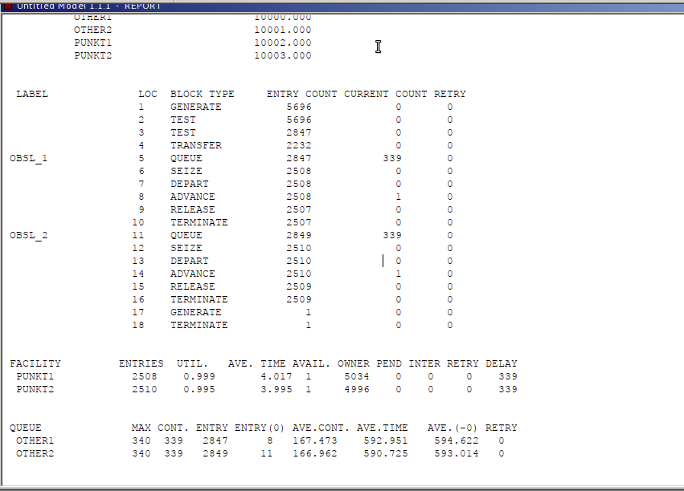{#fig:002 width=55%}

## Построение модели

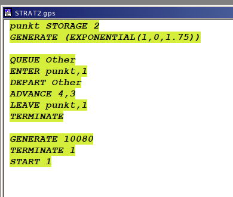{#fig:003 width=70%}

## Построение модели

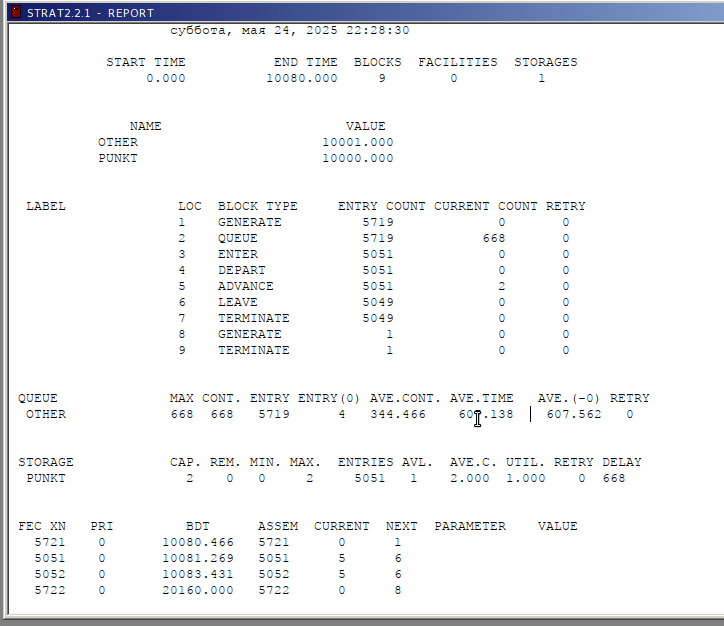{#fig:004 width=70%}

## Построение модели

Сравнение стратегий

| Показатель                 | стратегия 1 |         |          |  стратегия 2 |
|----------------------------|-------------|---------|----------|--------------|
|                            | пункт 1     | пункт 2 | в целом  |              |
| Поступило автомобилей      |2847         |2849     |5696      |5719          |
| Обслужено автомобилей      |2507         |2509     |5016      |5049          |
| Коэффициент загрузки       |0.999        |0.995    |0.9975    |1             |
| Максимальная длина очереди |340          |340      |340       |668           |
| Средняя длина очереди      |167.473      |166.962  |167.2175  |344.466       |
| Среднее время ожидания     |592.951      |590.725  |591.538   |609.138       |

## Оптимизация модели двух стратегий обслуживания

Изменим модели, чтобы определить оптимальное число пропускных пунктов (от 1 до 4). Будем подбирать под следующие критерии:

- коэффициент загрузки пропускных пунктов принадлежит интервалу [0, 5; 0, 95];
- среднее число автомобилей, одновременно находящихся на контрольно пропускном пункте, не должно превышать 3;
- среднее время ожидания обслуживания не должно превышать 4 мин.

## Оптимизация модели двух стратегий обслуживания

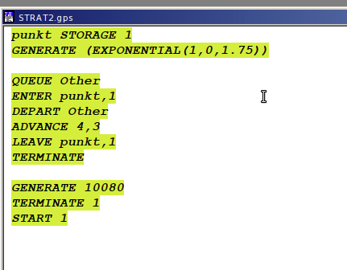{#fig:005 width=70%}

## Оптимизация модели двух стратегий обслуживания

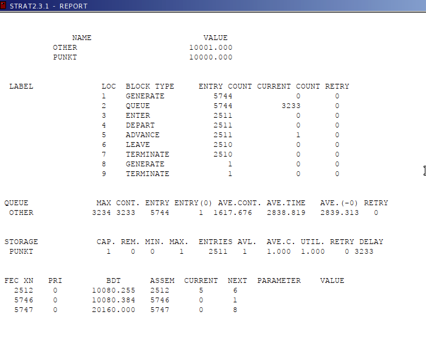{#fig:006 width=70%}

## Оптимизация модели двух стратегий обслуживания

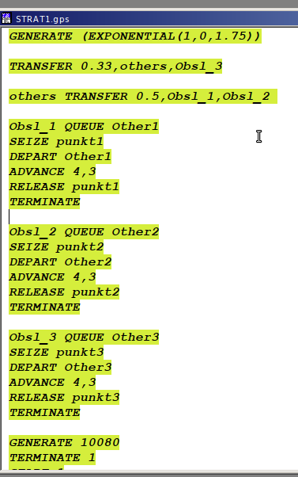{#fig:007 width=70%}

## Оптимизация модели двух стратегий обслуживания

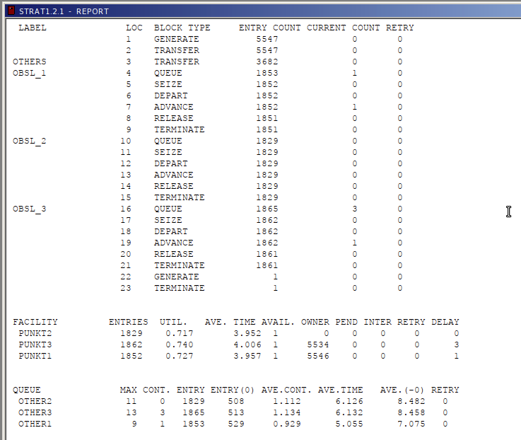{#fig:008 width=60%}

## Оптимизация модели двух стратегий обслуживания

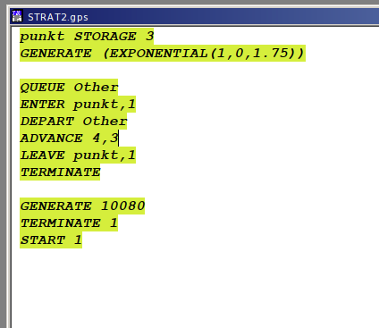{#fig:009 width=70%}

## Оптимизация модели двух стратегий обслуживания

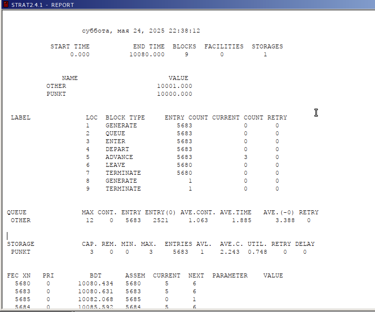{#fig:010 width=70%}

## Оптимизация модели двух стратегий обслуживания

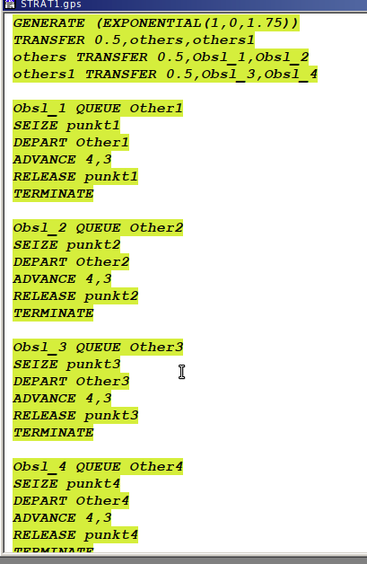{#fig:011 width=55%}

## Оптимизация модели двух стратегий обслуживания

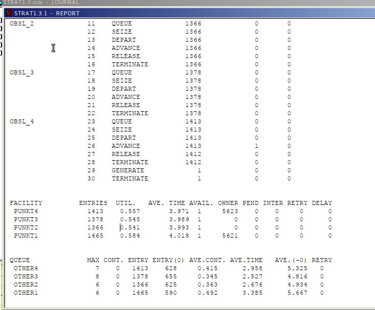{#fig:012 width=55%}

## Выводы

В результате выполнения данной лабораторной работы я реализовала с помощью gpss:

- модель с двумя очередями;
- модель с одной очередью;
- изменить модели, чтобы определить оптимальное число пропускных пунктов.